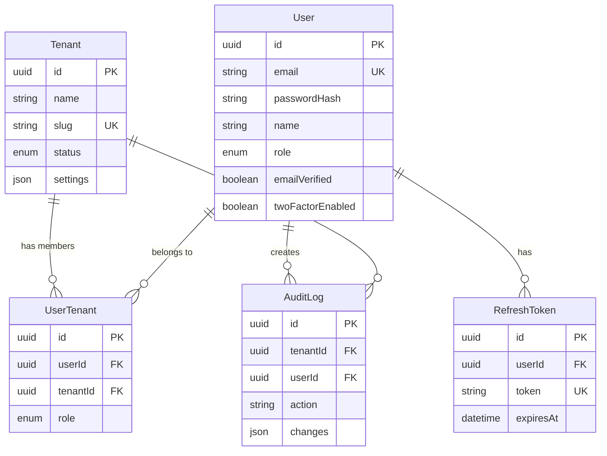

# 📊 WORKFLOW EXECUTION REPORT

> **Generated:** 2025-12-09 00:39:48
> **Workflow:** backend
> **Project:** Kaven Boilerplate v2.0.0

---

## 📋 TABLE OF CONTENTS

1. [Execution Summary](#execution-summary)
2. [Telemetry Data](#telemetry-data)
3. [Implementation Plan](#implementation-plan)
4. [Walkthrough/Analysis](#walkthroughanalysis)
5. [Generated Files](#generated-files)
6. [Validation Results](#validation-results)
7. [Issues & Observations](#issues--observations)
8. [Next Steps](#next-steps)

---

## 1. EXECUTION SUMMARY

### Workflow Details

| Attribute | Value |
|-----------|-------|
| **Workflow Name** | backend |
| **Execution Date** | 2025-12-09 |
| **Start Time** | [FILL: HH:MM] |
| **End Time** | [FILL: HH:MM] |
| **Duration** | [FILL: XX minutes] |
| **Status** | [FILL: ✅ Success / ⚠️ Partial / ❌ Failed] |


### Quick Status

- [ ] Workflow completed without errors
- [ ] All expected files generated
- [ ] Validation passed
- [ ] Telemetry recorded
- [ ] Ready for next phase

---

## 2. TELEMETRY DATA

### Raw Telemetry (Last Execution)

```json
{
  "execution_id": "6653b964-a566-4521-a313-a8e87949ea8e",
  "timestamp_start": "2025-12-09T03:37:41Z",
  "timestamp_end": "2025-12-09T03:39:32.897Z",
  "duration_seconds": 111.9,
  "workflow_name": "backend",
  "task_description": "Generate Prisma schema from PDR",
  "files_created": [
    "prisma/schema.prisma",
    "backend_analysis.md"
  ],
  "files_modified": [],
  "commands_executed": [
    "echo {...} > .agent/telemetry/current_execution.json",
    "npx prisma validate"
  ],
  "lines_of_code": 217,
  "tokens_used_estimated": 1560,
  "success": true,
  "error_message": null,
  "user_feedback": null,
  "metadata": {
    "model": "gemini-3-pro",
    "agent_mode": "plan",
    "project_name": "kaven-boilerplate",
    "git_branch": "main"
  }
}
```


### Key Metrics

| Metric | Value |
|--------|-------|
| **Execution ID** | [AUTO-FILLED or MANUAL] |
| **Duration (seconds)** | [AUTO-FILLED or MANUAL] |
| **Files Created** | [AUTO-FILLED or MANUAL] |
| **Files Modified** | [AUTO-FILLED or MANUAL] |
| **Commands Executed** | [AUTO-FILLED or MANUAL] |
| **Lines of Code** | [AUTO-FILLED or MANUAL] |
| **Success** | [AUTO-FILLED or MANUAL] |

---

## 3. IMPLEMENTATION PLAN

### Plan Location

⚠️ **Implementation plan not found** in expected locations.

**Searched:**
- `implementation_plan.md`
- `pre-production/analysis/backend_implementation_plan.md`
- `pre-production/analysis/implementation_plan.md`
- `.agent/workflows/backend_plan.md`

**Action:** Manually copy plan below if generated elsewhere.

```
[PASTE IMPLEMENTATION PLAN HERE]
```

---

## 4. WALKTHROUGH/ANALYSIS

### Analysis Document Location

✅ **Found:** `backend_analysis.md`

### Analysis Content

```markdown
# Backend Analysis

## Entity-Relationship Diagram (Textual)



## Row-Level Security (RLS) Strategy

We implement RLS at the application level using Prisma Middleware (or Extensions), as Prisma does not support native database RLS policies in `schema.prisma` directly (except via raw SQL migrations).

### Mechanism
1. **Context Injection**: Every authenticated request extracts `tenantId` from the JWT or header.
2. **Middleware Interception**: A Prisma Client Extension intercepts all queries.
3. **Query Modification**:
   - For `findMany`, `findFirst`, `count`: Injects `where: { tenantId: context.tenantId }`.
   - For `create`: Injects `data: { tenantId: context.tenantId }`.
   - For `update`, `delete`: Injects `where: { tenantId: context.tenantId }`.

### Exceptions
- **Super Admin**: Bypass RLS middleware to access all data.
- **Shared Data**: `User` table is global. Users access their own profile via `userId`.
- **System Config**: Global visibility (or restricted to Super Admin).

## Architectural Decisions

1. **PostgreSQL as Database**: Chosen for robustness, native JSON support, and better scalability for multi-tenant "Business" objective compared to SQLite.
2. **UUID Primary Keys**: Prevents ID enumeration attacks and allows easier data migration/sharding in the future.
3. **UTC Timestamps**: All `DateTime` fields are stored in UTC. Client converts to local time.
4. **Soft Deletes**: Not implemented in this schema version (except manual restricted status), relying on explicit status fields (`status: SUSPENDED`) for availability control.
5. **Audit Logging**: Implemented as a separate table `AuditLog` to enable compliance features. Relations are `SetNull` on delete to preserve history even if users/tenants are removed (though in practice, we usually archival delete).

## Security Considerations

1. **Sensitive Data**: `passwordHash`, `twoFactorSecret` (encrypted), `backupCodes` (implied encrypted in user settings or separate if needed).
2. **Cascading Deletes**: 
   - `User` delete -> cascades to `UserTenant`, `RefreshToken`.
   - `Tenant` delete -> cascades to `UserTenant` (but not `User` entity itself).
   - This ensures referential integrity without orphaning junction records.
3. **Index Strategy**:
   - `email` and `slug` are unique and indexed for fast lookups during auth/routing.
   - `tenantId` is indexed in all tenant-scoped tables (`UserTenant`, `AuditLog`) to ensure RLS queries are performant.

## Validations
- **Zod Schemas**: Will be generated to strictly validate Enums and formats at the API boundary, complementing the database constraints.
```

---

## 5. GENERATED FILES

### Expected Output Files

**For /backend workflow:**
- `prisma/schema.prisma`
- `backend_analysis.md`

### File Status

- ✅ `prisma/schema.prisma` exists
  - Lines: 124
- ✅ `backend_analysis.md` exists
  - Lines: 91

### Project Files (Relevant to Workflow)

```
backend_analysis.md
prisma/schema.prisma
```

### Generated Schema (prisma/schema.prisma)

```prisma
generator client {
  provider = "prisma-client-js"
}

datasource db {
  provider = "postgresql"
  url      = env("DATABASE_URL")
}

// Enums
enum UserRole {
  SUPER_ADMIN
  TENANT_ADMIN
  USER
}

enum TenantRole {
  TENANT_ADMIN
  MEMBER
}

enum TenantStatus {
  ACTIVE
  SUSPENDED
}

// Models

model Tenant {
  id        String       @id @default(uuid())
  name      String
  slug      String       @unique
  status    TenantStatus @default(ACTIVE)
  settings  Json?
  createdAt DateTime     @default(now())
  updatedAt DateTime     @updatedAt

  users    UserTenant[]
  auditLogs AuditLog[]

  @@index([status])
}

model User {
  id               String    @id @default(uuid())
  email            String    @unique
  passwordHash     String
  name             String
  role             UserRole  @default(USER)
  emailVerified    Boolean   @default(false)
  emailVerifiedAt  DateTime?
  twoFactorEnabled Boolean   @default(false)
  twoFactorSecret  String?
  createdAt        DateTime  @default(now())
  updatedAt        DateTime  @updatedAt

  tenants       UserTenant[]
  refreshTokens RefreshToken[]
  auditLogs     AuditLog[]

  @@index([email])
  @@index([role])
}

model UserTenant {
  id        String     @id @default(uuid())
  userId    String
  tenantId  String
  role      TenantRole @default(MEMBER)
  createdAt DateTime   @default(now())

  user   User   @relation(fields: [userId], references: [id], onDelete: Cascade)
  tenant Tenant @relation(fields: [tenantId], references: [id], onDelete: Cascade)

  @@unique([userId, tenantId])
  @@index([userId])
  @@index([tenantId])
}

model RefreshToken {
  id        String   @id @default(uuid())
  userId    String
  token     String   @unique
  expiresAt DateTime
  createdAt DateTime @default(now())

  user User @relation(fields: [userId], references: [id], onDelete: Cascade)

  @@index([userId])
  @@index([token])
}

model AuditLog {
  id         String   @id @default(uuid())
  tenantId   String?
  userId     String?
  action     String
  entityType String
  entityId   String
  changes    Json?
  ipAddress  String?
  userAgent  String?
  createdAt  DateTime @default(now())

  tenant Tenant? @relation(fields: [tenantId], references: [id], onDelete: SetNull)
  user   User?   @relation(fields: [userId], references: [id], onDelete: SetNull)

  @@index([tenantId])
  @@index([userId])
  @@index([action])
  @@index([createdAt])
}

model SystemConfig {
  id          String   @id @default(uuid())
  key         String   @unique
  value       Json
  description String?
  updatedBy   String?
  updatedAt   DateTime @updatedAt

  // Not strictly enforcing FK to User here to allow system updates, 
  // but logically it points to a User UUID if updated by human
}
```

---

## 6. VALIDATION RESULTS

### Automated Validation

#### Prisma Schema Validation

```bash
$ npx prisma validate --schema=prisma/schema.prisma
```

Environment variables loaded from .env
Prisma schema loaded from prisma/schema.prisma
The schema at prisma/schema.prisma is valid 🚀

✅ **Schema validation PASSED**


### Manual Verification Checklist

#### General
- [ ] All expected files generated
- [ ] No error messages in logs
- [ ] File contents look correct
- [ ] Telemetry recorded execution


#### Backend-Specific
- [ ] Schema includes Tenant model
- [ ] Schema includes User model
- [ ] Schema includes UserTenant junction
- [ ] Schema includes RefreshToken model
- [ ] Schema includes AuditLog model
- [ ] Schema includes SystemConfig model
- [ ] Relationships defined correctly
- [ ] Indexes present (@@index)
- [ ] Enums defined (UserRole, TenantStatus, etc)
- [ ] `npx prisma validate` passes

---

## 7. ISSUES & OBSERVATIONS

### Issues Encountered

**[FILL: Describe any issues, errors, or unexpected behavior]**

Examples:
- Workflow stuck at X step
- File Y not generated
- Validation failed with error Z

### Manual Adjustments Made

**[FILL: List any manual changes needed after workflow]**

Examples:
- Added missing index to schema
- Fixed typo in model name
- Adjusted enum values

### Observations

**[FILL: General observations about workflow execution]**

Examples:
- Took longer than expected (why?)
- Generated code quality (good/bad?)
- Missing features that should be added to v2.0.0

---

## 8. NEXT STEPS

### Immediate Actions

- [ ] Review this report
- [ ] Copy files to correct locations (if needed)
- [ ] Run manual validations
- [ ] Commit changes to git
- [ ] Proceed to next phase

### For Next Workflow Execution

**Improvements to make:**
- [FILL: Lessons learned]
- [FILL: PDR adjustments needed]
- [FILL: Workflow improvements for v2.0.0]

### Continue Implementation

**According to EXECUTION_GUIDE_HYBRID.md:**

- **Next:** Phase 3 - Migrate Schema to Production (30 min)
  - Copy schema.prisma to production/backend/prisma/
  - Run `npx prisma generate`
  - Run `npx prisma migrate dev --name init`
  - Verify with `npx prisma studio`

- **Then:** Phase 4 - Implement Auth Module (8h)

---


## 📎 APPENDIX

### Report Generation Info

- **Script:** `consolidate_workflow_report.sh`
- **Generated:** 2025-12-09 00:39:49
- **Working Directory:** `/home/bychrisr/projects/kaven-boilerplate`
- **Git Branch:** `main`
- **Git Commit:** `a7a0166`

### Related Files

- PDR: `pre-production/pdr/PDR.md`
- Telemetry: `.agent/telemetry/metrics.json`
- Execution Guide: `EXECUTION_GUIDE_HYBRID.md`

---

**Report End**

