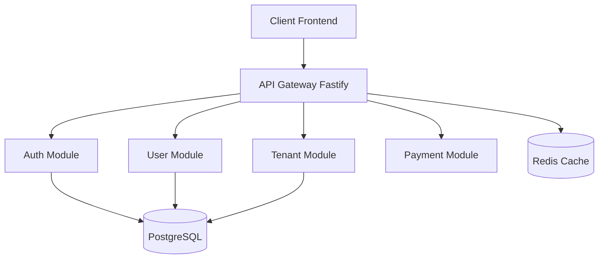

import { Callout } from 'nextra/components';

# Arquitetura da Plataforma

## Visão Geral

Sistema SaaS multi-tenant completo com arquitetura modular e escalável.

### Diagrama de Alto Nível



## Estrutura de Diretórios

```
kaven-boilerplate/
├── apps/
│ ├── api/ # Backend API (Fastify)
│ └── admin/ # Frontend Admin (Next.js)
├── packages/ # Shared packages (UI, Config)
└── docker/ # Infrastructure
```

## Camadas de Segurança

### 1. Autenticação (JWT)

- **Access Token**: 15 minutos
- **Refresh Token**: 7 dias (com rotação)

### 2. RBAC (Role-Based Access Control)

```typescript
enum Role {
  SUPER_ADMIN, // Acesso total
  TENANT_ADMIN, // Acesso ao tenant
  USER, // Acesso limitado
}
```

### 3. Multi-Tenant (Camaleão Middleware)

A detecção de tenant ocorre em 3 níveis:

2.  **Path**: \`/tenants/:slug/\*\*\`
3.  **Subdomain**: \`tenant.app.com\`

<Callout type="warning">
  O middleware injeta o contexto do tenant automaticamente, garantindo que o
  Prisma RLS filtre os dados corretamente.
</Callout>

## Infraestrutura

- **Database**: PostgreSQL 16
- **Cache**: Redis 7
- **Monitoring**: Prometheus + Grafana
