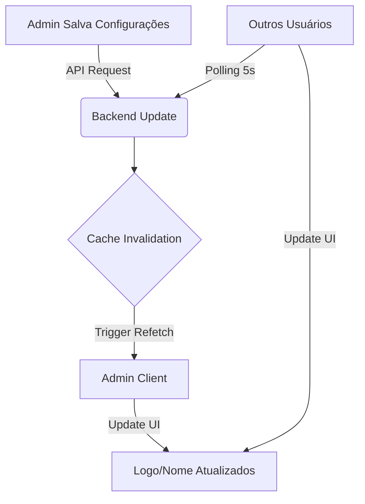

# Customização & Live Reload

> Sistema robusto para gestão de identidade visual da plataforma (White Label) com feedback visual instantâneo em toda a aplicação.

## Visão Geral

Este módulo permite que administradores configurem a identidade visual da plataforma (Logo, Favicon, Nome) com aplicação imediata das mudanças para todos os usuários conectados, sem necessidade de recarregar a página.

**Principais Features:**

- ✅ Upload de Logo (PNG, SVG, WEBP)
- ✅ Upload de Favicon (ICO, PNG)
- ✅ Live Reload via React Query (Polling Inteligente)
- ✅ Cache Invalidation automático após salvar
- ✅ Seeds com valores padrão (`/logo.svg`)

## Como Funciona

### Fluxo de Live Reload

O sistema utiliza `@tanstack/react-query` para manter as configurações da plataforma sincronizadas entre o backend e todos os clientes conectados.



### Arquitetura Técnica

#### 1. Hook `usePlatformSettings`

Hook centralizado que gerencia a busca e cache das configurações.

```typescript
// apps/admin/hooks/use-platform-settings.ts
export function usePlatformSettings() {
  return useQuery({
    queryKey: ['platform-settings'],
    queryFn: async () => {
      const res = await fetch('/api/settings/platform');
      if (!res.ok) throw new Error('Failed to load settings');
      return res.json();
    },
    // Estratégia de Live Reload
    refetchInterval: 5000, // Verifica mudanças a cada 5s
    refetchOnWindowFocus: true, // Verifica ao focar a aba
    staleTime: 2000, // Cache válido por 2s
  });
}
```

#### 2. Componente de Logo Reativo

O componente `<Logo />` consome este hook para garantir que o logo esteja sempre atualizado.

```typescript
// apps/admin/components/logo.tsx
export function Logo() {
  const { data } = usePlatformSettings();
  const logoUrl = data?.logoUrl || '/logo.svg'; // Fallback seguro

  return ;
}
```

## Configuração

### Valores Padrão (Seeds)

O sistema vem configurado por padrão através das seeds do Prisma:

```typescript
// packages/database/prisma/seed.ts
create: {
  id: 'default-config',
  companyName: 'Kaven HQ',
  logoUrl: '/logo.svg',       // Caminho público
  faviconUrl: '/favicon.ico',
  primaryColor: '#00A76F',
  // ...
}
```

## API Reference

### `GET /api/settings/platform`

Retorna as configurações atuais da plataforma.

**Response:**

```json
{
  "companyName": "Kaven Inc",
  "logoUrl": "https://storage.kaven.dev/logo-123.png",
  "faviconUrl": "https://storage.kaven.dev/favicon-123.ico",
  "primaryColor": "#00A76F",
  "timezone": "America/Sao_Paulo",
  "language": "pt-BR"
}
```

### `PUT /api/settings/platform`

Atualiza as configurações. Invalida o cache automaticamente.

```typescript
// Exemplo de Payload
{
  "companyName": "Nova Empresa",
  "logoUrl": "data:image/png;base64,..."
}
```

## Migrando para Fontes Google (Fix Chrome)

Para resolver problemas de carregamento de fontes locais no Chrome, migramos para `next/font/google`:

```typescript
// apps/admin/app/[locale]/layout.tsx
import { Inter } from 'next/font/google';

const inter = Inter({
  subsets: ['latin'],
  variable: '--font-inter'
});

<body className={inter.variable}>
```

Isso garante classes CSS únicas (ex: `__Inter_12345`) que não conflitam com fontes locais do sistema operacional.

## Troubleshooting

### Logo não atualiza imediatamente

- Verifique se a invalidação de cache está sendo chamada no `onSuccess` do mutation.
- Confirme se o navegador não está cacheando a imagem estática (usamos URLs únicas ou base64 para evitar isso).

### Erro "Controlled Input" no Console

- Certifique-se de que os inputs `TextField` nunca recebam `null` ou `undefined`.
- Use `value={field.value ?? ''}`.

## Relacionados

- [Sistema de Timezones](/platform/timezone-system)
- [Frontend Architecture](/platform/frontend)
