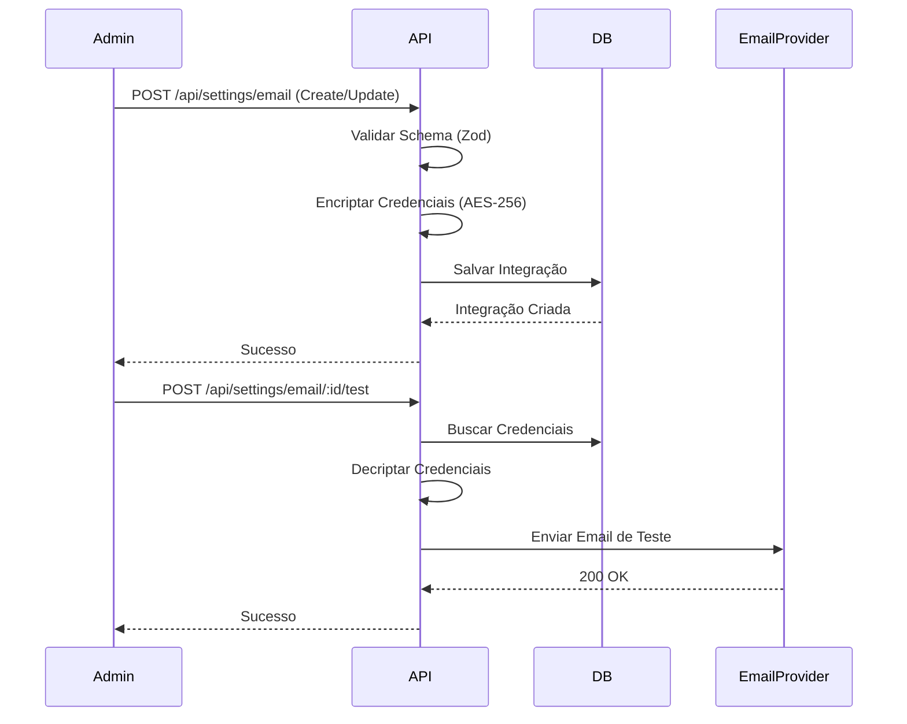

# Email Integrations

> Gerenciamento centralizado de provedores de email com suporte a failover, métricas e múltiplas contas.

## Visão Geral

O módulo de Email Integrations permite configurar e gerenciar múltiplos provedores de serviço de email (ESPs) dentro da plataforma. Suporta os principais provedores do mercado e configurações genéricas via SMTP.

**Principais Features:**
- ✅ Múltiplos Provedores (SMTP, AWS SES, Resend, Postmark)
- ✅ Criptografia de credenciais (AES-256-CBC)
- ✅ Definição de provedor primário e ativo
- ✅ Teste de conexão em tempo real
- ✅ Limites de envio diários/horários (Rate Limiting)
- ✅ Rastreamento de Opens e Clicks (via headers customizados)
- ✅ UI Premium para gerenciamento

## Como Funciona

1. **Configuração**: Admin cadastra credenciais do provedor.
2. **Encriptação**: Chaves e segredos são encriptados antes de salvar no banco.
3. **Seleção**: O sistema utiliza o provedor marcado como `isPrimary` para envios transacionais.
4. **Envio**: O `EmailService` resolve o provedor e despacha o email usando a estratégia correta.
5. **Rastreamento**: Se habilitado, headers de tracking são injetados na mensagem.

## Fluxo Técnico



## Exemplos de Uso

### Criar Integração SMTP

```typescript
const integration = await emailIntegrationService.create({
  provider: 'SMTP',
  host: 'smtp.example.com',
  port: 587,
  username: 'user@example.com',
  password: 'super-secret-password', // Será encriptado
  fromEmail: 'noreply@example.com',
  isPrimary: true
});
```

### Testar Conexão

```typescript
const result = await emailIntegrationService.testConnection(integrationId);
if (result.success) {
  console.log('Email enviado com sucesso!');
}
```

## API Reference

### `create(data: EmailIntegrationInput)`
Cria uma nova integração de email. Credenciais sensíveis são encriptadas automaticamente.

### `update(id: string, data: Partial<EmailIntegrationInput>)`
Atualiza uma integração existente.

### `delete(id: string)`
Remove uma integração.

### `test(id: string)`
Envia um email de teste para o endereço configurado no perfil do admin atual para validar as credenciais.

## Configuração de Ambiente

Certifique-se de que a chave de criptografia está configurada corretamente no `.env`:

```env
# Deve ser uma string HEX de 32 bytes (64 caracteres)
ENCRYPTION_KEY="d23f71c9a6e4b8d52f9a3c7b6e8d1a5f4c2e9b3d7a8c1f6e5d9b2a4c8f3e7d1a"
```

> [!IMPORTANT]
> Se a `ENCRYPTION_KEY` for alterada, todas as integrações existentes deixarão de funcionar pois não será possível descriptografar as senhas.

## Troubleshooting

### Erro: `Invalid key length`
**Causa:** A variável `ENCRYPTION_KEY` no `.env` não é uma string hexadecimal de 64 caracteres.
**Solução:** Gere uma nova chave válida e atualize o `.env`.

### Erro: `500 Internal Server Error` ao salvar
**Causa:** Geralmente relacionado a falha na criptografia ou no banco de dados.
**Solução:** Verifique os logs do backend para detalhes do erro (`RangeError`, Prisma Validation, etc).
