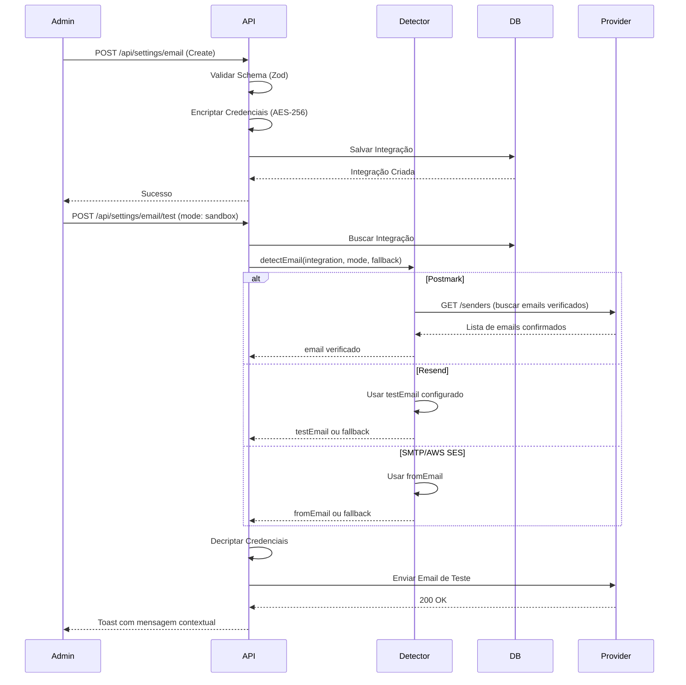

# Email Integrations

> Gerenciamento centralizado de provedores de email com detecção automática de emails verificados, dois modos de teste e observability integrado.

## Visão Geral

O módulo de Email Integrations permite configurar e gerenciar múltiplos provedores de serviço de email (ESPs) dentro da plataforma. Suporta os principais provedores do mercado, configurações genéricas via SMTP, e inclui sistema inteligente de testes.

**Principais Features:**

- ✅ Múltiplos Provedores (SMTP, AWS SES, Resend, Postmark)
- ✅ Criptografia de credenciais (AES-256-CBC)
- ✅ Detecção automática de emails verificados (Postmark)
- ✅ Dois modos de teste (Sandbox e Domínio Customizado)
- ✅ Campo `testEmail` dedicado para Resend
- ✅ Mensagens contextuais e inteligentes
- ✅ Integração com Observability (aba External API)
- ✅ Limites de envio diários/horários (Rate Limiting)
- ✅ Rastreamento de Opens e Clicks
- ✅ UI Premium para gerenciamento

## Como Funciona

### Fluxo de Configuração

1. **Configuração**: Admin cadastra credenciais do provedor
2. **Encriptação**: Chaves e segredos são encriptados antes de salvar no banco
3. **Seleção**: Sistema utiliza o provedor marcado como `isPrimary` para envios
4. **Teste**: Admin pode testar com modo sandbox ou domínio customizado
5. **Detecção**: Sistema detecta automaticamente emails verificados (Postmark)
6. **Observability**: Integração aparece na aba "External API" do Observability

### Fluxo Técnico



## Configuração por Provider

### Resend

**Configuração Básica:**

```typescript
{
  provider: 'RESEND',
  apiKey: 're_...',                    // API Key do Resend
  testEmail: 'seu-email@exemplo.com',  // Email da sua conta Resend
  fromEmail: 'noreply@seudominio.com', // Email de envio (opcional)
  isPrimary: true
}
```

**Setup Externo (Resend Dashboard):**

1. Acesse [resend.com](https://resend.com)
2. Crie uma conta ou faça login
3. Vá em **API Keys** → **Create API Key**
4. Copie a chave (começa com `re_`)
5. (Opcional) Adicione e verifique seu domínio em **Domains**

**Modo Sandbox:**

- Usa `onboarding@resend.dev` como remetente
- Envia apenas para o email configurado em `testEmail`
- Não requer verificação de domínio

**Modo Custom:**

- Usa `fromEmail` configurado
- Requer domínio verificado no Resend
- Permite envio para qualquer destinatário

---

### Postmark

**Configuração Básica:**

```typescript
{
  provider: 'POSTMARK',
  apiKey: 'pm_...',                    // Server API Token
  fromEmail: 'noreply@seudominio.com', // Email verificado
  isPrimary: false
}
```

**Setup Externo (Postmark):**

1. Acesse [postmarkapp.com](https://postmarkapp.com)
2. Crie um servidor (Server)
3. Vá em **API Tokens** → Copie o **Server API Token**
4. Em **Sender Signatures**, adicione e verifique seu email/domínio
5. Aguarde confirmação por email

**Detecção Automática:**

- Sistema busca emails verificados via API `/senders`
- Usa primeiro email com `Confirmed: true`
- Fallback para `fromEmail` se nenhum verificado

---

### AWS SES

**Configuração Básica:**

```typescript
{
  provider: 'AWS_SES',
  apiKey: 'AKIA...',                   // AWS Access Key ID
  apiSecret: 'wJalrXUtn...',           // AWS Secret Access Key
  fromEmail: 'noreply@seudominio.com', // Email verificado no SES
  isPrimary: false
}
```

**Setup Externo (AWS Console):**

1. Acesse [AWS SES Console](https://console.aws.amazon.com/ses/)
2. Verifique um email ou domínio em **Verified identities**
3. Crie um usuário IAM com permissões SES
4. Gere Access Key e Secret Key
5. (Produção) Solicite saída do Sandbox Mode

**Limitações Sandbox:**

- Envia apenas para emails verificados
- Limite de 200 emails/dia
- Solicite aumento de limite para produção

---

### SMTP

**Configuração Básica:**

```typescript
{
  provider: 'SMTP',
  smtpHost: 'smtp.gmail.com',
  smtpPort: 587,
  smtpSecure: false,                   // true para porta 465
  smtpUser: 'seu-email@gmail.com',
  smtpPassword: 'senha-de-app',        // Senha de aplicativo
  fromEmail: 'seu-email@gmail.com',
  isPrimary: false
}
```

**Setup Externo (Gmail como exemplo):**

1. Ative **Verificação em 2 etapas** na conta Google
2. Vá em **Senhas de app** → Gere uma senha
3. Use a senha gerada (16 caracteres) no campo `smtpPassword`

**Outros Provedores SMTP:**

- **Outlook:** `smtp.office365.com:587`
- **Yahoo:** `smtp.mail.yahoo.com:587`
- **SendGrid:** `smtp.sendgrid.net:587`

## Exemplos de Uso

### Criar Integração via UI

1. Acesse `/settings` → Aba **"Integrations"**
2. Clique em **"Nova Integração"**
3. Selecione o provider (Resend, Postmark, AWS SES, SMTP)
4. Preencha os campos específicos
5. (Resend) Preencha **"Email de Teste"** com o email da sua conta
6. Marque **"Ativo"** e/ou **"Primário"**
7. Clique em **"Salvar"**

### Testar Integração

**Resend/Postmark (Dois Botões):**

1. Clique no ícone de teste (⚡) no card da integração
2. Escolha:
   - **"Testar Sandbox"** → Teste rápido sem verificação de domínio
   - **"Testar Domínio"** → Teste com domínio customizado verificado
3. Aguarde toast com resultado

**SMTP/AWS SES (Um Botão):**

1. Clique no ícone de teste (⚡)
2. Email será enviado usando configuração padrão
3. Aguarde toast com resultado

### Criar Integração via API

```typescript
import { emailIntegrationsApi } from '@/lib/api/email-integrations';

const integration = await emailIntegrationsApi.create({
  provider: 'RESEND',
  apiKey: 're_...',
  testEmail: 'seu-email@exemplo.com',
  fromEmail: 'noreply@seudominio.com',
  fromName: 'Minha Empresa',
  isActive: true,
  isPrimary: true,
  trackOpens: true,
  trackClicks: true,
  dailyLimit: 10000,
  hourlyLimit: 500,
});
```

### Testar Conexão via API

```typescript
// Teste com modo sandbox
const result = await emailIntegrationsApi.test(integrationId, 'sandbox');

if (result.success) {
  console.log(result.message);
  // "✅ Teste enviado para seu-email@exemplo.com (email verificado no Resend)"
} else {
  console.error(result.error);
}
```

## API Reference

### `create(data: EmailIntegrationInput)`

Cria uma nova integração de email. Credenciais sensíveis são encriptadas automaticamente.

**Parâmetros:**

- `provider` (EmailProvider) - SMTP | RESEND | POSTMARK | AWS_SES
- `apiKey` (string, opcional) - API Key do provider
- `apiSecret` (string, opcional) - Secret Key (AWS SES)
- `testEmail` (string, opcional) - Email para testes (Resend)
- `fromEmail` (string, opcional) - Email de envio padrão
- `fromName` (string, opcional) - Nome do remetente
- `isActive` (boolean) - Se a integração está ativa
- `isPrimary` (boolean) - Se é a integração primária
- `trackOpens` (boolean) - Rastrear aberturas
- `trackClicks` (boolean) - Rastrear cliques
- `dailyLimit` (number, opcional) - Limite diário de envios
- `hourlyLimit` (number, opcional) - Limite horário de envios

**Retorna:** `Promise<EmailIntegration>`

---

### `update(id: string, data: Partial<EmailIntegrationInput>)`

Atualiza uma integração existente.

**Parâmetros:**

- `id` (string) - ID da integração
- `data` (`Partial<EmailIntegrationInput>`) - Dados para atualizar

**Retorna:** `Promise<EmailIntegration>`

---

### `delete(id: string)`

Remove uma integração.

**Parâmetros:**

- `id` (string) - ID da integração

**Retorna:** `Promise<void>`

---

### `test(id: string, mode?: 'sandbox' | 'custom')`

Envia um email de teste para validar as credenciais.

**Parâmetros:**

- `id` (string) - ID da integração
- `mode` ('sandbox' | 'custom', opcional) - Modo de teste (padrão: 'custom')

**Retorna:**

```typescript
Promise<{
  success: boolean;
  message?: string;
  error?: string;
  isInfo?: boolean; // Se true, exibir como toast.info
  emailSource?: string; // 'verified' | 'configured' | 'sandbox' | 'fallback'
}>;
```

**Comportamento por Provider:**

| Provider | Sandbox                       | Custom          | Detecção Automática |
| -------- | ----------------------------- | --------------- | ------------------- |
| Resend   | Usa `testEmail`               | Usa `fromEmail` | ❌ Não              |
| Postmark | Usa primeiro email verificado | Usa `fromEmail` | ✅ API `/senders`   |
| AWS SES  | Usa `fromEmail`               | Usa `fromEmail` | ⏳ Futuro           |
| SMTP     | Usa `fromEmail`               | Usa `fromEmail` | ❌ N/A              |

---

### `list()`

Lista todas as integrações cadastradas.

**Retorna:** `Promise<EmailIntegration[]>`

## Detecção Automática de Emails

### Como Funciona

O sistema possui um **Provider Email Detector** que busca automaticamente emails verificados de cada provider:

```typescript
// apps/api/src/lib/email/provider-email-detector.ts

interface ProviderEmailResult {
  email: string;
  source: 'verified' | 'configured' | 'sandbox' | 'fallback';
  isVerified: boolean;
  providerMessage?: string;
}
```

### Estratégia por Provider

**Resend:**

1. Se `testEmail` configurado → Usa (prioridade máxima)
2. Se modo sandbox → Usa email do admin
3. Se `fromEmail` configurado → Usa
4. Fallback → Email do admin

**Postmark:**

1. Chama API `GET /senders` com Account Token
2. Filtra por `Confirmed: true`
3. Retorna primeiro email verificado
4. Fallback → `fromEmail` ou email do admin

**AWS SES:**

1. (Futuro) Chamar `ListEmailIdentities`
2. Filtrar por `VerificationStatus: Success`
3. Retornar primeiro email verificado
4. Fallback → `fromEmail` ou email do admin

**SMTP:**

- Usa `fromEmail` configurado
- Fallback → Email do admin

## Observability

### Integração com External API

Todas as integrações de email aparecem automaticamente na aba **"External API"** do Observability:

**Localização:** `/observability` → Aba "External API"

**Informações Exibidas:**

- Nome: `Email - RESEND (Primary)`
- Status: `healthy` (ativo) ou `not_configured` (inativo)
- Ícone: ✉️ (Mail)

**Carregamento Dinâmico:**

```typescript
// apps/api/src/modules/observability/services/external-api-monitor.service.ts

async loadEmailIntegrations(): Promise<ExternalAPI[]> {
  const integrations = await prisma.emailIntegration.findMany({
    select: { id, provider, isActive, isPrimary, fromEmail }
  });

  return integrations.map(integration => ({
    name: `Email - ${integration.provider}${integration.isPrimary ? ' (Primary)' : ''}`,
    provider: 'custom',
    enabled: integration.isActive,
    // ...
  }));
}
```

### Métricas de Email

Acesse `/observability` → Aba **"Email"** para ver:

- Total de emails enviados
- Taxa de entrega
- Bounces e complaints
- Métricas por provider

## Configuração de Ambiente

### Variáveis Obrigatórias

```env
# Chave de Criptografia (32 bytes em HEX = 64 caracteres)
ENCRYPTION_KEY="d23f71c9a6e4b8d52f9a3c7b6e8d1a5f4c2e9b3d7a8c1f6e5d9b2a4c8f3e7d1a"
```

> [!IMPORTANT]
> Se a `ENCRYPTION_KEY` for alterada, todas as integrações existentes deixarão de funcionar pois não será possível descriptografar as credenciais.

### Gerar Nova Chave

```bash
# Node.js
node -e "console.log(require('crypto').randomBytes(32).toString('hex'))"

# OpenSSL
openssl rand -hex 32
```

## Mensagens Contextuais

O sistema exibe mensagens inteligentes baseadas na fonte do email detectado:

### Toast Verde (Success)

**Email Verificado (Postmark):**

> ✅ Teste enviado para kaventhecreator@gmail.com (email verificado no Postmark)

**Email Configurado (testEmail):**

> ✅ Teste enviado para seu-email@exemplo.com (email de teste configurado)

### Toast Azul (Info)

**Sandbox (Resend):**

> ℹ️ Teste enviado! Modo sandbox permite apenas envio para seu email (seu-email@exemplo.com). Para produção, verifique seu domínio.

**Domínio Não Verificado:**

> ℹ️ Teste enviado para admin@kaven.dev (email do admin). Domínio não verificado - verifique em resend.com/domains

**Fallback:**

> ℹ️ Teste enviado para admin@kaven.dev (email do admin). Configure testEmail ou fromEmail na integração

## Troubleshooting

### Erro: `Invalid key length`

**Causa:** A variável `ENCRYPTION_KEY` no `.env` não é uma string hexadecimal de 64 caracteres.

**Solução:**

```bash
# Gerar nova chave
openssl rand -hex 32

# Atualizar .env
ENCRYPTION_KEY="<nova-chave-gerada>"

# Reiniciar servidor
```

---

### Erro: `500 Internal Server Error` ao salvar

**Causa:** Falha na criptografia ou validação do schema Prisma.

**Solução:**

1. Verifique logs do backend
2. Confirme que todos os campos obrigatórios estão preenchidos
3. Verifique se o schema Prisma está sincronizado: `npm run db:push`

---

### Erro: `You can only send testing emails to your own email`

**Causa:** Resend em modo sandbox permite apenas envio para o email da conta.

**Solução:**

1. Preencha o campo **"Email de Teste"** com o email da sua conta Resend
2. Ou verifique seu domínio em [resend.com/domains](https://resend.com/domains)
3. Use modo **"Testar Domínio"** após verificação

---

### Erro: `API returned 401 Unauthorized` (Postmark)

**Causa:** API Key inválida ou expirada.

**Solução:**

1. Verifique se está usando **Server API Token** (não Account Token)
2. Gere um novo token no Postmark
3. Atualize a integração com o novo token

---

### Erro: `Sender signature not confirmed` (Postmark)

**Causa:** Email de envio não verificado no Postmark.

**Solução:**

1. Acesse Postmark → **Sender Signatures**
2. Adicione o email ou domínio
3. Confirme via email recebido
4. Aguarde status `Confirmed: true`

---

### Integração não aparece em Observability

**Causa:** Integração está inativa ou erro no carregamento.

**Solução:**

1. Marque a integração como **"Ativo"**
2. Recarregue a página `/observability`
3. Verifique logs do backend para erros

## Segurança

### Criptografia de Credenciais

Todas as credenciais sensíveis são criptografadas usando **AES-256-CBC**:

```typescript
// Campos criptografados:
-apiKey - apiSecret - smtpPassword - webhookSecret;
```

### Controle de Acesso

- ✅ Apenas **Super Admins** podem gerenciar integrações
- ✅ Middleware `requireSuperAdmin` protege todas as rotas
- ✅ Testes enviam apenas para email do admin logado ou `testEmail` configurado

### Boas Práticas

1. **Rotacione API Keys** periodicamente
2. **Use domínios verificados** em produção
3. **Configure rate limiting** para evitar abuso
4. **Monitore métricas** em Observability
5. **Teste regularmente** as integrações

## Relacionados

- [Email Service](/platform/features/email-system) - Serviço de envio de emails
- [Observability](/platform/observability) - Monitoramento e métricas
- [Platform Settings](/platform/backend) - Configurações da plataforma
