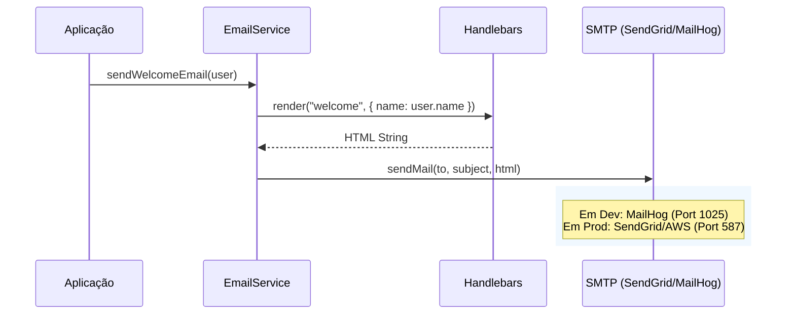

# Email System

> Sistema robusto de envio de emails transacionais integrado com MailHog para desenvolvimento local e Handlebars para templates.

## Visão Geral

O Email System do Kaven é projetado para ser resiliente e flexível. Ele permite o envio de notificações críticas (boas-vindas, redefinição de senha, convites) utilizando templates dinâmicos.

**Principais Features:**

- ✅ **Templates Dinâmicos:** Uso de Handlebars (`.hbs`) para separação clara entre lógica e apresentação.
- ✅ **Ambiente de Desenvolvimento:** Integração automática com **MailHog** para capturar emails localmente sem disparos reais.
- ✅ **Configuração Automática:** Detecção inteligente de ambiente (Dev vs Prod) para fallback seguro.
- ✅ **Tipagem Forte:** Integração com interfaces TypeScript para dados dos templates.

## Como Funciona

1. **Seleção de Transporter:** Ao iniciar, o `EmailService` verifica as variáveis de ambiente. Em `development`, se as credenciais SMTP não estiverem presentes, ele se conecta automaticamente ao MailHog (`localhost:1025`).
2. **Renderização:** O método `renderTemplate` carrega o arquivo `.hbs` correspondente e injeta os dados do contexto.
3. **Envio:** O email processado é enviado via SMTP.

## Fluxo Técnico



## Configuração

### Variáveis de Ambiente

Para produção, configure as credenciais do seu provedor SMTP. Para desenvolvimento local, basta deixar o `SMTP_HOST` como `localhost` (ou vazio, que o sistema assume defaults).

```env
# Produção (Exemplo SendGrid)
SMTP_HOST=smtp.sendgrid.net
SMTP_PORT=587
SMTP_SECURE=false
SMTP_USER=apikey
SMTP_PASS=sua_api_key_aqui

# Desenvolvimento (MailHog - Automático)
SMTP_HOST=localhost
SMTP_PORT=1025
SMTP_SECURE=false
```

### Docker (MailHog)

O serviço `mailhog` está definido no `docker-compose.yml`:

- **SMTP:** Porta 1025 (Envio)
- **Web UI:** Porta 8025 (Visualização)

Acesse [http://localhost:8025](http://localhost:8025) para ver os emails capturados.

## API Reference

### `emailService`

Instância singleton exportada de `apps/api/src/lib/email.service.ts`.

#### `sendWelcomeEmail(user)`

Envia email de boas-vindas após cadastro.

- **Params:** `{ email: string, name: string }`

#### `sendVerificationEmail(user, token)`

Envia link para verificação de email.

- **Params:** `user`, `token` (string)

#### `sendPasswordResetEmail(user, token)`

Envia link para redefinição de senha.

- **Params:** `user`, `token` (string)

#### `sendInviteEmail(email, inviteUrl, tenantName, inviterName)`

Convida um usuário para um Tenant.

- **Params:** strings

#### `sendInvoiceEmail(user, invoice)`

Notifica sobre uma nova fatura.

- **Params:** `user`, `invoice` (Pick<Invoice, ...>)

## Templates & Design System

The email system is fully integrated with the Kaven Design System.

### Single Source of Truth (SSOT)

All colors and typography are sourced directly from the shared package:

- **Package:** `@kaven/shared`
- **Location:** `packages/shared/src/theme/tokens.ts`
- **Usage:** Injected into templates via `EmailService`.

This ensures that if you update the primary brand color in `@kaven/shared`, all email templates update automatically without any code changes in the API.

### Layout System

A master layout (`layouts/main.hbs`) handles the common skeleton:

- **Header:** Brand Logo/Name
- **Footer:** Copyright and links
- **Container:** Accessible width and responsive padding

### Handlebars Integration

Templates use the `{{theme}}` context variable to access semantic tokens:

```hbs
<!-- Example: Using the primary color -->
<a href='...' style='background: {{theme.colors.brand.primary}}'>
  Confirmar Email
</a>
```

### Available Templates

Templates are located in `src/templates/emails` and use **Handlebars** (.hbs).

| Arquivo              | Propósito        | Contexto Necessário                          |
| -------------------- | ---------------- | -------------------------------------------- |
| `welcome.hbs`        | Boas-vindas      | `name`, `frontendUrl`                        |
| `verification.hbs`   | Verificar Email  | `name`, `verificationUrl`                    |
| `reset-password.hbs` | Resetar Senha    | `name`, `resetUrl`                           |
| `invite.hbs`         | Convite para Org | `inviteUrl`, `tenantName`, `inviterName`     |
| `invoice.hbs`        | Fatura           | `name`, `invoiceNumber`, `amount`, `dueDate` |

### Customization

To modify a template, edit the `.hbs` file. To modify colors, edit `packages/shared/src/theme/tokens.ts`.

## Adicionando Novos Emails

1. Crie um novo arquivo `.hbs` em `apps/api/src/templates/emails/`.
2. Adicione um método no `EmailService`.
3. Defina a interface dos dados do template.
4. Chame `this.renderTemplate('nome-arquivo', dados)`.
5. Chame `this.sendEmail(...)`.

## Troubleshooting

### `ECONNREFUSED 127.0.0.1:1025`

**Causa:** Container do MailHog não está rodando.
**Solução:** Execute `docker-compose up -d mailhog`.

### Emails não aparecem no MailHog

**Causa:** Aplicação pode estar tentando enviar para porta 587 ou host externo.
**Solução:** Verifique se `SMTP_PORT` está 1025 no `.env` local.
