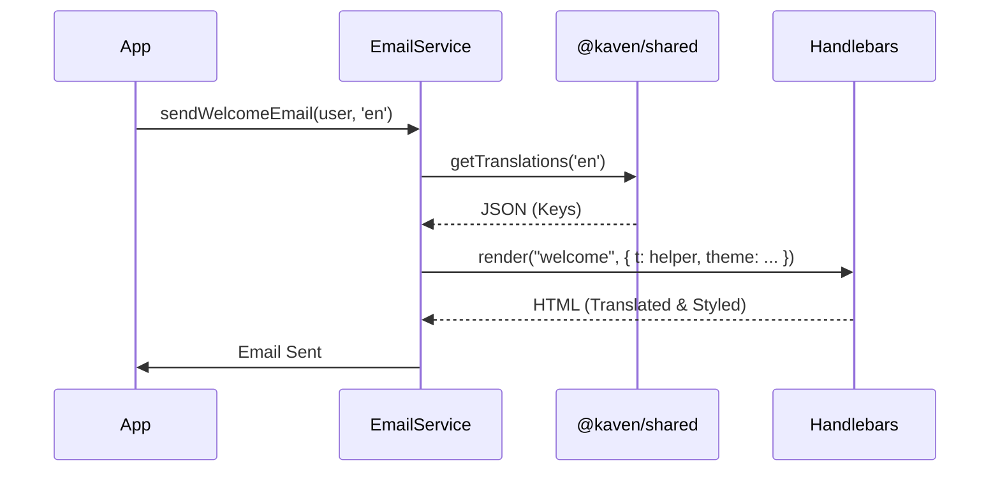

# Email System

> Sistema avançado de emails transacionais com suporte nativo a internacionalização (i18n), temas via Design System e templates dinâmicos.

## Visão Geral

O Email System do Kaven foi refatorado para oferecer uma experiência "Premium SaaS". Ele suporta múltiplos idiomas (`pt`, `en`), utiliza tokens de design compartilhados para consistência visual e inclui templates para cenários críticos de segurança e cobrança.

**Principais Features:**

- ✅ **Internacionalização (i18n):** Suporte nativo a `pt` (Português) e `en` (Inglês) em todos os emails.
- ✅ **Design System Compartilhado:** Cores e tipografia importados de `@kaven/shared` (SSOT), garantindo consistência com a plataforma.
- ✅ **Partials Reutilizáveis:** Componentes modulares (`header`, `footer`, `button`, `alert`) para manutenção fácil.
- ✅ **Ambiente de Desenvolvimento:** Integração automática com **MailHog** na porta 1025.
- ✅ **Tipagem Forte:** Interfaces TypeScript para garantir integridade dos dados injetados.

## Estrutura do Projeto

```
apps/api/src/templates/emails/
├── layouts/
│   └── main.hbs         # Esqueleto mestre (HTML, Head, Styles)
├── partials/
│   ├── header.hbs       # Logo com gradiente semântico
│   ├── footer.hbs       # Copyright dinâmico
│   ├── button.hbs       # CTA estilizado
│   └── alert.hbs        # Box de alertas (warning, error, info)
├── welcome.hbs
├── verification.hbs
├── reset-password.hbs
├── otp.hbs              # [Novo] Autenticação 2FA
├── security-alert.hbs   # [Novo] Login suspeito
├── payment-failed.hbs   # [Novo] Falha no pagamento
├── invite.hbs
└── invoice.hbs
```

## Como Funciona

1. **EmailService:** O serviço detecta o `locale` do usuário (padrão `pt`).
2. **Tradução:** Carrega as chaves do pacote `@kaven/shared/i18n`.
3. **Renderização:**
   - Compila o template `.hbs`.
   - Injta helpers (`t` para tradução, `formatCurrency` implícito via serviço).
   - Injta o tema (`emailTheme`) derivado de `theme.css`.
4. **Envio:** Dispara via SMTP (Nodemailer).

## Fluxo Técnico (i18n)



## API Reference

### `EmailService`

Instância singleton em `apps/api/src/lib/email.service.ts`. Todos os métodos aceitam um parâmetro opcional `locale`.

#### `sendWelcomeEmail(user, locale?)`

Envia email de boas-vindas.

#### `sendVerificationEmail(user, token, locale?)`

Link para verificação de conta.

#### `sendPasswordResetEmail(user, token, locale?)`

Link para redefinição de senha com alerta de segurança.

#### `sendOtpEmail(user, code, locale?)`

Envia código 2FA.

- **Template:** `otp.hbs`
- **Destaque:** Código em fonte monoespaçada e alerta de segurança.

#### `sendSecurityAlertEmail(user, details, locale?)`

Alerta sobre novo login.

- **Params:** `details: { device, location, ip }`
- **Template:** `security-alert.hbs`

#### `sendPaymentFailedEmail(user, locale?)`

Notificação de falha em renovação de assinatura.

- **Template:** `payment-failed.hbs`
- **Tom:** Urgente / Ação Necessária.

#### `sendInvoiceEmail(user, invoice, locale?)`

Notificação de Fatura.

- **Formatação:** Formata moeda (BRL/USD) e data automaticamente com base no locale.

## Customização

### Tema (Cores)

As cores são lidas de `packages/shared/src/theme/tokens.ts`.

- **Primary:** `#00AB55` (Kaven Green)
- **Secondary:** `#3366FF` (Kaven Blue)
- **Error/Sales:** `#FF5630`

Para alterar as cores dos emails, altere o arquivo de tokens compartilhado. Isso atualizará automaticamente o frontend e os emails.

### Traduções

Edite os arquivos JSON em `packages/shared/src/i18n/locales/`:

- `pt.json` (Português)
- `en.json` (Inglês)

## Troubleshooting

### Placeholder `{{year}}` não renderiza

O ano corrente é injetado automaticamente pelo `EmailService` no contexto global. Se não aparecer, verifique se o método `renderTemplate` está passando `year: new Date().getFullYear()`.

### Estilos quebrados no Gmail

O Gmail remove tags `<style>` do `<head>`. Todos os estilos críticos no Kaven Email System são aplicados **inline** nos elementos HTML para garantir compatibilidade máxima.
