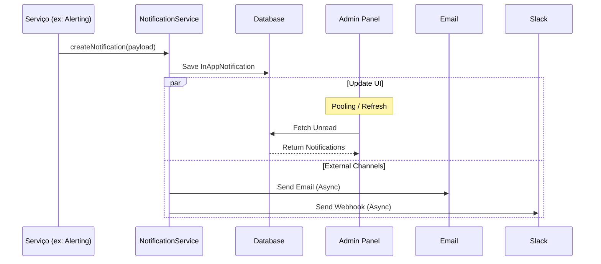

# Notification System

> Sistema robusto para envio e gerenciamento de notificações multi-canal.

## Visão Geral

O Notification System é responsável por centralizar toda a comunicação outbound da plataforma. Ele permite que diferentes módulos (Observability, Billing, Security) disparem alertas e mensagens para os usuários através de múltiplos canais.

**Principais Features:**

- ✅ **Centralizado:** Único ponto de entrada para notificações.
- ✅ **Multi-canal:** Suporte a In-App (Header), Email, Slack e Webhooks.
- ✅ **Persistência:** Notificações In-App são salvas no banco de dados.
- ✅ **Priorização:** Suporte a níveis `low`, `medium`, `high` e `critical`.
- ✅ **Tempo Real:** Verificação automática de alertas em background.

## Como Funciona

1. **Trigger:** Um serviço (ex: `AlertingService`) detecta uma condição (ex: CPU > 80%).
2. **Processamento:** O serviço chama `notificationService.createNotification()`.
3. **Persistência:** A notificação é salva na tabela `InAppNotification`.
4. **Entrega:**
   - **In-App:** Disponível imediatamente no painel administrativo.
   - **Canais Externos:** Enviada via drivers específicos (Email/Slack).

## Fluxo Técnico



## Exemplos de Uso

### Criar Notificação (Backend)

Use o `notificationService` para disparar notificações de qualquer lugar do backend.

```typescript
import { notificationService } from '@/modules/notifications/services/notification.service';

await notificationService.createNotification({
  userId: 'user_uuid',
  type: 'system',
  priority: 'high',
  title: 'Backup Concluído',
  message: 'O backup diário foi realizado com sucesso.',
  metadata: {
    backupId: 'bkp_123',
    size: '1.2GB',
  },
  actionUrl: '/settings/backups',
  actionText: 'Ver Detalhes',
});
```

### Consumir Notificações (Frontend)

O frontend utiliza o `NotificationContext` para gerenciar o estado global.

```typescript
import { useNotifications } from '@/contexts/notification-context';

export function MyComponent() {
  const { state, markAsRead } = useNotifications();

  return (
    <div>
      <p>Não lidas: {state.unreadCount}</p>
      {state.notifications.map(n => (
        <div key={n.id} onClick={() => markAsRead(n.id)}>
          {n.title}
        </div>
      ))}
    </div>
  );
}
```

## API Reference

### `createNotification(data)`

Cria e dispara uma nova notificação.

**Parâmetros:**

- `userId` (string) - ID do usuário destinatário.
- `type` (NotificationType) - `system`, `user`, `security`, `automation`, `payment`.
- `priority` (NotificationPriority) - `low`, `medium`, `high`, `critical`.
- `title` (string) - Título curto.
- `message` (string) - Mensagem detalhada.
- `metadata` (object?) - Dados arbitrários para uso futuro.
- `actionUrl` (string?) - Link para ação.
- `actionText` (string?) - Texto do botão de ação.

**Retorna:** `Promise<InAppNotification>`

## Integração com Observability

O módulo de Observabilidade utiliza o Notification System para alertas de infraestrutura.

- **Monitoramento:** O `MetricsUpdaterService` roda a cada 10s.
- **Verificação:** Chama `AlertingService.checkMetrics()`.
- **Disparo:** Se um threshold for violado, cria notificação para todos os `SUPER_ADMIN`.

> [!IMPORTANT]
> Certifique-se de que os usuários `SUPER_ADMIN` existam no banco de dados para receberem alertas de sistema.

## Troubleshooting

### Notificações não aparecem no Header

1. **Verifique o Usuário:** A notificação foi criada para o `userId` correto?
2. **Verifique o Robô:** O `MetricsUpdaterService` está rodando? (Logs: `[MetricsUpdater] Starting...`)
3. **Verifique o Banco:** Consulte a tabela `InAppNotification` para ver se o registro existe.

```sql
SELECT * FROM "InAppNotification" ORDER BY "createdAt" DESC LIMIT 5;
```
