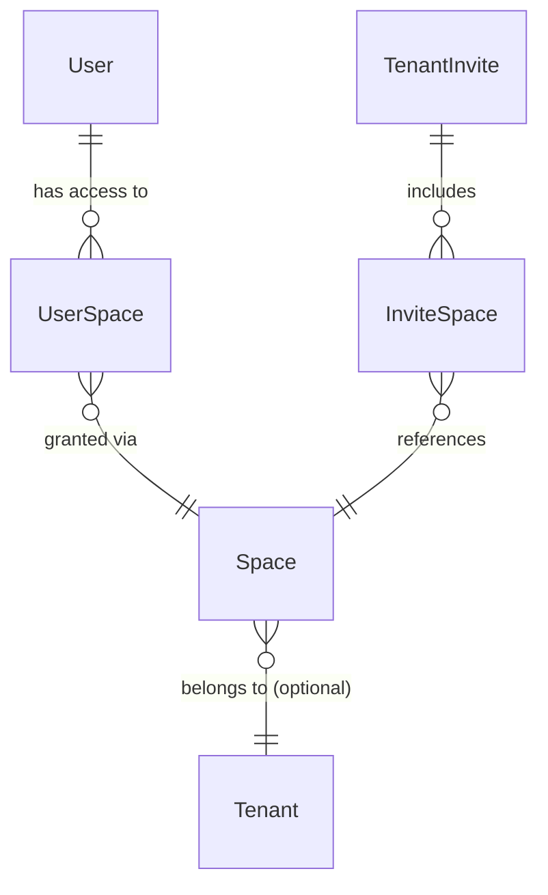

import { Callout } from 'nextra/components';

# Spaces & Permission System

> Sistema robusto e configurável para segmentação de acesso e permissões granulares dentro de tenants.

## Overview

O **Spaces & Permission System** resolve a limitação do RBAC tradicional (limitado a roles fixas como Admin/User) introduzindo o conceito de **Spaces**. Spaces são contêineres lógicos de permissões que podem representar departamentos (Financeiro, Marketing), projetos ou áreas funcionais.

**Principais Benefícios:**

- ✅ **Granularidade**: Permissões específicas por área de negócio e não apenas por nível hierárquico.
- ✅ **Configurabilidade**: Spaces podem ser criados, editados e removidos dinamicamente (diferente de Enums).
- ✅ **Multi-Space**: Um usuário pode pertencer a múltiplos spaces simultaneamente.
- ✅ **Isolamento**: Permite que um admin financeiro tenha poderes totais em Finanças, mas nenhum acesso a DevOps.

---

## Estrutura de Dados

O sistema é construído sobre três novos modelos no banco de dados, desenhados para flexibilidade e performance.

### 1. Modelo `Space`

Representa uma área funcional. Pode ser global (definido pela plataforma) ou específico de um Tenant.

```prisma
model Space {
  id          String   @id @default(uuid())
  tenantId    String?  // null = Global Space (Platform-wide)
  code        String   // Ex: 'FINANCE', 'MARKETING'
  name        String   // Ex: 'Finance Dept'

  // UI Display
  icon        String   @default("Folder")
  color       String   @default("#6B7280")

  // Base Permissions
  defaultPermissions String[] // ['view:invoices', 'manage:refunds']

  // ... timestamps & relations
}
```

### 2. Modelo `UserSpace` (Join Table)

A tabela de junção entre Usuários e Spaces. É aqui que a mágica da personalização acontece.

```prisma
model UserSpace {
  userId    String
  spaceId   String

  // Permission Override
  // Permite adicionar ou remover permissões específicas para este usuário neste space
  // sem afetar o Space original ou outros usuários.
  customPermissions String[]

  // ... timestamps & relations
}
```

### 3. Modelo `InviteSpace`

Permite definir o acesso a spaces já no momento do convite.

```prisma
model InviteSpace {
  inviteId  String
  spaceId   String

  // ... timestamps & relations
}
```

---

## Diagrama de Relacionamento

A arquitetura utiliza relações many-to-many explícitas para máxima flexibilidade de consulta.



---

## Fluxo de Permissões

A verificação de acesso segue uma lógica de "Camadas de Cebola":

1. **Super Admin Bypass**: Se `user.role === 'SUPER_ADMIN'`, acesso total.
2. **Tenant Admin Bypass**: Se `user.role === 'TENANT_ADMIN'` E o recurso não exigir space específico (legacy compat), acesso permitido.
3. **Space Check**: Verifica se o usuário tem registro em `UserSpace` para o space requerido.
4. **Permission Check**: Verifica `customPermissions` (se houver) OU `space.defaultPermissions`.

### Exemplo de Middlewares

```typescript
// Middleware para proteger rota Financeira
export function requireFinanceSpace(req, res, next) {
  const user = req.user;

  // 1. Check
  if (user.role === 'SUPER_ADMIN') return next();

  // 2. Space Check
  const financeAccess = user.userSpaces.find(
    (us) => us.space.code === 'FINANCE',
  );

  if (!financeAccess) {
    return res.status(403).json({ error: 'Access denied to Finance Space' });
  }

  next();
}
```

---

## Migração e Compatibilidade

> [!IMPORTANT]
> O sistema foi projetado para coexistir com o antigo `user.metadata.internalRole` durante a fase de transição.

### Estratégia de Migração:

1. **Schema Update**: Tabelas criadas sem quebrar lógica existente.
2. **Data Seed**: Script popula spaces globais padrão (Admin, Finance, Support, Marketing, DevOps).
3. **User Migration**: Script lê `metadata.internalRole` e cria os registros `UserSpace` correspondentes.
4. **Code Switch**: Backend passa a verificar Spaces antes de metadata.

---

## API Reference (Future)

Endpoints planejados para a Fase 2 de implementação:

| Método   | Endpoint                | Descrição                                 |
| :------- | :---------------------- | :---------------------------------------- |
| `GET`    | `/api/spaces`           | Lista spaces disponíveis para o usuário   |
| `POST`   | `/api/admin/spaces`     | Cria um novo space (Super Admin)          |
| `PUT`    | `/api/admin/spaces/:id` | Atualiza permissões ou metadados do space |
| `DELETE` | `/api/admin/spaces/:id` | Remove um space e revoga acessos          |

---

## Relacionados

- [RBAC Middleware](/platform/features/RBAC_MIDDLEWARE)
- [Authentication](/platform/backend/authentication)
- [Database Schema](/platform/database)
