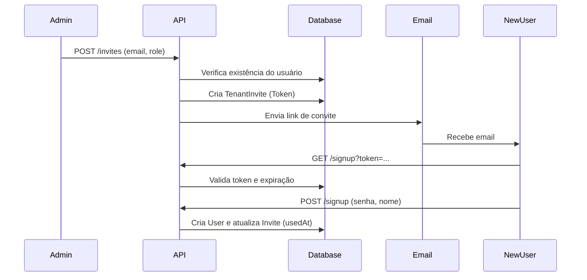

# User Invites

> Sistema completo para convidar novos usuários para um Tenant específico garantindo segurança e validação.

## Visão Geral

O sistema de convites permite que administradores adicionem novos membros ao seu espaço de trabalho (Tenant) de forma segura. O fluxo envolve a geração de um token único criptograficamente seguro, envio de email e validação na aceitação.

**Principais Features:**

- ✅ Geração de tokens únicos (32 bytes hex)
- ✅ Validade de 7 dias (configurável)
- ✅ Envio de email transacional automático
- ✅ Validação de estado (Pendente, Aceito, Expirado)
- ✅ Atribuição automática de Tenant e Role no cadastro

## Fluxo Técnico



## API Reference

### `createInvite(data)`

Gera um novo convite e envia por email.

**Parâmetros:**

- `email` (string) - Email do novo usuário
- `role` (Role) - Função no sistema (`USER` ou `TENANT_ADMIN`)
- `tenantId` (string) - ID da organização
- `invitedById` (string) - ID do adm que convidou

**Exemplo:**

```typescript
await inviteService.createInvite({
  email: 'colleague@company.com',
  role: Role.USER,
  tenantId: 'tenant_123',
  invitedById: 'user_456',
});
```

### `validateInvite(token)`

Verifica se um token é válido, não expirou e não foi usado.

**Retorna:** `TenantInvite` ou lança erro.

**Erros Possíveis:**

- `Invalid invite token`
- `Invite already used`
- `Invite expired`

### `acceptInvite(token, userData)`

Finaliza o cadastro do usuário convidado.

**Parâmetros:**

- `password` (string) - Senha escolhida pelo usuário
- `name` (string) - Nome completo

## Implementação Frontend

O diálogo de convite (`invite-dialog.tsx`) utiliza a instância `api` (Axios) configurada com interceptors para garantir que o Tenant ID e Token de autenticação sejam enviados corretamente.

```tsx
const inviteMutation = useMutation({
  mutationFn: async (data) => {
    // api injeta automaticamente Authorization e X-Tenant-Id
    const response = await api.post('/api/users/invites', data);
    return response.data;
  },
});
```
