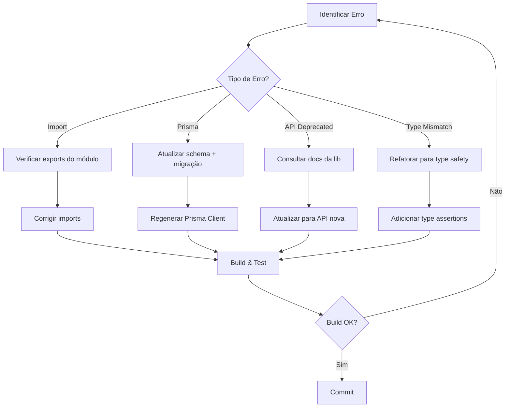

# Resolução de Erros de Tipo TypeScript

> Guia prático para resolver os erros de tipo mais comuns no projeto Kaven, com soluções robustas e completas

## Visão Geral

Este guia documenta as correções de 13 erros de tipo TypeScript identificados no projeto Kaven, abrangendo frontend e backend. Todas as soluções implementadas são **robustas e completas**, evitando paliativos temporários.

**Escopo das Correções:**

- ✅ 3 erros no frontend (componentes React)
- ✅ 10 erros no backend (Prisma, Sentry, serviços)
- ✅ 100% de resolução (0 erros restantes)

---

## Erros de Frontend

### 1. Select Component - Imports Incorretos

**Sintoma:**

```typescript
// ❌ ERRO
Module '"../ui/select"' has no exported member 'SelectTrigger'
```

**Causa:** Tentativa de importar componentes Radix UI que não existem no projeto.

**Solução:**

```typescript
// ✅ CORRETO - Usar API customizada
import { Select, SelectOption } from '../ui/select';

<Select
  value={filterType}
  onChange={(value) => setFilterType(value)}
  placeholder="Tipo"
>
  <SelectOption value="all">Todos os tipos</SelectOption>
  <SelectOption value="system">Sistema</SelectOption>
</Select>
```

**Arquivo:** `apps/admin/components/notifications/notification-dropdown.tsx`

---

### 2. ScrollArea Component Inexistente

**Sintoma:**

```typescript
// ❌ ERRO
Module '"../ui/scroll-area"' not found
```

**Causa:** Componente `ScrollArea` não existe no projeto.

**Solução:**

```tsx
// ✅ CORRETO - Usar div com overflow
<div className="max-h-96 overflow-y-auto">
  {notifications.map((notification) => (
    <NotificationItem key={notification.id} notification={notification} />
  ))}
</div>
```

**Arquivo:** `apps/admin/components/notifications/notification-dropdown.tsx`

---

### 3. Notifications API - Autenticação Ausente

**Sintoma:**

```
401 Unauthorized em /api/notifications
```

**Causa:** Uso de `axios` puro sem interceptors de autenticação.

**Solução:**

```typescript
// ❌ ANTES
import axios from 'axios';
const response = await axios.get(`${API_URL}/api/notifications`);

// ✅ DEPOIS - Usar instância configurada
import { api } from '../api';
const response = await api.get('/api/notifications');
```

**Impacto:** Resolve erro 401 e habilita refresh automático de tokens.

**Arquivo:** `apps/admin/lib/api/notifications.ts`

---

## Erros de Backend

### 4. Sentry API Deprecated

**Sintoma:**

```typescript
// ❌ ERRO
'ProfilingIntegration' is deprecated
'Integrations.Http' does not exist
```

**Causa:** Uso de API deprecated do Sentry v9.

**Solução:**

```typescript
// ❌ ANTES (Sentry v9)
import { ProfilingIntegration } from '@sentry/profiling-node';
integrations: [
  new ProfilingIntegration(),
  new Sentry.Integrations.Http({ tracing: true }),
];

// ✅ DEPOIS (Sentry v10)
import { nodeProfilingIntegration } from '@sentry/profiling-node';
integrations: [nodeProfilingIntegration(), Sentry.httpIntegration()];
```

**Arquivo:** `apps/api/src/lib/sentry.ts`

---

### 5-6. NestJS em Projeto Fastify

**Sintoma:**

```typescript
// ❌ ERRO
Cannot find module '@nestjs/common'
```

**Causa:** Imports de NestJS em projeto baseado em Fastify.

**Solução:**

```typescript
// ❌ ANTES
import { Injectable } from '@nestjs/common';

@Injectable()
export class EntitlementService {}

// ✅ DEPOIS
export class EntitlementService {}
```

**Arquivos:**

- `apps/api/src/modules/subscriptions/services/entitlement.service.ts`
- `apps/api/src/modules/subscriptions/services/usage-tracking.service.ts`

---

### 7. Prisma Schema - productId Obrigatório

**Sintoma:**

```typescript
// ❌ ERRO
Type 'string | null' is not assignable to type 'string'
```

**Causa:** Schema Prisma define `productId` como obrigatório, mas lógica permite `null`.

**Solução:**

```prisma
// ❌ ANTES
model Purchase {
  productId String @map("product_id")
  product Product @relation(...)
}

// ✅ DEPOIS
model Purchase {
  productId String? @map("product_id")
  product Product? @relation(...)
}
```

**Migração:**

```bash
npx prisma migrate dev --name make_product_id_optional
npx prisma generate
```

**Arquivo:** `prisma/schema.prisma`

> [!IMPORTANT]
> Sempre regenere o Prisma Client após alterar o schema: `npx prisma generate`

---

### 8-12. Usage Tracking - featureCode vs featureId

**Sintoma:**

```typescript
// ❌ ERRO
Object literal may only specify known properties, and 'tenantId_featureCode'
does not exist in type 'UsageRecordWhereUniqueInput'
```

**Causa:** Código usa `featureCode` (string), mas schema Prisma usa `featureId` (UUID).

**Solução Robusta - Refatoração Completa:**

```typescript
// ✅ NOVO - Método principal usa featureId
async incrementUsage(
  tenantId: string,
  featureId: string,
  amount: number = 1
): Promise<void> {
  await prisma.usageRecord.upsert({
    where: {
      tenantId_featureId_periodStart: {
        tenantId,
        featureId,
        periodStart: this.getPeriodStart(new Date())
      }
    },
    update: {
      currentUsage: { increment: amount }
    },
    create: {
      tenantId,
      featureId,
      currentUsage: amount,
      periodStart: this.getPeriodStart(new Date()),
      periodEnd: this.getNextPeriodEnd()
    }
  });
}

// ✅ NOVO - Método auxiliar para compatibilidade
async incrementUsageByCode(
  tenantId: string,
  featureCode: string,
  amount: number = 1
): Promise<void> {
  const feature = await prisma.feature.findUnique({
    where: { code: featureCode }
  });

  if (!feature) {
    throw new Error(`Feature "${featureCode}" não encontrada`);
  }

  await this.incrementUsage(tenantId, feature.id, amount);
}
```

**Benefícios:**

- ✅ Alinhamento total com schema Prisma
- ✅ Métodos `ByCode` mantêm compatibilidade
- ✅ Validação robusta de features
- ✅ Type safety garantido

**Arquivo:** `apps/api/src/modules/subscriptions/services/usage-tracking.service.ts`

---

### 13. Error Handler - Tipo Unknown

**Sintoma:**

```typescript
// ❌ ERRO
'error' is of type 'unknown'
```

**Causa:** Fastify tipifica `error` como `unknown` por segurança.

**Solução:**

```typescript
// ❌ ANTES
fastify.setErrorHandler((error: any, request, reply) => {
  error: error.message, // TS18046
});

// ✅ DEPOIS
fastify.setErrorHandler((error: any, request, reply) => {
  error: (error as Error).message,
});
```

**Arquivo:** `apps/api/src/server.ts`

---

## Fluxo de Correção Recomendado



---

## Checklist de Validação

Após corrigir erros de tipo, execute:

### Build Validation

```bash
# Backend
cd apps/api
pnpm run build  # Deve retornar exit code 0

# Frontend
cd apps/admin
pnpm run build  # Deve retornar exit code 0
```

### Type Checking

```bash
# Backend
cd apps/api
pnpm exec tsc --noEmit

# Frontend
cd apps/admin
pnpm exec tsc --noEmit
```

### Prisma Validation

```bash
# Validar schema
npx prisma validate

# Verificar migrações pendentes
npx prisma migrate status
```

---

## Princípios de Correção

### 1. Soluções Robustas, Não Paliativas

❌ **Evite:**

```typescript
// Paliativo - apenas mascara o erro
const productId = data.productId ?? undefined;
```

✅ **Prefira:**

```prisma
// Solução robusta - corrige a raiz do problema
model Purchase {
  productId String? @map("product_id")  // Torna opcional
}
```

### 2. Refatoração Completa

❌ **Evite:**

```typescript
// Conversões manuais em todo lugar
const featureId = await getFeatureIdFromCode(featureCode);
```

✅ **Prefira:**

```typescript
// Métodos dedicados com validação
async incrementUsageByCode(tenantId: string, featureCode: string) {
  const feature = await this.validateFeature(featureCode);
  await this.incrementUsage(tenantId, feature.id);
}
```

### 3. Type Safety First

❌ **Evite:**

```typescript
const error: any = ...;  // Perde type safety
```

✅ **Prefira:**

```typescript
const error = ... as Error;  // Mantém type safety
```

---

## Troubleshooting Comum

### Erro Persiste Após Correção

**Problema:** Erro continua mesmo após corrigir o código.

**Soluções:**

```bash
# 1. Limpar cache do TypeScript
rm -rf node_modules/.cache

# 2. Regenerar Prisma Client
npx prisma generate

# 3. Reiniciar TypeScript server (VSCode)
# Cmd+Shift+P > "TypeScript: Restart TS Server"

# 4. Rebuild completo
pnpm run clean
pnpm install
pnpm run build
```

### Migração Prisma Falha

**Problema:** `prisma migrate dev` retorna erro.

**Soluções:**

```bash
# 1. Verificar conexão com banco
npx prisma db pull

# 2. Resetar banco (DEV ONLY!)
npx prisma migrate reset

# 3. Aplicar migração manualmente
npx prisma migrate deploy
```

### Build Passa, Runtime Falha

**Problema:** Build TypeScript OK, mas erro em runtime.

**Causa:** Type assertions incorretas ou dados inválidos.

**Solução:**

```typescript
// ✅ Adicionar validação em runtime
import { z } from 'zod';

const schema = z.object({
  productId: z.string().optional(),
});

const validated = schema.parse(data);
```

---

## Ferramentas Úteis

### VSCode Extensions

- **Prisma** - Syntax highlighting para schema
- **ESLint** - Detecta problemas de código
- **Error Lens** - Mostra erros inline

### Scripts Úteis

```json
{
  "scripts": {
    "type-check": "tsc --noEmit",
    "type-check:watch": "tsc --noEmit --watch",
    "prisma:validate": "prisma validate",
    "prisma:format": "prisma format"
  }
}
```

---

## Relacionados

- [Prisma Schema Reference](/platform/backend/prisma-schema)
- [TypeScript Best Practices](/platform/guides/typescript-best-practices)
- [API Error Handling](/platform/backend/error-handling)
- [Testing Guide](/platform/guides/testing)
