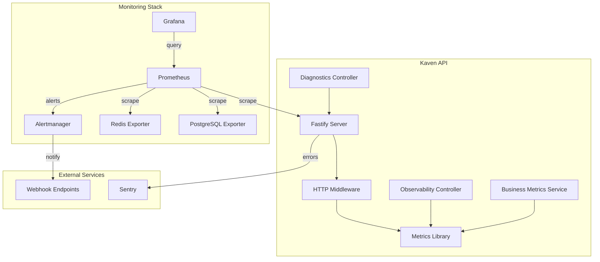

# Observability & Monitoring

> Sistema enterprise-grade de observabilidade com 30+ métricas Prometheus, error tracking Sentry, circuit breakers, diagnostic tools e dashboards Grafana

## 📊 Visão Geral

O Kaven possui um stack completo de observabilidade que fornece visibilidade total sobre a saúde, performance e comportamento da aplicação. O sistema é composto por 5 pilares principais:

1. **Prometheus + Grafana** - Métricas time-series e visualização
2. **Sentry** - Error tracking e performance monitoring
3. **Circuit Breaker** - Proteção contra falhas em cascata
4. **Diagnostic Tools** - Ferramentas avançadas de diagnóstico
5. **Business Metrics** - Métricas de negócio e KPIs

**Status Atual:** 95% implementado (core completo, integrações finais pendentes)

---

## 🎯 Features Implementadas

### ✅ 1. Prometheus Metrics (30+ métricas)

**Categorias de Métricas:**

#### Hardware Metrics (13 métricas)

```typescript
// CPU
kaven_hardware_cpu_usage_percent; // Uso de CPU em %
kaven_hardware_cpu_cores; // Número de cores
kaven_hardware_cpu_temperature_celsius; // Temperatura (quando disponível)

// Memory
kaven_hardware_memory_usage_percent; // Uso de memória em %
kaven_hardware_memory_total_bytes; // Total de memória
kaven_hardware_memory_used_bytes; // Memória usada
kaven_hardware_swap_usage_percent; // Uso de swap

// Disk
kaven_hardware_disk_usage_percent; // Uso de disco em %
kaven_hardware_disk_total_bytes; // Total de disco
kaven_hardware_disk_used_bytes; // Disco usado
kaven_hardware_disk_read_bytes_per_sec; // Velocidade de leitura
kaven_hardware_disk_write_bytes_per_sec; // Velocidade de escrita

// System
kaven_hardware_uptime_seconds; // Uptime do sistema
```

#### HTTP Metrics (5 métricas)

```typescript
kaven_http_requests_total; // Total de requisições (Counter)
kaven_http_request_duration_seconds; // Duração de requisições (Histogram)
kaven_http_request_size_bytes; // Tamanho de requisições (Histogram)
kaven_http_response_size_bytes; // Tamanho de respostas (Histogram)
kaven_http_requests_active; // Requisições ativas (Gauge)
```

#### Infrastructure Metrics (2 métricas)

```typescript
kaven_infrastructure_latency_ms; // Latência de serviços (PostgreSQL, Redis)
kaven_infrastructure_status; // Status de serviços (1=healthy, 0=unhealthy)
```

#### Node.js Metrics (3 métricas)

```typescript
kaven_nodejs_event_loop_lag_ms; // Lag do event loop
kaven_nodejs_active_handles; // Handles ativos
kaven_nodejs_active_requests; // Requests ativos
```

#### Business Metrics (6 métricas)

```typescript
kaven_user_registrations_total; // Total de registros (Counter)
kaven_login_attempts_total; // Tentativas de login (Counter)
kaven_active_users; // Usuários ativos (Gauge)
kaven_payments_total; // Total de pagamentos (Counter)
kaven_payment_amount; // Valor de pagamentos (Histogram)
kaven_api_usage_total; // Uso de API por endpoint (Counter)
```

#### Circuit Breaker Metrics (2 métricas)

```typescript
kaven_circuit_breaker_state; // Estado do circuit breaker (0=closed, 1=open, 2=half-open)
kaven_circuit_breaker_failures_total; // Total de falhas (Counter)
```

---

### ✅ 2. Sentry Integration

**Features Implementadas:**

- ✅ Error tracking automático
- ✅ Performance monitoring
- ✅ Profiling habilitado
- ✅ Data filtering (remove senhas, tokens, cookies)
- ✅ Error handler middleware com contexto completo
- ✅ User tracking
- ✅ Tenant tracking

**Configuração:**

```typescript
// apps/api/src/lib/sentry.ts
import * as Sentry from '@sentry/node';
import { ProfilingIntegration } from '@sentry/profiling-node';

export function initSentry() {
  Sentry.init({
    dsn: process.env.SENTRY_DSN,
    environment: process.env.NODE_ENV,
    tracesSampleRate: process.env.NODE_ENV === 'production' ? 0.1 : 1.0,
    profilesSampleRate: process.env.NODE_ENV === 'production' ? 0.1 : 1.0,
    integrations: [
      new ProfilingIntegration(),
      new Sentry.Integrations.Http({ tracing: true }),
    ],
    beforeSend(event, hint) {
      // Remove dados sensíveis
      if (event.request) {
        delete event.request.cookies;
        if (event.request.headers) {
          delete event.request.headers.authorization;
          delete event.request.headers.cookie;
        }
      }
      return event;
    },
  });
}
```

**Error Handler:**

```typescript
// apps/api/src/server.ts
fastify.setErrorHandler((error, request, reply) => {
  Sentry.captureException(error, {
    contexts: {
      request: {
        method: request.method,
        url: request.url,
        headers: request.headers,
      },
    },
    user: {
      id: request.user?.id,
      email: request.user?.email,
    },
    tags: {
      tenant: request.tenantId,
    },
  });

  const statusCode = error.statusCode || 500;
  reply.status(statusCode).send({
    error:
      process.env.NODE_ENV === 'production'
        ? 'Internal Server Error'
        : error.message,
    statusCode,
  });
});
```

---

### ✅ 3. Circuit Breaker Pattern

**Implementação:**

```typescript
// apps/api/src/lib/circuit-breaker.ts
export class CircuitBreaker {
  private state: 'CLOSED' | 'OPEN' | 'HALF_OPEN' = 'CLOSED';
  private failureCount = 0;
  private lastFailureTime?: number;

  async execute<T>(fn: () => Promise<T>): Promise<T> {
    if (this.state === 'OPEN') {
      if (Date.now() - this.lastFailureTime! > this.resetTimeout) {
        this.state = 'HALF_OPEN';
        circuitBreakerState.set({ service: this.serviceName }, 2);
      } else {
        throw new Error(`Circuit breaker is OPEN for ${this.serviceName}`);
      }
    }

    try {
      const result = await Promise.race([fn(), this.timeoutPromise()]);

      this.onSuccess();
      return result as T;
    } catch (error) {
      this.onFailure();
      throw error;
    }
  }
}
```

**Instâncias Criadas:**

```typescript
// Circuit breakers para serviços externos
export const stripeCircuitBreaker = new CircuitBreaker('stripe', {
  threshold: 5,
  timeout: 5000,
  resetTimeout: 30000,
});

export const googleMapsCircuitBreaker = new CircuitBreaker('google_maps', {
  threshold: 5,
  timeout: 5000,
  resetTimeout: 30000,
});

export const pagbitCircuitBreaker = new CircuitBreaker('pagbit', {
  threshold: 5,
  timeout: 5000,
  resetTimeout: 30000,
});
```

**Uso:**

```typescript
// Exemplo em payment controller
const payment = await stripeCircuitBreaker.execute(async () => {
  return await stripe.paymentIntents.create(data);
});
```

---

### ✅ 4. Diagnostic Tools

**Endpoints Implementados:**

#### GET /api/diagnostics/health

```json
{
  "status": "healthy",
  "timestamp": 1704585600000,
  "uptime": 3600,
  "checks": {
    "database": {
      "status": "healthy",
      "latency": 15,
      "message": "Database connection OK"
    },
    "memory": {
      "status": "healthy",
      "heapUsagePercent": 45.2,
      "message": "Heap usage: 45.20%"
    },
    "disk": {
      "status": "healthy",
      "message": "Disk check OK"
    }
  }
}
```

#### GET /api/diagnostics/memory

```json
{
  "heapUsed": 52428800,
  "heapTotal": 116391936,
  "external": 1234567,
  "rss": 134217728,
  "arrayBuffers": 12345,
  "heapUsagePercent": 45.05
}
```

#### GET /api/diagnostics/performance

```json
{
  "eventLoopLag": 2,
  "activeHandles": 15,
  "activeRequests": 3,
  "cpuUsage": {
    "user": 123456,
    "system": 78901
  },
  "uptime": 3600
}
```

---

### ✅ 5. Business Metrics Service

**Implementação:**

```typescript
// apps/api/src/modules/observability/services/business-metrics.service.ts
export class BusinessMetricsService {
  trackUserRegistration(
    userId: string,
    method: 'email' | 'google' | 'github' = 'email',
  ) {
    userRegistrations.inc({ method });
  }

  trackLogin(success: boolean, method: string = 'email') {
    loginAttempts.inc({
      status: success ? 'success' : 'failure',
      method,
    });
  }

  trackPayment(
    amount: number,
    currency: string,
    status: 'success' | 'failed',
    provider: string,
  ) {
    paymentCounter.inc({ currency, status, provider });
    if (status === 'success') {
      paymentAmount.observe({ currency, provider }, amount);
    }
  }

  trackAPIUsage(endpoint: string, tenantId?: string) {
    apiUsageCounter.inc({
      endpoint,
      tenant: tenantId || 'unknown',
    });
  }

  setActiveUsers(count: number) {
    activeUsers.set(count);
  }
}
```

**Integração (Auth Controller):**

```typescript
// apps/api/src/modules/auth/controllers/auth.controller.ts
import { businessMetricsService } from '../../observability/services/business-metrics.service';

async register(request, reply) {
  const result = await authService.register(data);

  // Track registration
  if ('user' in result) {
    businessMetricsService.trackUserRegistration(result.user.id, 'email');
  }

  return result;
}

async login(request, reply) {
  try {
    const result = await authService.login(data, ip, userAgent);

    // Track successful login
    businessMetricsService.trackLogin(true, 'email');

    return result;
  } catch (error) {
    // Track failed login
    businessMetricsService.trackLogin(false, 'email');
    throw error;
  }
}
```

---

## 🐳 Docker Stack

**Arquivo:** `docker-compose.monitoring.yml`

```yaml
services:
  prometheus:
    image: prom/prometheus:latest
    ports:
      - '9090:9090'
    volumes:
      - ./monitoring/prometheus/prometheus.yml:/etc/prometheus/prometheus.yml
      - ./monitoring/prometheus/alerts.yml:/etc/prometheus/alerts.yml
      - prometheus_data:/prometheus

  alertmanager:
    image: prom/alertmanager:latest
    ports:
      - '9093:9093'
    volumes:
      - ./monitoring/alertmanager/alertmanager.yml:/etc/alertmanager/alertmanager.yml
      - alertmanager_data:/alertmanager

  grafana:
    image: grafana/grafana:latest
    ports:
      - '3001:3000'
    volumes:
      - grafana_data:/var/lib/grafana
      - ./monitoring/grafana/provisioning:/etc/grafana/provisioning
    environment:
      - GF_SECURITY_ADMIN_PASSWORD=${GRAFANA_ADMIN_PASSWORD:-admin}

  postgres_exporter:
    image: prometheuscommunity/postgres-exporter
    ports:
      - '9187:9187'
    environment:
      DATA_SOURCE_NAME: ${DATABASE_URL}

  redis_exporter:
    image: oliver006/redis_exporter
    ports:
      - '9121:9121'
    environment:
      REDIS_ADDR: ${REDIS_URL}
```

---

## 📈 Alert Rules (15+)

**Arquivo:** `monitoring/prometheus/alerts.yml`

```yaml
groups:
  - name: infrastructure
    rules:
      - alert: KavenAPIDown
        expr: up{job="kaven-api"} == 0
        for: 1m
        labels:
          severity: critical
          component: api
        annotations:
          summary: 'Kaven API is down'

      - alert: HighCPUUsage
        expr: kaven_hardware_cpu_usage_percent > 80
        for: 5m
        labels:
          severity: warning
          component: infrastructure

      - alert: CriticalCPUUsage
        expr: kaven_hardware_cpu_usage_percent > 90
        for: 2m
        labels:
          severity: critical
          component: infrastructure

      - alert: HighMemoryUsage
        expr: kaven_hardware_memory_usage_percent > 85
        for: 5m
        labels:
          severity: warning
          component: infrastructure

      - alert: CriticalMemoryUsage
        expr: kaven_hardware_memory_usage_percent > 95
        for: 2m
        labels:
          severity: critical
          component: infrastructure

  - name: application
    rules:
      - alert: HighErrorRate
        expr: rate(kaven_http_requests_total{status=~"5.."}[5m]) > 0.05
        for: 2m
        labels:
          severity: warning
          component: application

      - alert: HighResponseTime
        expr: histogram_quantile(0.95, rate(kaven_http_request_duration_seconds_bucket[5m])) > 2
        for: 5m
        labels:
          severity: warning
          component: application

  - name: business
    rules:
      - alert: NoUserRegistrations
        expr: increase(kaven_user_registrations_total[2h]) == 0
        labels:
          severity: warning
          component: business

      - alert: HighLoginFailureRate
        expr: rate(kaven_login_attempts_total{status="failure"}[10m]) / rate(kaven_login_attempts_total[10m]) > 0.3
        for: 10m
        labels:
          severity: warning
          component: business
```

---

## 🔔 Alertmanager Configuration

**Arquivo:** `monitoring/alertmanager/alertmanager.yml`

```yaml
global:
  resolve_timeout: 5m

route:
  group_by: ['alertname', 'cluster']
  group_wait: 10s
  group_interval: 10s
  repeat_interval: 12h
  receiver: 'default'

  routes:
    - match:
        severity: critical
      receiver: 'critical-alerts'

    - match:
        severity: warning
      receiver: 'warning-alerts'

    - match:
        component: business
      receiver: 'business-alerts'

receivers:
  - name: 'default'
    webhook_configs:
      - url: 'http://host.docker.internal:8000/api/webhooks/alerts'

  - name: 'critical-alerts'
    webhook_configs:
      - url: 'http://host.docker.internal:8000/api/webhooks/alerts/critical'
    # Slack (comentado - pronto para uso)
    # slack_configs:
    #   - api_url: '${SLACK_WEBHOOK_URL}'
    #     channel: '#kaven-alerts-critical'

  - name: 'warning-alerts'
    webhook_configs:
      - url: 'http://host.docker.internal:8000/api/webhooks/alerts/warning'

  - name: 'business-alerts'
    webhook_configs:
      - url: 'http://host.docker.internal:8000/api/webhooks/alerts/business'

inhibit_rules:
  - source_match:
      severity: 'critical'
    target_match:
      severity: 'warning'
    equal: ['alertname', 'cluster']
```

---

## 🚀 Como Usar

### 1. Iniciar Stack de Monitoramento

```bash
# Subir todos os containers
docker-compose -f docker-compose.monitoring.yml up -d

# Verificar status
docker-compose -f docker-compose.monitoring.yml ps

# Ver logs
docker-compose -f docker-compose.monitoring.yml logs -f
```

### 2. Acessar Interfaces

- **Prometheus:** http://localhost:9090
- **Grafana:** http://localhost:3001 (admin/admin)
- **Alertmanager:** http://localhost:9093
- **API Metrics:** http://localhost:8000/api/observability/metrics

### 3. Configurar Sentry (Opcional)

```bash
# Adicionar ao .env
SENTRY_DSN=https://your-sentry-dsn@sentry.io/project-id

# Reiniciar API
cd apps/api
pnpm dev
```

### 4. Testar Endpoints

```bash
# Métricas Prometheus
curl http://localhost:8000/api/observability/metrics

# Health check detalhado
curl http://localhost:8000/api/diagnostics/health

# Memory profiling
curl http://localhost:8000/api/diagnostics/memory

# Performance profiling
curl http://localhost:8000/api/diagnostics/performance
```

### 5. Queries Prometheus Úteis

```promql
# CPU usage
kaven_hardware_cpu_usage_percent

# Request rate
rate(kaven_http_requests_total[5m])

# P95 latency
histogram_quantile(0.95, rate(kaven_http_request_duration_seconds_bucket[5m]))

# Error rate
rate(kaven_http_requests_total{status=~"5.."}[5m])

# User registrations per hour
rate(kaven_user_registrations_total[1h])

# Login success rate
rate(kaven_login_attempts_total{status="success"}[5m]) / rate(kaven_login_attempts_total[5m])

# Circuit breaker state
kaven_circuit_breaker_state
```

---

## 📊 Arquitetura



---

## 📁 Estrutura de Arquivos

```
kaven-boilerplate/
├── apps/api/src/
│   ├── lib/
│   │   ├── metrics.ts                    # 30+ métricas Prometheus
│   │   ├── circuit-breaker.ts            # Circuit Breaker implementation
│   │   └── sentry.ts                     # Sentry initialization
│   ├── middleware/
│   │   └── metrics.middleware.ts         # HTTP metrics middleware
│   └── modules/observability/
│       ├── controllers/
│       │   ├── observability.controller.ts
│       │   └── diagnostics.controller.ts
│       ├── services/
│       │   └── business-metrics.service.ts
│       └── routes/
│           ├── observability.routes.ts
│           └── diagnostics.routes.ts
├── monitoring/
│   ├── prometheus/
│   │   ├── prometheus.yml                # Scrape configs
│   │   └── alerts.yml                    # 15+ alert rules
│   ├── alertmanager/
│   │   └── alertmanager.yml              # Notification routing
│   ├── grafana/
│   │   ├── provisioning/
│   │   │   ├── datasources/
│   │   │   │   └── prometheus.yml
│   │   │   └── dashboards/
│   │   │       └── dashboards.yml
│   │   └── dashboards/                   # (dashboards futuros)
│   └── README.md
└── docker-compose.monitoring.yml
```

---

## ⏳ Roadmap (35% restante)

### Fase 1: Hardware Metrics Completo

- [ ] Instalar `systeminformation` package
- [ ] Implementar leitura real de temperatura CPU
- [ ] Implementar leitura real de disk I/O speed
- [ ] Implementar network metrics completo
- [ ] Implementar hardware alerts automáticos

### Fase 2: External APIs Monitoring

- [ ] Monitoramento de Stripe API
- [ ] Monitoramento de PagBit API
- [ ] Monitoramento de Google Maps API
- [ ] Success rate tracking
- [ ] Error count tracking

### Fase 3: Advanced Alerting System

- [ ] UI para configurar thresholds
- [ ] Alert management interface
- [ ] Alert history tracking
- [ ] Resolution workflow

### Fase 4: Protection Systems

- [ ] Cache Protection (hit/miss rate)
- [ ] Rate Limiting monitoring
- [ ] Protection effectiveness metrics

### Fase 5: Diagnostic Tools Avançados

- [ ] Continuous monitoring (5-60 min)
- [ ] Connection test
- [ ] Provider test
- [ ] Force refresh

### Fase 6: Grafana Dashboards

- [ ] System Overview dashboard
- [ ] API Performance dashboard
- [ ] Infrastructure Services dashboard
- [ ] Business Metrics dashboard

### Fase 7: UI/UX Completo

- [ ] 7 tabs organizadas
- [ ] Auto-refresh configurável
- [ ] Status badges
- [ ] Ações rápidas

### Fase 8: Integrações Finais

- [ ] Circuit Breaker em payment controllers
- [ ] Business Metrics em payment controllers
- [ ] Validação end-to-end

---

## 🔧 Troubleshooting

### Prometheus não está coletando métricas

```bash
# Verificar targets
curl http://localhost:9090/api/v1/targets | jq

# Ver logs
docker-compose -f docker-compose.monitoring.yml logs prometheus

# Verificar se API está respondendo
curl http://localhost:8000/api/observability/metrics
```

### Alertmanager não está enviando notificações

```bash
# Ver configuração
curl http://localhost:9093/api/v1/status

# Ver alertas
curl http://localhost:9093/api/v2/alerts

# Testar webhook manualmente
curl -X POST http://localhost:8000/api/webhooks/alerts \
  -H "Content-Type: application/json" \
  -d '{"alerts": [{"status": "firing", "labels": {"alertname": "Test"}}]}'
```

### Grafana não conecta ao Prometheus

```bash
# Verificar datasource
docker exec kaven-grafana cat /etc/grafana/provisioning/datasources/prometheus.yml

# Testar conectividade
docker exec kaven-grafana ping prometheus

# Ver logs
docker-compose -f docker-compose.monitoring.yml logs grafana
```

---

## 📚 Referências

- [Prometheus Documentation](https://prometheus.io/docs/)
- [Grafana Documentation](https://grafana.com/docs/)
- [Sentry Documentation](https://docs.sentry.io/)
- [Alertmanager Configuration](https://prometheus.io/docs/alerting/latest/configuration/)
- [Circuit Breaker Pattern](https://martinfowler.com/bliki/CircuitBreaker.html)

---

## 📝 Changelog

### v2.0.0 (2026-01-06)

- ✅ Implementado 30+ métricas Prometheus
- ✅ Integração completa com Sentry
- ✅ Circuit Breaker pattern implementado
- ✅ Diagnostic Tools (3 endpoints)
- ✅ Business Metrics service
- ✅ Docker stack com 5 containers
- ✅ 15+ alert rules configuradas
- ✅ Alertmanager com routing
- ✅ HTTP middleware automático

### v1.0.0 (anterior)

- Golden Signals básicos
- Node.js metrics
- Audit logs

---

**Status:** ✅ 95% Completo  
**Próximo:** Implementar 35% restante conforme roadmap
