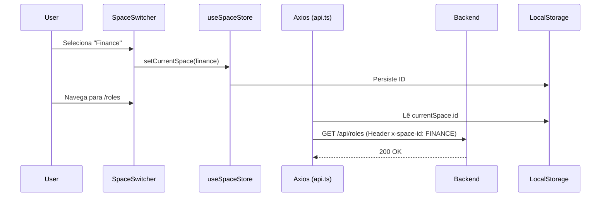

# Spaces & Permissions

O Kaven utiliza um modelo híbrido de **Spaces**, **Capabilities** e **Grants** para fornecer um sistema de autorização robusto, auditável e seguro. Diferente de sistemas RBAC tradicionais simples, o Kaven permite o controle granular de ações e dados através de múltiplos domínios operacionais.

## Visão Geral

Um **Space** representa um domínio operacional (ex.: Suporte, DevOps, Financeiro) que segmenta a navegação, as permissões e a visibilidade de dados.

### Princípios Fundamentais

- **Least Privilege**: Acesso mínimo necessário para a função.
- **Auditability First**: Responde quem, o quê, quando e por que.
- **Explicit Overrides**: Exceções são concedidas via Grants temporários.
- **Deny Wins**: Negações explícitas têm precedência absoluta.

---

## Arquitetura Técnica

A autorização é calculada em tempo real combinando diferentes camadas de permissões.

### Ordem de Resolução

1.  **SUPER_ADMIN Bypass**: Admin total do sistema.
2.  **DENY Grants**: Bloqueios explícitos por usuário/capability.
3.  **ADD Grants**: Exceções temporárias (Access Leasing).
4.  **Role Capabilities**: Permissões padrão do cargo no Space.
5.  **Policies Enforcement**: Validação de IP, MFA, Dispositivo e Horário.


---

## Capabilities

As **Capabilities** são a unidade atômica de permissão no Kaven. Elas definem `recurso.ação` (ex: `users.delete`).

### Categorias Principais

- **Support**: `tickets.read`, `impersonation.start`, `auth.2fa_reset.request`
- **Finance**: `billing.view`, `payments.refund`, `invoices.issue`
- **DevOps**: `observability.view_metrics`, `infrastructure.manage`
- **Management**: `tenants.cross_read`, `users.manage`, `invites.manage`

> [!IMPORTANT]
> Capabilities podem ser marcadas como **SENSITIVE** ou **CRITICAL**, exigindo obrigatoriamente MFA ou aprovação adicional.

---

## Grants & Access Leasing

O sistema de **Grants** permite a concessão de acesso temporário sem a necessidade de alterar a role permanente do usuário.

### Fluxo de Solicitação

1.  **Request**: O usuário solicita uma capability justificando a necessidade.
2.  **Review**: Um gestor com permissão `grant.review` aprova ou rejeita.
3.  **Activation**: O grant é ativado com expiração automática (default 7 dias).

```typescript
// Exemplo de criação de solicitação
const request = await grantRequestService.createRequest(userId, {
  capabilityId: 'payments.refund',
  justification: 'Necessário para resolver ticket #1234',
  requestedDuration: 3, // dias
  accessLevel: 'READ_WRITE',
});
```

---

## Security Policies

As políticas aplicam restrições contextuais dinâmicas à autorização.

| Política           | Descrição                                                      |
| :----------------- | :------------------------------------------------------------- |
| **IP Restriction** | Bloqueia acesso fora de faixas de IP/VPN autorizadas.          |
| **Device Trust**   | Exige que o dispositivo seja marcado como confiável.           |
| **Time-based**     | Restringe acesso a horários comerciais ou janelas específicas. |
| **MFA Required**   | Exige verificação em duas etapas para ações sensíveis.         |

---

## Data Masking & Privacidade

Para cumprir regulamentações como GDPR/LGPD, o Kaven implementa **Data Masking** automático em dados PII (Personally Identifiable Information).

### Comportamento

- Usuários sem a capability `users.view_pii` veem dados mascarados:
  - `email`: `jo***@domain.com`
  - `phone`: `+55 (11) *****-4432`
  - `address`: `Rua Am***... (Ocultado)`

---

## Impersonation

Permite que a equipe de suporte aja em nome de um usuário para fins de depuração.

> [!CAUTION]
> Toda sessão de Impersonation dispara um alerta de segurança **CRÍTICO** para o usuário final e é limitada a 30 minutos por padrão.

### Regras de Segurança

- Auditoria completa de todas as ações executadas durante a sessão.
- Bloqueio automático de ações críticas (Reset de 2FA, Mudança de Senha).

---

## Auditoria & Logs

O Kaven mantém um registro imutável de todos os eventos de segurança.

- **Capability Logs**: Registra cada verificação de autorização (Sucesso/Falha).
- **Grant Audit**: Histórico de quem concedeu acessos e por que.
- **Export Control**: Auditoria granular de quem baixou CSVs, com contagem de registros e campos.

---

---

## Implementação Técnica (Admin Context)

A estabilidade do sistema de permissões no Admin depende da propagação correta do contexto do Space em cada requisição.

### Propagação de Contexto (HTTP)

O Kaven utiliza interceptores do **Axios** em `apps/admin/lib/api.ts` para garantir que o contexto seja enviado de forma transparente para o backend.

- **Header `x-space-id`**: Enviado em todas as chamadas para a API. O valor é obtido dinamicamente do `localStorage` (chave `space-storage-v2`).
- **Header `X-Tenant-ID`**: Propagado para garantir o isolamento multi-tenant.
- **Fail-Secure**: Se nenhum Space estiver selecionado ou persistido, o header não é enviado, e o backend aplica as políticas globais ou nega o acesso por padrão.

### Gerenciamento de Estado (Space Store)

O contexto do Space é gerenciado centralmente pelo `useSpaceStore` (Zustand), que coordena:

1.  **Hydration**: Recupera o último Space selecionado do armazenamento persistente ao carregar o Admin.
2.  **Sync**: Garante que o switcher de espaços (`SpaceSwitcher`) reflita o estado global.
3.  **API Integration**: Utiliza o cliente `api` pré-configurado para carregar a lista de espaços, garantindo que o carregamento inicial ocorra sob autenticação válida.



---

## API Reference

### Admin HTTP Client (`lib/api.ts`)

O cliente `api` é o **source of truth** para comunicações com o backend.

- **Request Interceptor**: Injeta `Authorization`, `X-Tenant-ID` e `x-space-id`.
- **Response Interceptor**: Gerencia automaticamente o refresh de tokens (401) e redirecionamento para login em caso de expiração total.

### `grantRequestService`

Localizado em `apps/admin/services/grant-request.service.ts`, este serviço unifica as operações de Access Leasing.

- `listPending()`: Lista solicitações aguardando aprovação para o contexto atual.
- `review(requestId, data)`: Aprova ou rejeita (`APPROVED` | `REJECTED`) justificando a decisão.

### `spaceStore`

Localizado em `apps/admin/stores/space.store.ts`, gerencia a lista de domínios operacionais.

- `fetchSpaces()`: Carrega os espaços disponíveis para o usuário autenticado.
- `setCurrentSpace(space)`: Altera o contexto ativo globalmente.
