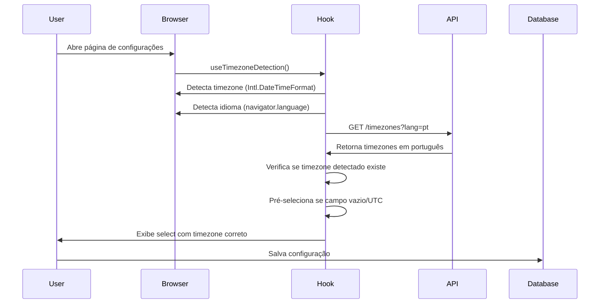

# Sistema de Timezones Multi-idioma

> Sistema completo de timezones com auto-detecção, suporte multi-idioma (pt/en) e horário de verão automático usando zonas IANA.

## Visão Geral

O Sistema de Timezones Multi-idioma é uma solução robusta para gerenciamento de fusos horários na plataforma. Ele detecta automaticamente o timezone do navegador do usuário, exibe labels no idioma correto (português ou inglês) e garante que o horário de verão funcione automaticamente usando zonas IANA.

**Principais Features:**

- ✅ Auto-detecção de timezone do navegador
- ✅ Auto-detecção de idioma (pt/en) baseado no locale do usuário
- ✅ Suporte a horário de verão automático (IANA zones)
- ✅ Agrupamento visual por continente
- ✅ API backend com parâmetro de idioma
- ✅ Hooks reutilizáveis para detecção
- ✅ Cache inteligente por idioma

## Como Funciona

### Fluxo de Auto-detecção



### Por que IANA Zones?

Offsets fixos (`-3h`) **não funcionam** para horário de verão:

- Nova York: `-5h` no inverno (EST), `-4h` no verão (EDT)
- São Paulo: `-3h` o ano todo (Brasil aboliu horário de verão)
- Paris: `+1h` no inverno (CET), `+2h` no verão (CEST)

Usando zonas IANA como `America/New_York`, bibliotecas como `date-fns-tz` ou `Intl.DateTimeFormat` calculam automaticamente o offset correto baseado na data.

## Arquitetura

### Backend (API)

#### Constantes de Timezone

**Arquivo:** `apps/api/src/utils/timezone-constants.ts`

```typescript
export interface TimezoneOption {
  offset: string; // Ex: "-3"
  zone: string; // IANA zone: "America/Sao_Paulo"
  continent: string; // "América", "Europa/África", "Ásia/Oceania"
  pt: string; // Label em português
  en: string; // Label em inglês
}

export const TIMEZONES: TimezoneOption[] = [
  {
    offset: '-3',
    zone: 'America/Sao_Paulo',
    continent: 'América',
    pt: '-3h Brasília / São Paulo',
    en: '-3h Brasilia / Sao Paulo',
  },
  // ... 22 timezones principais
];
```

**Funções Utilitárias:**

```typescript
// Retorna timezones no idioma especificado
export function getTimezonesByLanguage(lang: 'pt' | 'en' = 'pt') {
  return TIMEZONES.map((tz) => ({
    value: tz.zone,
    label: tz[lang],
    offset: tz.offset,
    country: tz.continent,
  }));
}

// Detecta timezone do navegador
export function detectBrowserTimezone(): string {
  try {
    return Intl.DateTimeFormat().resolvedOptions().timeZone;
  } catch {
    return 'UTC';
  }
}

// Agrupa timezones por continente
export function groupTimezonesByContinent(lang: 'pt' | 'en' = 'pt') {
  return TIMEZONES.reduce(
    (acc, tz) => {
      const continent = tz.continent;
      if (!acc[continent]) acc[continent] = [];
      acc[continent].push({
        value: tz.zone,
        label: tz[lang],
      });
      return acc;
    },
    {} as Record<string, Array<{ value: string; label: string }>>,
  );
}
```

#### API Endpoint

**Arquivo:** `apps/api/src/modules/platform/controllers/platform.controller.ts`

```typescript
/**
 * GET /api/settings/platform/timezones?lang=pt
 * Lista todos os timezones disponíveis no idioma especificado
 */
async getTimezones(
  req: FastifyRequest<{ Querystring: { lang?: string } }>,
  reply: FastifyReply
) {
  try {
    const lang = (req.query.lang === 'en' ? 'en' : 'pt') as 'pt' | 'en';
    const timezones = TimezoneUtil.getTimezonesByLanguage(lang);
    return reply.send(timezones);
  } catch (error) {
    req.log.error(error);
    return reply.status(500).send({ error: 'Erro ao buscar timezones' });
  }
}
```

**Rotas:**

- `GET /api/settings/platform/timezones?lang=pt` - Retorna timezones em português
- `GET /api/settings/platform/timezones?lang=en` - Retorna timezones em inglês

### Frontend (Admin)

#### Hook de Locale

**Arquivo:** `apps/admin/hooks/use-locale.ts`

```typescript
import { useLocale as useNextIntlLocale } from 'next-intl';

/**
 * Hook para gerenciar idioma da aplicação
 * Converte locale do next-intl (pt-BR, en-US) para formato simplificado (pt, en)
 */
export function useLocale() {
  const locale = useNextIntlLocale();
  const lang = locale.startsWith('pt') ? 'pt' : 'en';

  return {
    locale, // pt-BR, en-US, etc
    lang, // pt ou en
  };
}
```

#### Hook de Auto-detecção

**Arquivo:** `apps/admin/hooks/use-timezone-detection.ts`

```typescript
import { useEffect } from 'react';
import { useFormContext } from 'react-hook-form';
import { useQuery } from '@tanstack/react-query';
import { api } from '@/lib/api';
import { useLocale } from './use-locale';

/**
 * Hook para auto-detecção de timezone com suporte multi-idioma
 *
 * Funcionalidades:
 * - Busca timezones da API no idioma correto
 * - Detecta timezone do navegador automaticamente
 * - Pré-seleciona timezone detectado se campo estiver vazio/UTC
 * - Retorna lista de timezones agrupados por continente
 */
export function useTimezoneDetection(fieldName: string = 'timezone') {
  const { setValue, watch } = useFormContext();
  const { lang } = useLocale();
  const currentValue = watch(fieldName);

  // Buscar timezones da API no idioma correto
  const { data: timezones = [], isLoading } = useQuery({
    queryKey: ['timezones', lang],
    queryFn: async () => {
      const { data } = await api.get(
        `/api/settings/platform/timezones?lang=${lang}`,
      );
      return data;
    },
  });

  // Detectar timezone do navegador
  const detectBrowserTimezone = (): string => {
    try {
      return Intl.DateTimeFormat().resolvedOptions().timeZone;
    } catch {
      return 'UTC';
    }
  };

  const detected = detectBrowserTimezone();

  // Auto-detecção: pré-selecionar timezone detectado se campo estiver vazio
  useEffect(() => {
    if (timezones.length > 0 && (!currentValue || currentValue === 'UTC')) {
      const exists = timezones.find((tz) => tz.value === detected);

      if (exists) {
        setValue(fieldName, detected, { shouldDirty: false });
      }
    }
  }, [timezones, currentValue, detected, fieldName, setValue]);

  // Agrupar timezones por continente
  const grouped = timezones.reduce((acc, tz) => {
    const continent = tz.country || 'Outros';
    if (!acc[continent]) acc[continent] = [];
    acc[continent].push(tz);
    return acc;
  }, {});

  return { timezones, grouped, detected, isLoading, lang };
}
```

#### Componente de UI

**Arquivo:** `apps/admin/sections/saas-settings/saas-settings-general.tsx`

```typescript
import { useTimezoneDetection } from '@/hooks/use-timezone-detection';
import {
  Select,
  SelectContent,
  SelectItem,
  SelectTrigger,
  SelectValue,
  SelectGroup,
  SelectLabel
} from '@/components/ui/radix-select';

export function SaasSettingsGeneral() {
  const { control } = useFormContext();
  const { grouped, isLoading } = useTimezoneDetection('timezone');

  return (
    <Controller
      name="timezone"
      control={control}
      render={({ field }) => (
        <Select
          onValueChange={field.onChange}
          value={field.value}
          disabled={isLoading}
        >
          <SelectTrigger className="w-full">
            <SelectValue placeholder="Selecione o fuso horário" />
          </SelectTrigger>
          <SelectContent>
            {Object.entries(grouped).map(([continent, zones]) => (
              <SelectGroup key={continent}>
                <SelectLabel>{continent}</SelectLabel>
                {zones.map((tz) => (
                  <SelectItem key={tz.value} value={tz.value}>
                    {tz.label}
                  </SelectItem>
                ))}
              </SelectGroup>
            ))}
          </SelectContent>
        </Select>
      )}
    />
  );
}
```

## Exemplos de Uso

### Uso Básico no Formulário

```typescript
import { useTimezoneDetection } from '@/hooks/use-timezone-detection';

function MyForm() {
  const { grouped, isLoading } = useTimezoneDetection('timezone');

  // O hook automaticamente:
  // 1. Detecta o idioma do usuário (pt ou en)
  // 2. Busca timezones da API no idioma correto
  // 3. Detecta timezone do navegador
  // 4. Pré-seleciona se campo estiver vazio

  return (
    <Select>
      {/* Timezones já agrupados por continente */}
      {Object.entries(grouped).map(([continent, zones]) => (
        <SelectGroup key={continent}>
          <SelectLabel>{continent}</SelectLabel>
          {zones.map(tz => (
            <SelectItem value={tz.value}>{tz.label}</SelectItem>
          ))}
        </SelectGroup>
      ))}
    </Select>
  );
}
```

### Chamada Direta à API

```typescript
// Português
const response = await fetch('/api/settings/platform/timezones?lang=pt');
const timezones = await response.json();
// [{ value: "America/Sao_Paulo", label: "-3h Brasília / São Paulo", ... }]

// Inglês
const response = await fetch('/api/settings/platform/timezones?lang=en');
const timezones = await response.json();
// [{ value: "America/Sao_Paulo", label: "-3h Brasilia / Sao Paulo", ... }]
```

### Uso do Hook de Locale

```typescript
import { useLocale } from '@/hooks/use-locale';

function MyComponent() {
  const { locale, lang } = useLocale();

  console.log(locale); // "pt-BR" ou "en-US"
  console.log(lang); // "pt" ou "en"

  // Use lang para chamadas de API
  const url = `/api/timezones?lang=${lang}`;
}
```

## API Reference

### Backend

#### `TimezoneUtil.getTimezonesByLanguage(lang)`

Retorna lista de timezones no idioma especificado.

**Parâmetros:**

- `lang` (`'pt' | 'en'`, default: `'pt'`) - Idioma das labels

**Retorna:** `Array<{ value: string; label: string; offset: string; country: string }>`

**Exemplo:**

```typescript
const timezones = TimezoneUtil.getTimezonesByLanguage('pt');
// [
//   { value: "America/Sao_Paulo", label: "-3h Brasília / São Paulo", offset: "-3", country: "América" },
//   ...
// ]
```

#### `TimezoneUtil.detectBrowserTimezone()`

Detecta timezone do navegador usando `Intl.DateTimeFormat`.

**Retorna:** `string` - IANA timezone (ex: `"America/Sao_Paulo"`) ou `"UTC"` em caso de erro

**Exemplo:**

```typescript
const timezone = TimezoneUtil.detectBrowserTimezone();
// "America/Sao_Paulo" (no Brasil)
// "America/New_York" (nos EUA)
```

#### `TimezoneUtil.groupTimezonesByContinent(lang)`

Agrupa timezones por continente no idioma especificado.

**Parâmetros:**

- `lang` (`'pt' | 'en'`, default: `'pt'`) - Idioma das labels

**Retorna:** `Record<string, Array<{ value: string; label: string }>>`

**Exemplo:**

```typescript
const grouped = TimezoneUtil.groupTimezonesByContinent('pt');
// {
//   "América": [
//     { value: "America/Sao_Paulo", label: "-3h Brasília / São Paulo" },
//     ...
//   ],
//   "Europa/África": [...],
//   "Ásia/Oceania": [...]
// }
```

### Frontend

#### `useLocale()`

Hook para gerenciar idioma da aplicação.

**Retorna:** `{ locale: string; lang: 'pt' | 'en' }`

**Exemplo:**

```typescript
const { locale, lang } = useLocale();
// locale: "pt-BR" ou "en-US"
// lang: "pt" ou "en"
```

#### `useTimezoneDetection(fieldName?)`

Hook completo de auto-detecção de timezone.

**Parâmetros:**

- `fieldName` (`string`, default: `'timezone'`) - Nome do campo no formulário

**Retorna:**

```typescript
{
  timezones: Array<TimezoneData>;
  grouped: Record<string, TimezoneData[]>;
  detected: string;
  isLoading: boolean;
  lang: 'pt' | 'en';
}
```

**Exemplo:**

```typescript
const { grouped, isLoading } = useTimezoneDetection('timezone');

if (isLoading) return <Spinner />;

return (
  <Select>
    {Object.entries(grouped).map(([continent, zones]) => (
      <SelectGroup key={continent}>
        <SelectLabel>{continent}</SelectLabel>
        {zones.map(tz => <SelectItem value={tz.value}>{tz.label}</SelectItem>)}
      </SelectGroup>
    ))}
  </Select>
);
```

## Configuração

### Variáveis de Ambiente

Não requer variáveis de ambiente específicas. O sistema usa o locale configurado no `next-intl`.

### Timezones Suportados

Lista completa de 22 timezones principais:

| Offset | Zona IANA                      | Continente    | Português                        | Inglês                            |
| ------ | ------------------------------ | ------------- | -------------------------------- | --------------------------------- |
| -10    | Pacific/Honolulu               | América       | -10h Havaí                       | -10h Hawaii                       |
| -9     | America/Anchorage              | América       | -9h Alasca                       | -9h Alaska                        |
| -8     | America/Los_Angeles            | América       | -8h Los Angeles / Vancouver      | -8h Los Angeles / Vancouver       |
| -7     | America/Denver                 | América       | -7h Denver / Phoenix             | -7h Denver / Phoenix              |
| -6     | America/Mexico_City            | América       | -6h Cidade do México / Chicago   | -6h Mexico City / Chicago         |
| -5     | America/New_York               | América       | -5h Nova York / Miami            | -5h New York / Miami              |
| -4     | America/Manaus                 | América       | -4h Manaus / Cuiabá              | -4h Manaus / Cuiaba               |
| -3     | America/Sao_Paulo              | América       | -3h Brasília / São Paulo         | -3h Brasilia / Sao Paulo          |
| -3     | America/Argentina/Buenos_Aires | América       | -3h Buenos Aires                 | -3h Buenos Aires                  |
| -2     | America/Noronha                | América       | -2h Fernando de Noronha          | -2h Fernando de Noronha           |
| 0      | UTC                            | Europa/África | 0h Londres / Lisboa / Dublin     | 0h London / Lisbon / Dublin       |
| +1     | Europe/Paris                   | Europa/África | +1h Berlim / Paris / Madri       | +1h Berlin / Paris / Madrid       |
| +2     | Africa/Johannesburg            | Europa/África | +2h Joanesburgo / Cairo / Atenas | +2h Johannesburg / Cairo / Athens |
| +3     | Europe/Moscow                  | Europa/África | +3h Moscou / Riade / Istambul    | +3h Moscow / Riyadh / Istanbul    |
| +4     | Asia/Dubai                     | Ásia/Oceania  | +4h Dubai / Baku                 | +4h Dubai / Baku                  |
| +5:30  | Asia/Kolkata                   | Ásia/Oceania  | +5:30h Mumbai / Nova Deli        | +5:30h Mumbai / New Delhi         |
| +7     | Asia/Bangkok                   | Ásia/Oceania  | +7h Bangkok / Jacarta            | +7h Bangkok / Jakarta             |
| +8     | Asia/Singapore                 | Ásia/Oceania  | +8h Pequim / Singapura / Perth   | +8h Beijing / Singapore / Perth   |
| +9     | Asia/Tokyo                     | Ásia/Oceania  | +9h Tóquio / Seul                | +9h Tokyo / Seoul                 |
| +9:30  | Australia/Adelaide             | Ásia/Oceania  | +9:30h Adelaide                  | +9:30h Adelaide                   |
| +10    | Australia/Sydney               | Ásia/Oceania  | +10h Sydney / Melbourne          | +10h Sydney / Melbourne           |
| +12    | Pacific/Auckland               | Ásia/Oceania  | +12h Auckland / Fiji             | +12h Auckland / Fiji              |

## Troubleshooting

### Timezone não detectado automaticamente

**Problema:** Campo permanece em UTC mesmo com auto-detecção ativa.

**Possíveis Causas:**

1. Timezone do navegador não está na lista de 22 timezones suportados
2. Navegador não suporta `Intl.DateTimeFormat`
3. Campo já tinha valor diferente de UTC

**Solução:**

```typescript
// Verificar timezone detectado no console
const detected = Intl.DateTimeFormat().resolvedOptions().timeZone;
console.log('Timezone detectado:', detected);

// Se não estiver na lista, adicionar em timezone-constants.ts
export const TIMEZONES: TimezoneOption[] = [
  // ... timezones existentes
  {
    offset: 'seu_offset',
    zone: detected,
    continent: 'Continente',
    pt: 'Label PT',
    en: 'Label EN',
  },
];
```

### Labels em idioma errado

**Problema:** Labels aparecem em inglês mesmo com navegador em português.

**Causa:** O `next-intl` não está detectando o locale corretamente.

**Solução:**

```typescript
// Verificar locale atual
const { locale, lang } = useLocale();
console.log('Locale:', locale, 'Lang:', lang);

// Forçar mudança de idioma no dropdown do header
// O sistema deve atualizar automaticamente
```

### Erro "Cannot find module 'SelectGroup'"

**Problema:** Erro ao importar componentes do Radix Select.

**Solução:**

```typescript
// Certifique-se de importar todos os componentes necessários
import {
  Select,
  SelectContent,
  SelectItem,
  SelectTrigger,
  SelectValue,
  SelectGroup, // ← Não esquecer
  SelectLabel, // ← Não esquecer
} from '@/components/ui/radix-select';
```

### Cache não atualiza ao mudar idioma

**Problema:** Timezones não mudam de idioma ao trocar no dropdown.

**Causa:** React Query está usando cache antigo.

**Solução:**
O hook já implementa cache correto com `queryKey: ['timezones', lang]`. Se o problema persistir:

```typescript
// Invalidar cache manualmente
import { useQueryClient } from '@tanstack/react-query';

const queryClient = useQueryClient();
queryClient.invalidateQueries({ queryKey: ['timezones'] });
```

## Segurança

### Validação de Idioma

```typescript
// Backend valida idioma aceito
const lang = (req.query.lang === 'en' ? 'en' : 'pt') as 'pt' | 'en';
// Apenas 'pt' ou 'en' são aceitos, default para 'pt'
```

### Validação de Timezone

```typescript
// Validar se timezone é IANA válido
static isValidTimezone(timezone: string): boolean {
  try {
    Intl.DateTimeFormat(undefined, { timeZone: timezone });
    return true;
  } catch {
    return false;
  }
}
```

## Performance

### Cache Inteligente

```typescript
// React Query cacheia por idioma
const { data: timezones } = useQuery({
  queryKey: ['timezones', lang], // Cache separado por idioma
  queryFn: async () => {
    const { data } = await api.get(
      `/api/settings/platform/timezones?lang=${lang}`,
    );
    return data;
  },
});
```

**Benefícios:**

- ✅ Primeira chamada em PT: busca da API
- ✅ Segunda chamada em PT: retorna do cache (instantâneo)
- ✅ Primeira chamada em EN: busca da API
- ✅ Segunda chamada em EN: retorna do cache (instantâneo)

### Otimizações

- **Auto-detecção não bloqueia UI:** Usa `shouldDirty: false` para não marcar form como modificado
- **Loading state:** Componente desabilita select durante carregamento
- **Agrupamento eficiente:** Reduce executado apenas uma vez por render

## Relacionados

- [Platform Settings](/platform/platform-settings) - Configurações gerais da plataforma
- [Internationalization](/platform/i18n) - Sistema de internacionalização
- [Date Formatting](/platform/date-formatting) - Formatação de datas e horas
- [User Preferences](/platform/user-preferences) - Preferências do usuário
