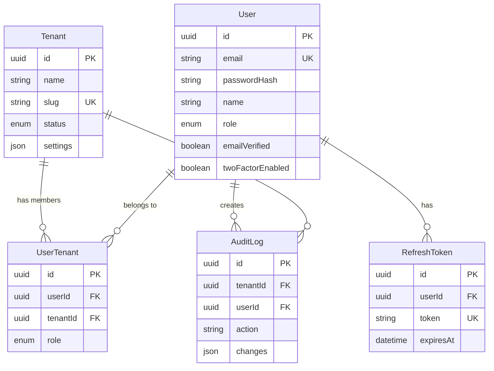

# Backend Analysis

## Entity-Relationship Diagram (Textual)

## Row-Level Security (RLS) Strategy

We implement RLS at the application level using Prisma Middleware (or Extensions), as Prisma does not support native database RLS policies in `schema.prisma` directly (except via raw SQL migrations).

### Mechanism
1. **Context Injection**: Every authenticated request extracts `tenantId` from the JWT or header.
2. **Middleware Interception**: A Prisma Client Extension intercepts all queries.
3. **Query Modification**:
   - For `findMany`, `findFirst`, `count`: Injects `where: { tenantId: context.tenantId }`.
   - For `create`: Injects `data: { tenantId: context.tenantId }`.
   - For `update`, `delete`: Injects `where: { tenantId: context.tenantId }`.

### Exceptions
- **Super Admin**: Bypass RLS middleware to access all data.
- **Shared Data**: `User` table is global. Users access their own profile via `userId`.
- **System Config**: Global visibility (or restricted to Super Admin).

## Architectural Decisions

1. **PostgreSQL as Database**: Chosen for robustness, native JSON support, and better scalability for multi-tenant "Business" objective compared to SQLite.
2. **UUID Primary Keys**: Prevents ID enumeration attacks and allows easier data migration/sharding in the future.
3. **UTC Timestamps**: All `DateTime` fields are stored in UTC. Client converts to local time.
4. **Soft Deletes**: Not implemented in this schema version (except manual restricted status), relying on explicit status fields (`status: SUSPENDED`) for availability control.
5. **Audit Logging**: Implemented as a separate table `AuditLog` to enable compliance features. Relations are `SetNull` on delete to preserve history even if users/tenants are removed (though in practice, we usually archival delete).

## Security Considerations

1. **Sensitive Data**: `passwordHash`, `twoFactorSecret` (encrypted), `backupCodes` (implied encrypted in user settings or separate if needed).
2. **Cascading Deletes**: 
   - `User` delete -> cascades to `UserTenant`, `RefreshToken`.
   - `Tenant` delete -> cascades to `UserTenant` (but not `User` entity itself).
   - This ensures referential integrity without orphaning junction records.
3. **Index Strategy**:
   - `email` and `slug` are unique and indexed for fast lookups during auth/routing.
   - `tenantId` is indexed in all tenant-scoped tables (`UserTenant`, `AuditLog`) to ensure RLS queries are performant.

## Validations
- **Zod Schemas**: Will be generated to strictly validate Enums and formats at the API boundary, complementing the database constraints.
