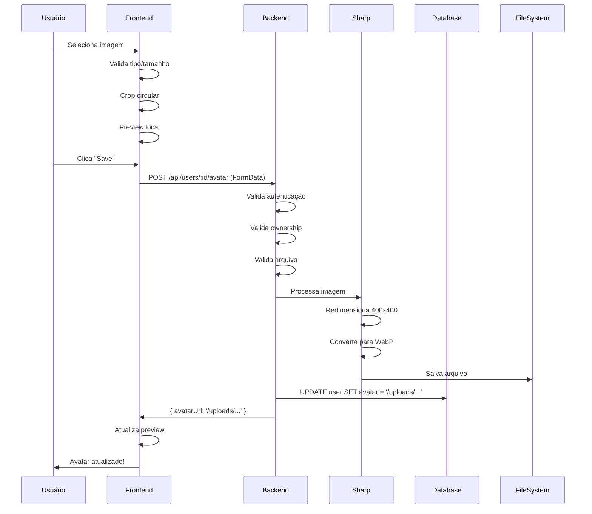
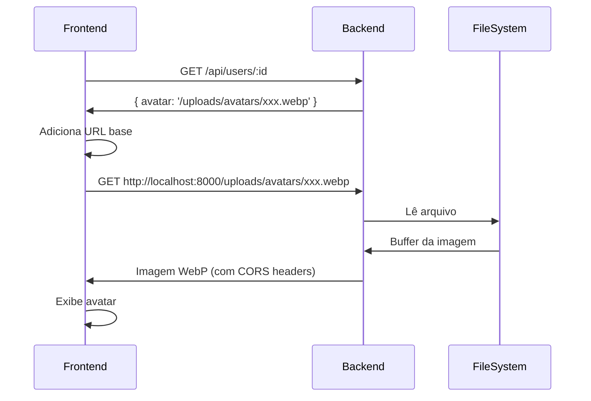

# Avatar Upload Feature - Documentação Técnica

## Visão Geral

Sistema completo de upload de avatar com conversão automática para WebP, redimensionamento, e exibição em múltiplas áreas da aplicação.

## Arquitetura

### Backend (Fastify + Sharp + Prisma)

#### 1. Endpoint de Upload

**Rota:** `POST /api/users/:id/avatar`

**Arquivo:** [user.routes.ts](file:///home/bychrisr/projects/kaven-boilerplate/apps/api/src/modules/users/routes/user.routes.ts)

```typescript
fastify.post('/:id/avatar', {
  preHandler: [authMiddleware, requireResourceOwnership('id')],
  handler: userController.uploadAvatar.bind(userController),
});
```

**Segurança:**

- Requer autenticação (`authMiddleware`)
- Requer ownership ou TENANT_ADMIN (`requireResourceOwnership`)

#### 2. Controller

**Arquivo:** [user.controller.ts](file:///home/bychrisr/projects/kaven-boilerplate/apps/api/src/modules/users/controllers/user.controller.ts#L81-L130)

**Responsabilidades:**

- Processar multipart/form-data
- Validar tipo de arquivo (jpeg, jpg, png, gif, webp)
- Validar tamanho (máx 3MB)
- Converter stream para buffer
- Delegar para service

#### 3. Service

**Arquivo:** [user.service.ts](file:///home/bychrisr/projects/kaven-boilerplate/apps/api/src/modules/users/services/user.service.ts#L372-L425)

**Processamento:**

1. Verifica se usuário existe
2. Cria diretório `/uploads/avatars/` se não existir
3. Gera nome único: `{userId}_{random}.webp`
4. Processa imagem com Sharp:
   - Redimensiona para 400x400px (fit: cover)
   - Converte para WebP (quality: 85%, effort: 6)
5. Salva arquivo
6. Atualiza campo `avatar` no banco
7. Registra audit log

#### 4. Servir Arquivos Estáticos

**Arquivo:** [server.ts](file:///home/bychrisr/projects/kaven-boilerplate/apps/api/src/server.ts#L104-L115)

```typescript
fastify.register(fastifyStatic, {
  root: path.join(process.cwd(), 'uploads'),
  prefix: '/uploads/',
  setHeaders: (res) => {
    res.setHeader('Access-Control-Allow-Origin', '*');
    res.setHeader('Cross-Origin-Resource-Policy', 'cross-origin');
  },
});
```

**Headers CORS:** Necessários para permitir carregamento cross-origin (localhost:3000 → localhost:8000)

#### 5. Schema do Banco

**Arquivo:** [schema.prisma](file:///home/bychrisr/projects/kaven-boilerplate/prisma/schema.prisma#L104)

```prisma
model User {
  // ...
  avatar  String?  // URL do avatar do usuário
  // ...
}
```

**Migração:** `20251227011027_add_user_avatar_field`

---

### Frontend (Next.js + React + TanStack Query)

#### 1. Componente de Upload

**Arquivo:** [avatar-upload.tsx](file:///home/bychrisr/projects/kaven-boilerplate/apps/admin/components/avatar-upload.tsx)

**Features:**

- Upload por clique ou drag & drop
- Validação de tipo e tamanho
- Crop circular com zoom (`react-easy-crop`)
- Preview em tempo real
- Botão de remoção

**Design (Minimals UI):**

- Círculo com borda tracejada
- Fundo escuro com contraste
- Ícone de câmera centralizado
- Hover com opacidade

#### 2. Integração no Formulário

**Arquivo:** [user-edit-view.tsx](file:///home/bychrisr/projects/kaven-boilerplate/apps/admin/sections/user/view/user-edit-view.tsx)

**Estados:**

```typescript
const [avatarPreview, setAvatarPreview] = useState<string>('');
const [avatarFile, setAvatarFile] = useState<File | null>(null);
```

**Fluxo de Upload:**

1. Usuário seleciona imagem
2. Crop e preview local
3. Ao salvar formulário:
   - Envia avatar via FormData para `/api/users/:id/avatar`
   - Aguarda resposta (avatarUrl)
   - Atualiza dados do usuário

**Carregamento do Avatar:**

```typescript
if (user.avatar) {
  const avatarUrl = user.avatar.startsWith('http')
    ? user.avatar
    : `http://localhost:8000${user.avatar}`;
  setAvatarPreview(avatarUrl);
}
```

#### 3. Exibição na Lista de Usuários

**Arquivo:** [user-table-row.tsx](file:///home/bychrisr/projects/kaven-boilerplate/apps/admin/sections/user/user-table-row.tsx)

**Lógica:**

```tsx
<Avatar>
  {row.avatar ? (
    <AvatarImage
      src={
        row.avatar.startsWith('http')
          ? row.avatar
          : `http://localhost:8000${row.avatar}`
      }
      alt={name}
    />
  ) : null}
  <AvatarFallback>{initials}</AvatarFallback>
</Avatar>
```

#### 4. Exibição no Header

**Arquivo:** [user-menu.tsx](file:///home/bychrisr/projects/kaven-boilerplate/apps/admin/components/layout/user-menu.tsx)

**Features:**

- Avatar do usuário logado
- Exibido em 2 lugares (trigger + dropdown header)
- Fallback para iniciais
- Gradient ring (Minimals style)

---

## Fluxo Completo

### Upload de Avatar



### Carregamento de Avatar



---

## Otimizações Implementadas

### 1. Conversão para WebP

- **Antes:** JPEG/PNG original (500KB - 2MB)
- **Depois:** WebP otimizado (~50-150KB)
- **Economia:** ~70-85% de redução

### 2. Redimensionamento

- **Tamanho fixo:** 400x400px
- **Fit:** cover (mantém proporção, corta excesso)
- **Benefício:** Consistência visual + performance

### 3. Lazy Loading

- Avatar carrega apenas quando componente monta
- Fallback para iniciais enquanto carrega

### 4. CORS Otimizado

- Headers específicos para arquivos estáticos
- Permite cross-origin apenas para GET

---

## Segurança

### 1. Validação de Arquivo

```typescript
const allowedTypes = [
  'image/jpeg',
  'image/jpg',
  'image/png',
  'image/gif',
  'image/webp',
];
const maxSize = 3 * 1024 * 1024; // 3MB
```

### 2. Autenticação e Autorização

- Requer token JWT válido
- Usuário só pode alterar próprio avatar
- TENANT_ADMIN pode alterar qualquer avatar do tenant

### 3. Nome de Arquivo Único

```typescript
const uniqueName = `${userId}_${crypto.randomBytes(8).toString('hex')}.webp`;
```

- Previne sobrescrita
- Dificulta enumeração

### 4. Audit Log

```typescript
await auditService.log({
  action: 'user.avatar_updated',
  entity: 'User',
  entityId: userId,
  metadata: { avatarUrl },
});
```

---

## Tipos TypeScript

### Backend

```typescript
// Prisma gerado automaticamente
interface User {
  avatar?: string | null;
}
```

### Frontend

```typescript
// use-users.ts
interface User {
  avatar?: string;
}

// auth.store.ts
interface User {
  avatar?: string;
}
```

---

## Testes Recomendados

### Backend

- [ ] Upload com arquivo válido
- [ ] Upload com arquivo inválido (tipo)
- [ ] Upload com arquivo muito grande
- [ ] Upload sem autenticação
- [ ] Upload de avatar de outro usuário (sem permissão)
- [ ] Verificar conversão para WebP
- [ ] Verificar redimensionamento

### Frontend

- [ ] Selecionar imagem via clique
- [ ] Selecionar imagem via drag & drop
- [ ] Crop e zoom
- [ ] Preview antes de salvar
- [ ] Remover avatar
- [ ] Exibição na lista de usuários
- [ ] Exibição no header
- [ ] Fallback para iniciais

---

## Troubleshooting

### Imagem não carrega (ERR_BLOCKED_BY_RESPONSE)

**Causa:** Falta de headers CORS no `@fastify/static`

**Solução:** Verificar `setHeaders` em [server.ts](file:///home/bychrisr/projects/kaven-boilerplate/apps/api/src/server.ts#L110-L113)

### Avatar não aparece após upload

**Causa:** Campo `avatar` não incluído no `select` da query

**Solução:** Adicionar `avatar: true` em:

- `getUserById`
- `listUsers`
- `getCurrentUser`

### Erro 500 no upload

**Causa:** Diretório `/uploads/avatars/` não existe

**Solução:** Service cria automaticamente com `fs.mkdir(uploadsDir, { recursive: true })`

---

## Melhorias Futuras

### 1. Storage Externo

- [ ] Integração com S3/CloudFlare R2
- [ ] CDN para servir imagens
- [ ] Múltiplos tamanhos (thumbnails)

### 2. Processamento Avançado

- [ ] Detecção de faces
- [ ] Remoção de background
- [ ] Filtros e efeitos

### 3. Performance

- [ ] Cache de avatares
- [ ] Lazy loading com Intersection Observer
- [ ] Progressive image loading

### 4. UX

- [ ] Histórico de avatares
- [ ] Galeria de avatares padrão
- [ ] Integração com Gravatar

---

## Referências

- [Sharp Documentation](https://sharp.pixelplumbing.com/)
- [Fastify Multipart](https://github.com/fastify/fastify-multipart)
- [Fastify Static](https://github.com/fastify/fastify-static)
- [React Easy Crop](https://github.com/ValentinH/react-easy-crop)
- [Minimals UI](https://minimals.cc/)

---

**Última atualização:** 2025-12-26
**Versão:** 1.0.0
**Autor:** Kaven Team
