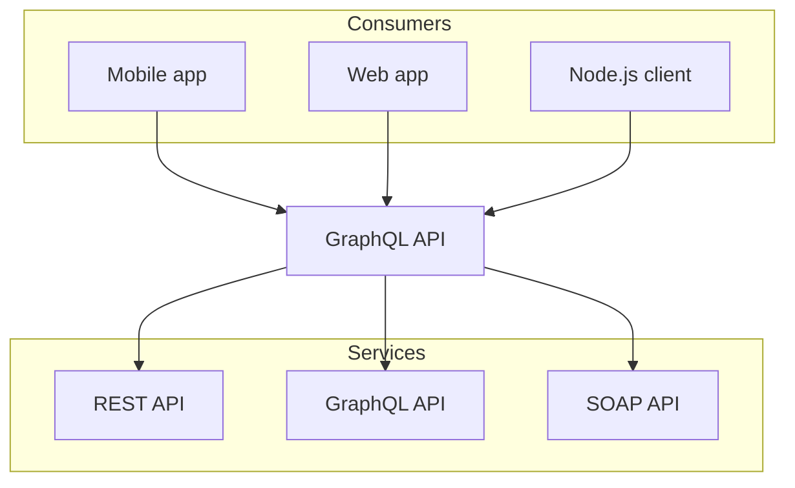

# Documentação: https://nextra.site/docs/

*Gerado automaticamente por Documentation Crawler v2.0.2*
*Data: 2026-01-06 00:55:30*

## Metadados da Execução

- **Total de páginas**: 80
- **Páginas falhas**: 6
- **Cache hits**: 27
- **Links encontrados**: 85
- **Code blocks extraídos**: 0

## Table of Contents

- [Make beautiful websites with Next.js & MDX](#make-beautiful-websites-with-nextjs--mdx)
- [About Nextra](#about-nextra)
- [API](#api)
- [compileMdx Function](#compilemdx-function)
- [evaluate Function](#evaluate-function)
- [generateDefinition Function](#generatedefinition-function)
- [generateStaticParamsFor Function](#generatestaticparamsfor-function)
- [getPageMap Function](#getpagemap-function)
- [importPage Function](#importpage-function)
- [MdxOptions Type](#mdxoptions-type)
- [nextra Function](#nextra-function)
- [NextraConfig Type](#nextraconfig-type)
- [normalizePages Function](#normalizepages-function)
- [proxy Function](#proxy-function)
- [useMDXComponents Function](#usemdxcomponents-function)
- [Blog](#blog)
- [Introduction](#introduction)
- [Advanced](#advanced)
- [Customize the Cascade Layers](#customize-the-cascade-layers)
- [LaTeX](#latex)
- [Mermaid](#mermaid)
- [Npm2Yarn](#npm2yarn)
- [Remote Content](#remote-content)
- [Rendering Tables](#rendering-tables)
- [Tailwind CSS](#tailwind-css)
- [Twoslash Support](#twoslash-support)
- [TypeScript](#typescript)
- [Nextra Blog Theme](#nextra-blog-theme)
- [Get Posts and Their Tags](#get-posts-and-their-tags)
- [Posts Page](#posts-page)
- [Generate RSS feed](#generate-rss-feed)
- [Get Started](#get-started)
- [Tags Page](#tags-page)
- [Built-Ins](#built-ins)
- [Banner Component](#banner-component)
- [Bleed Component](#bleed-component)
- [Callout Component](#callout-component)
- [Cards Component](#cards-component)
- [FileTree Component](#filetree-component)
- [Head Component](#head-component)
- [MDXRemote Component](#mdxremote-component)
- [Playground Component](#playground-component)
- [Search Component](#search-component)
- [Steps Component](#steps-component)
- [Table Component](#table-component)
- [Tabs Component](#tabs-component)
- [TSDoc Component](#tsdoc-component)
- [Custom Theme](#custom-theme)
- [Nextra Docs Theme](#nextra-docs-theme)
- [API](#api)
- [Built-Ins](#built-ins)
- [Footer Component](#footer-component)
- [Layout Component](#layout-component)
- [Navbar Component](#navbar-component)
- [NotFoundPage Component](#notfoundpage-component)
- [_meta.js File](#_metajs-file)
- [Docs Theme](#docs-theme)
- [Layout Component](#layout-component)
- [File Conventions](#file-conventions)
- [content Directory](#content-directory)
- [mdx-components.js File](#mdx-componentsjs-file)
- [_meta.js File](#_metajs-file)
- [page.mdx File](#pagemdx-file)
- [src Directory](#src-directory)
- [Guide](#guide)
- [Custom CSS Support](#custom-css-support)
- [GitHub Alert Syntax](#github-alert-syntax)
- [Next.js I18n](#nextjs-i18n)
- [Next.js Image](#nextjs-image)
- [Next.js Link](#nextjs-link)
- [Markdown](#markdown)
- [Search Engine](#search-engine)
- [Ask AI](#ask-ai)
- [Next.js Static Rendering](#nextjs-static-rendering)
- [Static Exports](#static-exports)
- [Syntax Highlighting](#syntax-highlighting)
- [Tailwind CSS](#tailwind-css)
- [Usage with Turbopack](#usage-with-turbopack)
- [Showcase](#showcase)
- [Sponsors](#sponsors)

---

# Make beautiful websites with Next.js & MDX

Simple, powerful and flexible site generation framework with everything you love from Next.js .

Get started →

### Full-power documentation in minutes

### Links and images are always optimized

Nextra automatically converts Markdown links and images to use Next.js Link  and Next.js Image  when possible. No slow navigation or layout shift.

`[Learn more](/more)`
``
`<Link .../>`
`<Image .../>`
### Advanced syntax highlighting solution

Performant and reliable build-time syntax highlighting powered by Shiki .

### I18n as easy as creating new files

Place your page files in folders specific to each locale, Nextra and Next.js will handle the rest for you.

MDX 3  lets you use Components inside Markdown, with huge performance boost since v1.

### Dark mode included

### Full-text search,zero-config needed

Nextra indexes your content automatically at build-time and performs incredibly fast full-text search via Pagefind .

### Organize pages intuitively, with file-system routing from Next.js

### A11y as a top priority

Nextra respects system options such as Increase Contrast and Reduce Motion.

### Hybrid rendering, next generation

You can leverage the hybrid rendering power from Next.js with your Markdown content including Server Components , Client Components , and Incremental Static Regeneration (ISR) .

### And more...

SEO / RTL Layout / Pluggable Themes / Built-in Components / Last Git Edit Time / Multi-Docs...A lot of new possibilities to be explored.

Start using Nextra →

*Fonte: [https://nextra.site/](https://nextra.site/)*

---

# About Nextra

Nextra was initially created by Vercel  members
Shu Ding  and
Paco Coursey  in 2020. Since 2021,
Yixuan Xu  contributed tremendously to the
project.

In 2022, Dimitri Postolov  from
The Guild  joined the core team to help with the
development of Nextra 2.

In 2024 Nextra 3 was released, current primary maintainer Dimitri Postolov fully
developed it, and Oscar Xie 
actively contributed 
to this release.

In 2025 Nextra 4 with App Router  support was
released, Dimitri Postolov fully developed it too.

## Team

Currently, the project is maintained by Dimitri Postolov. You can check out
the full list of contributors 
on GitHub.

## Credits

Nextra is powered by these incredible open source projects:

- https://reactjs.org

- https://nextjs.org

- https://turbo.build

- https://mdxjs.com

- https://pnpm.io

- https://tailwindcss.com

- https://github.com/pacocoursey/next-themes

- https://github.com/shikijs/shiki

- https://github.com/cloudcannon/pagefind

- https://github.com/atomiks/rehype-pretty-code

- https://github.com/Brooooooklyn/simple-git

- https://github.com/francoismassart/eslint-plugin-tailwindcss

## Design assets

Feel free to use the Nextra logo and other assets in your project. But please
don’t modify the logo, and don’t use the logo to represent your project or
product.

## License

The Nextra project and themes are licensed under
the MIT license .

*Fonte: [https://nextra.site/about/](https://nextra.site/about/)*

---

# API

This API reference is automatically generated from the catch-all route file
/api/[name]/page.tsx using the new Nextra <TSDoc />
component.

`/api/[name]/page.tsx`
`<TSDoc />`
## Types

## Functions

*Fonte: [https://nextra.site/api/](https://nextra.site/api/)*

---

# compileMdx Function

`compileMdx`
Exported from nextra/compile.

`nextra/compile`
## Signature

`rawMdx`
`string`
`[1]?.staticImage`
`boolean`
`[1]?.search`
`boolean | { codeblocks: boolean; }`
`[1]?.defaultShowCopyCode`
`boolean | undefined`
`[1]?.readingTime`
`boolean | undefined`
`[1]?.latex`
`boolean | { renderer: "mathjax"; options?: { src?: string | undefined; config?: MathJaxConfig | undefined; } | undefined; } | { renderer: "katex"; options: rehype_katex_lib_index_js.Options; } | undefined`
`[1]?.codeHighlight`
`boolean`
`[1]?.whiteListTagsStyling`
`string[] | undefined`
`[1]?.mdxOptions`
`{ rehypePlugins?: PluggableList | null | undefined; remarkPlugins?: PluggableList | null | undefined; recmaPlugins?: PluggableList | null | undefined; format?: "detect" | ... 1 more ... | "md"; rehypePrettyCodeOptions?: Options; } & Pick<...>`
`{}`
`[1]?.filePath`
`string`
`''`
`[1]?.useCachedCompiler`
`boolean`
`[1]?.isPageImport`
`boolean`
`false`
`[1]?.lastCommitTime`
`number`
`Promise<string>`
## Example

```tsx
// Usage with MDXRemote
import { compileMdx } from 'nextra/compile'
import { MDXRemote } from 'nextra/mdx-remote'
 
const rawJs = await compileMdx(rawMdx)
const content = <MDXRemote compiledSource={rawJs} components={...} scope={...} />
```

*Fonte: [https://nextra.site/api/compilemdx/](https://nextra.site/api/compilemdx/)*

---

# evaluate Function

`evaluate`
Exported from nextra/evaluate.

`nextra/evaluate`
## Signature

`rawJs`
`string`
`components`
`MDXComponents`
`{}`
`scope`
`Scope`
`{}`
`default`
`FC<any>`
The MDX component to render.

`toc`
`Heading[]`
Table of contents list.

`metadata`
`$NextraMetadata`
Page’s front matter or metadata object including title, description, etc.

`metadata`
`title`
`description`
`sourceCode`
`string`
Raw MDX source code

*Fonte: [https://nextra.site/api/evaluate/](https://nextra.site/api/evaluate/)*

---

# generateDefinition Function

`generateDefinition`
Generate documentation for properties of type and interface and parameters and returns
signature of function.

`type`
`interface`
`function`
Exported from nextra/tsdoc.

`nextra/tsdoc`
## Signature

`[0].code`
`string`
TypeScript source code to be processed.

`[0].exportName`
`string`
The name of the exported declaration.

`"default"`
`[0].flattened`
`boolean`
Whether to flatten nested objects.
E.g. { foo: { bar: string } } will be represented as: { foo.bar: string }

`{ foo: { bar: string } }`
`{ foo.bar: string }`
`false`
`GeneratedDefinition & (GeneratedType | GeneratedFunction)`
Parsed TSDoc definition from TypeScript type, interface or function.

`type`
`interface`
`function`
## Example

To generate documentation for a type, interface, or function, export it via the code
argument.

`type`
`interface`
`function`
`code`
### As a default export

`default`
```tsx
import { generateDefinition, TSDoc } from 'nextra/tsdoc'
 
<TSDoc
  definition={generateDefinition({
    code: "export { yourTypeOrFunction as default } from 'your-package'",
  })}
/>
```

### As a named export

```tsx
import { generateDefinition, TSDoc } from 'nextra/tsdoc'
 
<TSDoc
  definition={generateDefinition({
    code: "export { yourTypeOrFunction } from 'your-package'",
    exportName: 'yourTypeOrFunction'
  })}
/>
```

*Fonte: [https://nextra.site/api/generatedefinition/](https://nextra.site/api/generatedefinition/)*

---

# generateStaticParamsFor Function

`generateStaticParamsFor`
Generates static parameters based on your content directory structure.

`content`
This helper function is designed to work with Next.js’ generateStaticParams function to create
static paths for all your MDX/Markdown pages.

`generateStaticParams`
Exported from nextra/pages.

`nextra/pages`
## Signature

`segmentKey`
`string`
The name of your catch-all route segment (e.g., 'slug', 'mdxPath').

`'slug'`
`'mdxPath'`
`localeSegmentKey`
`string`
The name of the locale segment when you have i18n.

`"lang"`
`() => Promise<{ [x: string]: string | string[]; }[]>`
A function that generates an array of parameters for static page generation.

See

- Next.js generateStaticParams function

- Content Directory Structure

`generateStaticParams`
## Example

### Basic usage with a catch-all route

```tsx
// app/[[...slug]]/page.tsx
export const generateStaticParams = generateStaticParamsFor('slug')
```

### Usage with i18n support

```tsx
// app/[locale]/[[...mdxPath]]/page.tsx
export const generateStaticParams = generateStaticParamsFor('mdxPath', 'locale')
```

*Fonte: [https://nextra.site/api/generatestaticparamsfor/](https://nextra.site/api/generatestaticparamsfor/)*

---

# getPageMap Function

`getPageMap`
Retrieves the page map structure for a given route handling nested routes.

The page map structure represents the hierarchical organization of your documentation or content,
where each item can be either a page or a folder containing more pages.

Exported from nextra/page-map.

`nextra/page-map`
## Signature

`route`
`string`
The route path to retrieve the page map for.

`"/"`
`Promise<PageMapItem[]>`
A Promise that resolves to an array of PageMapItem objects representing the page structure
such as MdxFile, Folder and MetaJsonFile.

`PageMapItem`
`MdxFile`
`Folder`
`MetaJsonFile`
Throws an Error when the specified route segment cannot be found in the page map.

`Error`
See

Page Map Structure Documentation .

## Example

```javascript
import { getPageMap } from 'nextra/page-map'
 
// Get the root page map
const rootPageMap = await getPageMap()
 
// Get the page map for a specific route
const blogPageMap = await getPageMap('/blog')
 
// Get the page map for a specific language when using i18n
const enPageMap = await getPageMap('/en')
```

*Fonte: [https://nextra.site/api/getpagemap/](https://nextra.site/api/getpagemap/)*

---

# importPage Function

`importPage`
Function to import an MDX/Markdown page from the content directory.

`content`
This function is essential for Nextra’s dynamic page loading from a catch-all route.

Exported from nextra/pages.

`nextra/pages`
## Signature

`pathSegments`
`string[]`
Array of path segments representing the route to the page.

E.g., for the route /docs/getting-started/installation, pass ['docs', 'getting-started', 'installation'].

`/docs/getting-started/installation`
`['docs', 'getting-started', 'installation']`
`[]`
`lang`
`string`
The language segment when using i18n.

`''`
`Promise<EvaluateResult>`
A Promise that resolves to an object containing:

- default: The MDX component to render

- toc: Table of contents list

- metadata: Page’s front matter or metadata object including title, description, etc.

`default`
`toc`
`metadata`
`metadata`
`title`
`description`
See

- Content Directory Documentation

- Next.js Dynamic Routes

- Next.js Metadata API

## Example

### Basic usage in a dynamic Next.js route

```javascript
const { default: MDXContent, toc, metadata } = await importPage(['docs', 'getting-started'])
```

### Usage with i18n

```javascript
const { default: MDXContent } = await importPage(['docs', 'getting-started'], 'en')
```

### Import page’s front matter in generateMetadata function

`generateMetadata`
```tsx
// app/[[...mdxPath]]/page.tsx
import { importPage } from 'nextra/pages'
 
export async function generateMetadata(props) {
  const params = await props.params
  const { metadata } = await importPage(params.mdxPath)
  return metadata
}
```

### Import page in a catch-all route

```tsx
// app/[[...mdxPath]]/page.tsx
import { generateStaticParamsFor, importPage } from 'nextra/pages'
import { useMDXComponents as getMDXComponents } from 'path/to/your/mdx-components'
 
export const generateStaticParams = generateStaticParamsFor('mdxPath')
 
const Wrapper = getMDXComponents().wrapper
 
export default async function Page(props) {
  const params = await props.params
  const result = await importPage(params.mdxPath)
  const { default: MDXContent, toc, metadata } = result
  return (
    <Wrapper toc={toc} metadata={metadata}>
      <MDXContent {...props} params={params} />
    </Wrapper>
  )
}
```

*Fonte: [https://nextra.site/api/importpage/](https://nextra.site/api/importpage/)*

---

# MdxOptions Type

`MdxOptions`
## Fields

`rehypePlugins`
`PluggableList | null | undefined`
List of rehype plugins.

`remarkPlugins`
`PluggableList | null | undefined`
List of remark plugins.

`recmaPlugins`
`PluggableList | null | undefined`
List of recma plugins. This is a new ecosystem, currently in beta, to transform esast trees (JavaScript).

`format`
`"detect" | "mdx" | "md"`
Format of the file.

- 'md' means treat as markdown

- 'mdx' means treat as MDX

- 'detect' means try to detect the format based on file path.

`'md'`
`'mdx'`
`'detect'`
`"detect"`
`rehypePrettyCodeOptions`
`RehypePrettyCodeOptions`
Configuration options for Rehype Pretty Code .

`{}`

*Fonte: [https://nextra.site/api/mdxoptions/](https://nextra.site/api/mdxoptions/)*

---

# nextra Function

`nextra`
Nextra is a Next.js plugin that allows you to create Markdown-based content with ease.

## Signature

`nextraConfig`
`NextraConfig`
`(nextConfig?: NextConfig | undefined) => NextConfig`
See

- NextraConfig options

- Nextra documentation

- NextConfig options

`NextraConfig`
`NextConfig`
## Example

```javascript
import nextra from 'nextra'
 
// Set up Nextra with its configuration
const withNextra = nextra({
  // ... Add Nextra-specific options here
})
 
// Export the final Next.js config with Nextra included
export default withNextra({
  // ... Add regular Next.js options here
})
```

*Fonte: [https://nextra.site/api/nextra/](https://nextra.site/api/nextra/)*

---

# NextraConfig Type

`NextraConfig`
Exported from nextra.

`nextra`
## Fields

`defaultShowCopyCode`
`boolean`
Enable the copy button for all code blocks by default, without needing to set copy=true attribute in the code block metadata.

`copy=true`
You could still disable the button for specific blocks using copy=false attribute.

`copy=false`
`search`
`boolean | { codeblocks: boolean; }`
Option to enable search functionality. When enabled, it sets the data-pagefind-body attribute on the <main> element.

`data-pagefind-body`
`<main>`
When set to codeblocks: false, it adds the data-pagefind-ignore="all" attribute to all code blocks (<pre> elements).

`codeblocks: false`
`data-pagefind-ignore="all"`
`<pre>`
`{
"codeblocks": false
}`
`staticImage`
`boolean`
Option to automatically optimizing your static image imports with the Markdown syntax.

Example: .

``
`true`
`readingTime`
`boolean`
Adds estimated reading time of .md and .mdx files using readingTime  package.

`.md`
`.mdx`
The reading time is added to the front matter under the readingTime key.

`readingTime`
`latex`
`boolean | { renderer: "mathjax"; options?: { src?: string; config?: MathJaxConfig; }; } | { renderer: "katex"; options: Options; }`
Enable LaTeX either with KaTeX  to pre-render LaTeX expressions directly in MDX or MathJax  to dynamically render math in the browser.

`codeHighlight`
`boolean`
Enable or disable syntax highlighting.

`true`
`mdxOptions`
`MdxOptions`
Options specific to MDX compiling.

`{
"format": "detect",
"rehypePrettyCodeOptions": {}
}`
`whiteListTagsStyling`
`string[]`
Allows you to whitelist HTML elements to be replaced with components defined in the mdx-components.js file.

`mdx-components.js`
By default, Nextra only replaces <details> and <summary> elements.

`<details>`
`<summary>`
`contentDirBasePath`
`string`
Option to serve your .md and .mdx files from the content directory at a custom path instead of the root (/).

`.md`
`.mdx`
`content`
`/`
`"/"`
`unstable_shouldAddLocaleToLinks`
`boolean`
Prefixes locale to all links in the page map information. Useful for i18n when you don’t want to use Nextra’s middleware function.

`middleware`
`false`

*Fonte: [https://nextra.site/api/nextraconfig/](https://nextra.site/api/nextraconfig/)*

---

# normalizePages Function

`normalizePages`
Exported from nextra/normalize-pages.

`nextra/normalize-pages`
## Signature

`[0].list`
`PageMapItem[]`
`[0].route`
`string`
`[0].docsRoot`
`string`
`[0].underCurrentDocsRoot`
`boolean`
`[0].pageThemeContext.breadcrumb`
`boolean | undefined`
`[0].pageThemeContext.collapsed`
`boolean | undefined`
`[0].pageThemeContext.copyPage`
`boolean | undefined`
`[0].pageThemeContext.footer`
`boolean | undefined`
`[0].pageThemeContext.layout`
`"default" | "full" | undefined`
`[0].pageThemeContext.navbar`
`boolean | undefined`
`[0].pageThemeContext.pagination`
`boolean | undefined`
`[0].pageThemeContext.sidebar`
`boolean | undefined`
`[0].pageThemeContext.timestamp`
`boolean | undefined`
`[0].pageThemeContext.toc`
`boolean | undefined`
`[0].pageThemeContext.typesetting`
`"default" | "article" | undefined`
`activeType`
`"page" | "doc" | "menu"`
Active type for current page, used to determine layout in theme.

`activeIndex`
`number`
Active index for current page, used for pagination in combination with flatDocsDirectories
items.

`flatDocsDirectories`
`activeThemeContext.breadcrumb`
`boolean | undefined`
`activeThemeContext.collapsed`
`boolean | undefined`
`activeThemeContext.copyPage`
`boolean | undefined`
`activeThemeContext.footer`
`boolean | undefined`
`activeThemeContext.layout`
`"default" | "full" | undefined`
`activeThemeContext.navbar`
`boolean | undefined`
`activeThemeContext.pagination`
`boolean | undefined`
`activeThemeContext.sidebar`
`boolean | undefined`
`activeThemeContext.timestamp`
`boolean | undefined`
`activeThemeContext.toc`
`boolean | undefined`
`activeThemeContext.typesetting`
`"default" | "article" | undefined`
`activeMetadata`
`FrontMatter`
Parsed front matter  or exported
Metadata  from page.

`activePath`
`Item[]`
Active path for current page, used for breadcrumb navigation.

`directories`
`Item[]`
All directories in the tree structure.

`docsDirectories`
`DocsItem[]`
Directories with type: 'doc' in _meta file.

`type: 'doc'`
`_meta`
`flatDocsDirectories`
`DocsItem[]`
Flattened directories with type: 'doc' in _meta file.

`type: 'doc'`
`_meta`
`topLevelNavbarItems`
`(PageItem | MenuItem)[]`
Navbar items, items which have type: 'page' in _meta file.

`type: 'page'`
`_meta`

*Fonte: [https://nextra.site/api/normalizepages/](https://nextra.site/api/normalizepages/)*

---

# proxy Function

`proxy`
Exported from nextra/locales.

`nextra/locales`
## Signature

`request`
`NextRequest`
`NextResponse<unknown> | undefined`
## Example

```javascript
// Basic usage
export { proxy } from 'nextra/locales'
 
export const config = {
  // Matcher ignoring `/_next/` and `/api/`
  matcher: [
    '/((?!api|_next/static|_next/image|favicon.ico|icon.svg|apple-icon.png|manifest|_pagefind).*)'
  ]
}
```

*Fonte: [https://nextra.site/api/proxy/](https://nextra.site/api/proxy/)*

---

# useMDXComponents Function

`useMDXComponents`
Get current MDX components.

Exported from nextra/mdx-components.

`nextra/mdx-components`
## Signature

`components`
`MDXComponents`
An object where:

- The key is the name of the HTML element to override.

- The value is the component to render instead.

`DefaultMDXComponents & components`
The current set of MDX components.

`DefaultMDXComponents`
The current set of MDX components.

*Fonte: [https://nextra.site/api/usemdxcomponents/](https://nextra.site/api/usemdxcomponents/)*

---

# Blog

### Nextra 4

App Router support, Turbopack support, compiled by React Compiler, new Rust-powered search Pagefind, RSC i18n, server/client components, smallest bundle size EVER for a Nextra-powered website, GitHub Alert Syntax, new _meta.global file and more. Read more

### Nextra 3 – Your Favourite MDX Framework, Now on 🧪 Steroids

MDX 3, new i18n, new _meta files with JSX support, more powerful TOC, remote MDX, better bundle size, MathJax, new code block styles, shikiji, ESM-only and more. Read more

### Nextra 2 – Next.js Static Site Generator

Here are what the new version of Nextra 2 Framework includes. Read more

*Fonte: [https://nextra.site/blog/](https://nextra.site/blog/)*

---

# Introduction

Nextra is a framework on top of Next.js, that lets you build content focused
websites. It has all the great features from Next.js, plus extra power to create
Markdown-based content with ease.

## Quick start

To start using Nextra, you need to select a theme first:

If you want to use Nextra without using these built-in themes, you can follow
the Custom Theme docs.

## FAQ

The Nextra FAQ is a collection of useful questions and answers about the
project. If you have a question that isn’t answered here, please
open a discussion .

### Can I use Nextra with Next.js pages router?

`pages`
`app`
`pages`
### Can I use X with Nextra?

- Use Tailwind CSS

- Use custom CSS and Sass

- Use custom fonts

### How can I add a live coding component in Nextra?

*Fonte: [https://nextra.site/docs/](https://nextra.site/docs/)*

---

# Advanced

*Fonte: [https://nextra.site/docs/advanced/](https://nextra.site/docs/advanced/)*

---

# Customize the Cascade Layers

In some scenarios, you may need more control over the Nextra predefined CSS to
avoid unintended overrides of styles within cascade layers. Below is an example
of how nextra-theme-docs uses
postcss-import  to place predefined
CSS into a specified cascade layer:

`nextra-theme-docs`
## Install postcss-import

`postcss-import`
Install postcss-import and add it to postcss.config.mjs:

`postcss-import`
`postcss.config.mjs`
```javascript
export default {
  plugins: {
    'postcss-import': {}
    // ... your other PostCSS plugins (e.g., `autoprefixer`, `cssnano`)
  }
}
```

## Set up the cascade layers

In your CSS file (e.g. styles.css), import the nextra-docs-theme CSS and
specify the layers:

`styles.css`
`nextra-docs-theme`
```javascript
@layer nextra, my-base;
 
@import 'nextra-theme-docs/dist/style.css' layer(nextra);
 
@layer my-base {
  /* my base styles */
}
```

## Import your CSS file

Import your CSS file at the top-level layout of your application (e.g.
app/layout.jsx) to apply the styles.

`app/layout.jsx`
```javascript
import '../path/to/your/styles.css'
 
export default async function RootLayout({ children }) {
  // ... Your layout logic here
}
```

*Fonte: [https://nextra.site/docs/advanced/customize-the-cascade-layers/](https://nextra.site/docs/advanced/customize-the-cascade-layers/)*

---

# LaTeX

Nextra can use KaTeX  to pre-render LaTeX expressions
directly in MDX or MathJax  to dynamically render math in
the browser.

## Setup

### Enable the latex option

`latex`
By default, LaTeX is disabled. To enable it, you need to set the latex option
in your next.config.mjs file:

`latex`
`next.config.mjs`
```javascript
import nextra from 'nextra'
 
const withNextra = nextra({
  latex: true
})
 
export default withNextra()
```

A value of true will use KaTeX as the math renderer. To explicitly
specify the renderer, you may instead provide an object
{ renderer: 'katex' } or { renderer: 'mathjax' } as the value to
latex: ....

`true`
`{ renderer: 'katex' }`
`{ renderer: 'mathjax' }`
`latex: ...`
When enabled, the required CSS and fonts will be automatically included in your
site, and you can start writing math expressions by enclosing inline math in
$...$ or display math in a math-labeled fenced code block:

`$...$`
`math`
```markdown
```math
\int x^2
```
```

### Apply styles

This is applicable only to KaTeX as the math renderer.

### Import CSS from `katex` package

- Install the katex package

`katex`
```bash
npm i katex
```

```bash
pnpm add katex
```

```text
yarn add katex
```

```text
bun add katex
```

- Import CSS in the root layout

```javascript
import 'katex/dist/katex.min.css'
```

### Load CSS from CDN

Add <link rel="stylesheet" href="https://cdn.jsdelivr.net/npm/katex/dist/katex.css" />
inside <head> element in your root layout file since <link rel="stylesheet" />
isn’t supported with Next.js Metadata API .

`<link rel="stylesheet" href="https://cdn.jsdelivr.net/npm/katex/dist/katex.css" />`
`<head>`
`layout`
`<link rel="stylesheet" />`
Alternatively, you can include <link rel="stylesheet" /> directly in
your MDX file:

`<link rel="stylesheet" />`
```markdown
<link
  rel="stylesheet"
  href="https://cdn.jsdelivr.net/npm/katex/dist/katex.css"
/>
 
# My page with single usage of KaTeX
 
```math
\int_2^3x^3\,\mathrm{d}x
```
```

## Example

For example, the following Markdown code:

```markdown
The **Pythagorean equation** is $a=\sqrt{b^2 + c^2}$ and the quadratic formula:
 
```math
x=\frac{-b\pm\sqrt{b^2-4ac}}{2a}
```
```

will be rendered as:

The Pythagorean equation is a=b2+c2a=\sqrt{b^2 + c^2}a=b2+c2​ and the quadratic formula:

You can still use Markdown and MDX syntax in the same line
as your LaTeX expression.

If you want to display $ in your content instead of rendering it as an
equation, you can escape it with a backslash (\). For example \$e = mc^2\$
will be rendered as $e = mc^2$.

`$`
`\`
`\$e = mc^2\$`
## API

### KaTeX

rehype-katex is used to pre-render LaTeX expressions in your content. You can
pass supported KaTeX options  via the options
key in your Nextra config. For example, to add a macro \RR that renders as
\mathbb{R} you could use the following configuration.

`rehype-katex`
`options`
`\RR`
`\mathbb{R}`
```javascript
const withNextra = nextra({
  latex: {
    renderer: 'katex',
    options: {
      macros: {
        '\\RR': '\\mathbb{R}'
      }
    }
  }
})
```

See KaTeX’s documentation  for a list of
supported commands.

### MathJax

When MathJax is enabled (by setting latex: { renderer: 'mathjax' }) math
is rendered on page load via
better-react-mathjax
instead of being pre-rendered. By default, MathJax is served via the MathJax
CDN instead of the files being directly included in your site.1

`latex: { renderer: 'mathjax' }`
`better-react-mathjax`
MathJax rendering is enabled by setting renderer: 'mathjax' in your
Nextra config.

`renderer: 'mathjax'`
```javascript
const withNextra = nextra({
  latex: {
    renderer: 'mathjax'
  }
})
```

You can pass additional options to better-react-mathjax via the options key
in your Nextra config. The config: ... option sets the
MathJax configuration .
However, note that you can only pass serializable options to
better-react-mathjax via the options key in your Nextra config.2

`better-react-mathjax`
`options`
`config: ...`
`better-react-mathjax`
`options`
For example, to configure MathJax to render \RR as \mathbb{R} you could use
the following configuration.

`\RR`
`\mathbb{R}`
```javascript
const withNextra = nextra({
  latex: {
    renderer: 'mathjax',
    options: {
      config: {
        tex: {
          macros: {
            RR: '\\mathbb{R}'
          }
        }
      }
    }
  }
})
```

#### MathJax CDN

By default, MathJax is served via the MathJax CDN. To serve files from another
location (including locally in your project), you must pass the src: ...
option to the latex config. See the
better-react-mathjax documentation 
for details about the src option. Additionally, you may need to copy the
MathJax distribution into your /public folder for it to be served locally.

`src: ...`
`src`
`/public`
## KaTeX vs. MathJax

With KaTeX, math is pre-rendered which means flicker-free and faster page loads.
However, KaTeX does not support all the features of MathJax, especially features
related to accessibility.

The following two examples show the same formula rendered with KaTeX (first) and
MathJax (second).

Because of MathJax’s accessibility features, the second formula is
tab-accessible and has a context menu that helps screen readers reprocess math
for the visually impaired.

## Footnotes

- This can be changed by setting
{ options: { src: ... } }
in the Nextra config. ↩

- To pass non-serializable objects like Functions, you must use the
<MathJaxContext config={...} /> component directly in your source. ↩

This can be changed by setting
{ options: { src: ... } }
in the Nextra config. ↩

`{ options: { src: ... } }`
To pass non-serializable objects like Functions, you must use the
<MathJaxContext config={...} /> component directly in your source. ↩

`<MathJaxContext config={...} />`

*Fonte: [https://nextra.site/docs/advanced/latex/](https://nextra.site/docs/advanced/latex/)*

---

# Mermaid

Nextra supports mermaid  diagrams. Like in GitHub you
can use it in your Markdown files by using the mermaid code block language.
Out of the box, Nextra uses
@theguild/remark-mermaid
package that replaces the code block with the <Mermaid> component.

`mermaid`
`@theguild/remark-mermaid`
`<Mermaid>`
## Example

## Usage

```markdown

```

*Fonte: [https://nextra.site/docs/advanced/mermaid/](https://nextra.site/docs/advanced/mermaid/)*

---

# Npm2Yarn

Nextra uses
@theguild/remark-npm2yarn
package that replaces the code block that has npm2yarn metadata with
<Tabs> and <Tabs.Tab> components from
nextra/components.

`@theguild/remark-npm2yarn`
`npm2yarn`
`<Tabs>`
`<Tabs.Tab>`
`nextra/components`
The chosen tab is saved in the local storage, which will be chosen in future
page renders.

## Example

```bash
npm i -D @graphql-eslint/eslint-plugin
```

```bash
pnpm add -D @graphql-eslint/eslint-plugin
```

```text
yarn add --dev @graphql-eslint/eslint-plugin
```

```text
bun add --dev @graphql-eslint/eslint-plugin
```

## Usage

```bash
```sh npm2yarn
npm i -D @graphql-eslint/eslint-plugin
```
```

*Fonte: [https://nextra.site/docs/advanced/npm2yarn/](https://nextra.site/docs/advanced/npm2yarn/)*

---

# Remote Content

You can check out the
SWR i18n example 
source code.

## Create [[...slug]]/page.tsx file

`[[...slug]]/page.tsx`
Create [[...slug]]/page.tsx file in app/ directory with the following
content:

`[[...slug]]/page.tsx`
`app/`
```tsx
import { notFound } from 'next/navigation'
import { compileMdx } from 'nextra/compile'
import { Callout, Tabs } from 'nextra/components'
import { evaluate } from 'nextra/evaluate'
import {
  convertToPageMap,
  mergeMetaWithPageMap,
  normalizePageMap
} from 'nextra/page-map'
import { useMDXComponents as getMDXComponents } from '../../../../mdx-components'
 
const user = 'graphql-hive'
const repo = 'graphql-eslint'
const branch = '34b722a2a520599ce06a4ddcccc9623b76434089'
const docsPath = 'website/src/pages/docs/'
const filePaths = [
  'configs.mdx',
  'custom-rules.mdx',
  'getting-started.mdx',
  'getting-started/parser-options.mdx',
  'getting-started/parser.mdx',
  'index.mdx'
]
 
const { mdxPages, pageMap: _pageMap } = convertToPageMap({
  filePaths,
  basePath: 'graphql-eslint'
})
 
// `mergeMetaWithPageMap` is used to change sidebar order and title
const eslintPageMap = mergeMetaWithPageMap(_pageMap[0]!, {
  index: 'Introduction',
  'getting-started': {
    items: {
      index: 'Overview',
      'parser-options': '',
      parser: ''
    }
  },
  configs: '',
  'custom-rules': ''
})
 
export const pageMap = normalizePageMap(eslintPageMap)
 
const { wrapper: Wrapper, ...components } = getMDXComponents({
  $Tabs: Tabs,
  Callout
})
 
type PageProps = Readonly<{
  params: Promise<{
    slug?: string[]
  }>
}>
 
export default async function Page(props: PageProps) {
  const params = await props.params
  const route = params.slug?.join('/') ?? ''
  const filePath = mdxPages[route]
 
  if (!filePath) {
    notFound()
  }
  const response = await fetch(
    `https://raw.githubusercontent.com/${user}/${repo}/${branch}/${docsPath}${filePath}`
  )
  const data = await response.text()
  const rawJs = await compileMdx(data, { filePath })
  const { default: MDXContent, toc, metadata } = evaluate(rawJs, components)
 
  return (
    <Wrapper toc={toc} metadata={metadata} sourceCode={rawJs}>
      <MDXContent />
    </Wrapper>
  )
}
 
export function generateStaticParams() {
  const params = Object.keys(mdxPages).map(route => ({
    slug: route.split('/')
  }))
 
  return params
}
```

## Enhance pageMap

`pageMap`
You need to modify pageMap list in layout file, to properly display sidebar
and mobile navigation.

`pageMap`
`layout`
```javascript
import { getPageMap } from 'nextra/page-map'
import { pageMap as graphqlEslintPageMap } from './graphql-eslint/[[...slug]]/page'
 
// ...
 
const pageMap = [...(await getPageMap()), graphqlEslintPageMap]
```

*Fonte: [https://nextra.site/docs/advanced/remote/](https://nextra.site/docs/advanced/remote/)*

---

# Rendering Tables

This guide covers different ways to render tables in MDX, including GFM syntax
and literal HTML tag.

## GFM syntax

In Markdown, it is preferable to write tables via
GFM syntax .

```text
| left   | center | right |
| :----- | :----: | ----: |
| foo    |  bar   |   baz |
| banana | apple  |  kiwi |
```

will be rendered as:

## Literal HTML tables

If you try to render table with literal HTML elements <table>,
<thead>, <tbody>, <tr>, <th> and <td> – your
table will be unstyled because
MDX  doesn’t replace literal HTML
elements with components provided by useMDXComponents()1.

`<table>`
`<thead>`
`<tbody>`
`<tr>`
`<th>`
`<td>`
`useMDXComponents()`
Instead, use the built-in <Table> component
available via nextra/components.

`<Table>`
`nextra/components`
## Changing default behaviour

If you want to use standard HTML elements for your tables but have them styled
with components provided by useMDXComponents()1, you can do this by
configuring Nextra.

`useMDXComponents()`
To achieve this, pass the whiteListTagsStyling option to the Nextra function,
including an array of tags you want to replace.

`whiteListTagsStyling`
Here’s an example configuration in your next.config.mjs file:

`next.config.mjs`
```javascript
import nextra from 'nextra'
 
const withNextra = nextra({
  whiteListTagsStyling: ['table', 'thead', 'tbody', 'tr', 'th', 'td']
})
 
export default withNextra()
```

In this example, the tags <table>, <thead>, <tbody>, <tr>, <th>, and
<td> will be replaced with corresponding MDX components, allowing for
customized styling.

`<table>`
`<thead>`
`<tbody>`
`<tr>`
`<th>`
`<td>`
## Footnotes

- https://mdxjs.com/packages/react/#usemdxcomponentscomponents  ↩ ↩2

https://mdxjs.com/packages/react/#usemdxcomponentscomponents  ↩ ↩2

*Fonte: [https://nextra.site/docs/advanced/table/](https://nextra.site/docs/advanced/table/)*

---

# Tailwind CSS

Tailwind CSS is a CSS framework that provides a set of pre-defined CSS classes
to quickly style elements.

## Follow the official guide

Follow the official
Tailwind CSS guide for Next.js  to
set up Tailwind CSS for your project.

## Create the globals.css file

`globals.css`
Import Tailwind CSS into globals.css:

`globals.css`
```javascript
@import 'tailwindcss';
 
/* Optional: import Nextra theme styles */
@import 'nextra-theme-docs/style.css'; /* or nextra-theme-blog/style.css */
 
@variant dark (&:where(.dark *));
```

## Import styles in the root layout

To apply the styles globally, import the globals.css file in your root layout
file:

`globals.css`
```javascript
import '../path/to/your/globals.css'
 
export default async function RootLayout({ children }) {
  // ... Your layout logic here
}
```

*Fonte: [https://nextra.site/docs/advanced/tailwind-css/](https://nextra.site/docs/advanced/tailwind-css/)*

---

# Twoslash Support

Twoslash provides an inline type hove inside the code block.

## Basic usage

You can enable twoslash to your code blocks by adding a twoslash metadata:

`twoslash`
```tsx
```ts twoslash
// @errors: 2540
interface Todo {
  title: string
}
 
const todo: Readonly<Todo> = {
  title: 'Delete inactive users'.toUpperCase()
  //  ^?
}
 
todo.title = 'Hello'
 
Number.parseInt('123', 10)
//      ^|
               // Just comments, so Popup will be
               // not behind the viewport of `<code>`
               // element due his `position: absolute` style
               //
```
```

Renders:

```tsx
interface Todo {
  title: string
}
 
const todo: Readonly<Todo> = {
  title: stringtitle: 'Delete inactive users'.toUpperCase()
}
 
todo.title = 'Hello'Cannot assign to 'title' because it is a read-only property. 
Number.pparseFloatparseIntprototypearseInt('123', 10)
 
 
 
 
```

- parseFloat

- parseInt

- prototype

## Custom log message

You can add log message to your code by adding:

- @log: <message> Custom log message

- @error: <message> Custom error message

- @warn: <message> Custom warn message

- @annotate: <message> Custom annotate message

`@log: <message>`
`@error: <message>`
`@warn: <message>`
`@annotate: <message>`
```javascript
const a = 1Custom log messageconst b = 1Custom error messageconst c = 1Custom warning message Custom annotation message
```

*Fonte: [https://nextra.site/docs/advanced/twoslash/](https://nextra.site/docs/advanced/twoslash/)*

---

# TypeScript

Nextra is built with TypeScript and provides excellent TypeScript support out of
the box. This guide will help you leverage TypeScript in your Nextra project.

## Getting started

To use TypeScript in your Nextra project, you need to:

### Install TypeScript and types packages as devDependencies

`devDependencies`
```bash
npm i -D typescript @types/react @types/node
```

```bash
pnpm add -D typescript @types/react @types/node
```

```text
yarn add --dev typescript @types/react @types/node
```

```text
bun add --dev typescript @types/react @types/node
```

### tsconfig.json

`tsconfig.json`
You can manually create a tsconfig.json file in the root of your project or
rename the extension of some of the existing files to .ts or .tsx and then
Next.js will detect TypeScript in your project and create a tsconfig.json file
for you.

`tsconfig.json`
`.ts`
`.tsx`
`tsconfig.json`
## Type definitions

Nextra provides type definitions for distribution code for its components and
configurations. You can leverage these types by renaming your theme
configuration file to .ts or .tsx extension and importing a theme config
type, e.g. for nextra-theme-docs:

`.ts`
`.tsx`
`nextra-theme-docs`
```javascript
import type { DocsThemeConfig } from 'nextra-theme-docs'
 
const config: DocsThemeConfig = {
  // Your theme configuration
}
export default config
```

By leveraging TypeScript in your Nextra project, you can catch errors early,
improve code quality, and enhance the developer experience with better
autocompletion and type inference.

*Fonte: [https://nextra.site/docs/advanced/typescript/](https://nextra.site/docs/advanced/typescript/)*

---

# Nextra Blog Theme

`/posts`
`/tags/:id`
`/rss.xml`

*Fonte: [https://nextra.site/docs/blog-theme/](https://nextra.site/docs/blog-theme/)*

---

# Get Posts and Their Tags

The following code snippet demonstrates how to retrieve all posts along with
their associated tags.

```javascript
import { normalizePages } from 'nextra/normalize-pages'
import { getPageMap } from 'nextra/page-map'
 
export async function getPosts() {
  const { directories } = normalizePages({
    list: await getPageMap('/posts'),
    route: '/posts'
  })
  return directories
    .filter(post => post.name !== 'index')
    .sort((a, b) => new Date(b.frontMatter.date) - new Date(a.frontMatter.date))
}
 
export async function getTags() {
  const posts = await getPosts()
  const tags = posts.flatMap(post => post.frontMatter.tags)
  return tags
}
```

*Fonte: [https://nextra.site/docs/blog-theme/get-posts-and-tags/](https://nextra.site/docs/blog-theme/get-posts-and-tags/)*

---

# Posts Page

The following code snippet demonstrates how to create /posts page.

`/posts`
```tsx
import Link from 'next/link'
import { PostCard } from 'nextra-theme-blog'
import { getPosts, getTags } from './get-posts'
 
export const metadata = {
  title: 'Posts'
}
 
export default async function PostsPage() {
  const tags = await getTags()
  const posts = await getPosts()
  const allTags = Object.create(null)
 
  for (const tag of tags) {
    allTags[tag] ??= 0
    allTags[tag] += 1
  }
  return (
    <div data-pagefind-ignore="all">
      <h1>{metadata.title}</h1>
      <div
        className="not-prose"
        style={{ display: 'flex', flexWrap: 'wrap', gap: '.5rem' }}
      >
        {Object.entries(allTags).map(([tag, count]) => (
          <Link key={tag} href={`/tags/${tag}`} className="nextra-tag">
            {tag} ({count})
          </Link>
        ))}
      </div>
      {posts.map(post => (
        <PostCard key={post.route} post={post} />
      ))}
    </div>
  )
}
```

*Fonte: [https://nextra.site/docs/blog-theme/posts/](https://nextra.site/docs/blog-theme/posts/)*

---

# Generate RSS feed

The following code snippet demonstrates how to create /rss.xml route.

`/rss.xml`
```tsx
import { getPosts } from '../posts/get-posts.js'
 
const CONFIG = {
  title: 'My Blog',
  siteUrl: 'https://your-domain.com',
  description: 'Latest blog posts',
  lang: 'en-us'
}
 
export async function GET() {
  const allPosts = await getPosts()
  const posts = allPosts
    .map(
      post => `    <item>
        <title>${post.title}</title>
        <description>${post.frontMatter.description}</description>
        <link>${CONFIG.siteUrl}${post.route}</link>
        <pubDate>${new Date(post.frontMatter.date).toUTCString()}</pubDate>
    </item>`
    )
    .join('\n')
  const xml = `<?xml version="1.0" encoding="UTF-8" ?>
<rss version="2.0">
  <channel>
    <title>${CONFIG.title}</title>
    <link>${CONFIG.siteUrl}</link>
    <description>${CONFIG.description}</description>
    <language>${CONFIG.lang}</language>
${posts}
  </channel>
</rss>`
 
  return new Response(xml, {
    headers: {
      'Content-Type': 'application/rss+xml'
    }
  })
}
```

*Fonte: [https://nextra.site/docs/blog-theme/rss/](https://nextra.site/docs/blog-theme/rss/)*

---

# Get Started

An example of the blog theme can be found here ,
with source code here .

Similar to the Docs Theme, you can install the blog
theme with the following commands:

## Start as a new project

### Install

To create a Nextra Blog site manually, you have to install Next.js,
React, Nextra, and Nextra Blog Theme. In your project directory, run
the following command to install the dependencies:

```bash
npm i next react react-dom nextra nextra-theme-blog
```

```bash
pnpm add next react react-dom nextra nextra-theme-blog
```

```text
yarn add next react react-dom nextra nextra-theme-blog
```

```text
bun add next react react-dom nextra nextra-theme-blog
```

If you already have Next.js installed in your project, you only need to
install nextra and nextra-theme-blog as the add-ons.

`nextra`
`nextra-theme-blog`
Add the following scripts to your package.json:

`package.json`
```text
"scripts": {
  "dev": "next",
  "build": "next build",
  "start": "next start"
},
```

You can enable Turbopack in development by appending the --turbopack flag to
the dev command:

`--turbopack`
`dev`
```text
- "dev": "next",
+ "dev": "next --turbopack",
```

You can start the server in development mode with the following command
according to your package manager:

```bash
npm run dev
```

```bash
pnpm run dev
```

```text
yarn dev
```

```text
bun run dev
```

or in production mode:

```bash
npm run build
npm run start
```

```bash
pnpm run build
pnpm run start
```

```text
yarn build
yarn run start
```

```text
bun run build
bun run start
```

If you’re not familiar with Next.js, note that development mode is
significantly slower since Next.js compiles every page you navigate to.

### Add Next.js config

Create a next.config.mjs file in your project’s root directory with the
following content:

`next.config.mjs`
```javascript
import nextra from 'nextra'
 
// Set up Nextra with its configuration
const withNextra = nextra({
  // ... Add Nextra-specific options here
})
 
// Export the final Next.js config with Nextra included
export default withNextra({
  // ... Add regular Next.js options here
})
```

With this configuration, Nextra will handle Markdown files in your Next.js
project. For more Nextra configuration options, check out the
Guide.

### Add mdx-components file

`mdx-components`
### Setup search

To set up search, follow the instructions on the
Search Engine page.

### Create the root layout

Next, create the root layout of your application inside the app folder. This
layout will be used to configure your Nextra Theme:

`app`
```tsx
import { Footer, Layout, Navbar, ThemeSwitch } from 'nextra-theme-blog'
import { Banner, Head, Search } from 'nextra/components'
import { getPageMap } from 'nextra/page-map'
import 'nextra-theme-blog/style.css'
 
export const metadata = {
  title: 'Blog Example'
}
 
export default async function RootLayout({ children }) {
  const banner = (
    <Banner storageKey="4.0-release">
      🎉 Nextra 4.0 is released.{' '}
      <a
        href="#"
        style={{
          textDecoration: 'underline',
          textUnderlinePosition: 'from-font'
        }}
      >
        Read more →
      </a>
    </Banner>
  )
 
  return (
    <html lang="en" suppressHydrationWarning>
      <Head backgroundColor={{ dark: '#0f172a', light: '#fefce8' }} />
      <body>
        <Layout banner={banner}>
          <Navbar pageMap={await getPageMap()}>
            <Search />
            <ThemeSwitch />
          </Navbar>
 
          {children}
 
          <Footer>
            <abbr
              title="This site and all its content are licensed under a Creative Commons Attribution-NonCommercial 4.0 International License."
              style={{ cursor: 'help' }}
            >
              CC BY-NC 4.0
            </abbr>{' '}
            {new Date().getFullYear()} © Dimitri POSTOLOV.
            <a href="/feed.xml" style={{ float: 'right' }}>
              RSS
            </a>
          </Footer>
        </Layout>
      </body>
    </html>
  )
}
```

### Render MDX files

There are two ways to render MDX files using file-based routing, add your MDX
files via page files or
content directory convention.

`page`
`content`
### Run the project

Run the dev command specified in package.json to start developing the
project! 🎉

`dev`
`package.json`
```bash
npm run dev
```

```bash
pnpm run dev
```

```text
yarn dev
```

```text
bun run dev
```

## Layout Props

`children`
`ReactNode`
`nextThemes`
`Omit<ThemeProviderProps, "children">`
`banner`
`ReactNode`

*Fonte: [https://nextra.site/docs/blog-theme/start/](https://nextra.site/docs/blog-theme/start/)*

---

# Tags Page

The following code snippet demonstrates how to create /tags/:id pages.

`/tags/:id`
```tsx
import { PostCard } from 'nextra-theme-blog'
import { getPosts, getTags } from '../../posts/get-posts'
 
export async function generateMetadata(props) {
  const params = await props.params
  return {
    title: `Posts Tagged with “${decodeURIComponent(params.tag)}”`
  }
}
 
export async function generateStaticParams() {
  const allTags = await getTags()
  return [...new Set(allTags)].map(tag => ({ tag }))
}
 
export default async function TagPage(props) {
  const params = await props.params
  const { title } = await generateMetadata({ params })
  const posts = await getPosts()
  return (
    <>
      <h1>{title}</h1>
      {posts
        .filter(post =>
          post.frontMatter.tags.includes(decodeURIComponent(params.tag))
        )
        .map(post => (
          <PostCard key={post.route} post={post} />
        ))}
    </>
  )
}
```

*Fonte: [https://nextra.site/docs/blog-theme/tags/](https://nextra.site/docs/blog-theme/tags/)*

---

# Built-Ins

This API reference is automatically generated from the catch-all route file
/docs/built-ins/[name]/page.tsx using the new Nextra <TSDoc />
component.

`/docs/built-ins/[name]/page.tsx`
`<TSDoc />`
Nextra includes a couple of built-in components that you can use to better style
your content:

## Layout Components

## Content Components

## Other Components

*Fonte: [https://nextra.site/docs/built-ins/](https://nextra.site/docs/built-ins/)*

---

# Banner Component

`Banner`
A built-in component to show a banner on the top of the website. It can be used to show a warning
or a notice.

Exported from nextra/components.

`nextra/components`
## Props

`dismissible`
`boolean`
Closable banner or not.

`true`
`storageKey`
`string`
Storage key to keep the banner state.

`'nextra-banner'`
`...props`
`HTMLAttributes<HTMLDivElement>`
## Example

### Banner key

A banner can be dismissed. By default, it’s used by
localStorage 
to keep the banner state on the client.

If you have updated your banner text, you should change the key to make sure the banner is shown
again. The best practice is to always use a descriptive key for the current text, for example:

```tsx
import { Layout } from 'my-nextra-theme'
import { Banner } from 'nextra/components'
 
export default function MyLayout({ children, ...props }) {
  return (
    <Layout>
      <Banner storageKey="2.0-release">
        <a href="https://nextra.site" target="_blank">
          🎉 Nextra 2.0 is released. Read more →
        </a>
      </Banner>
      {children}
    </Layout>
  )
}
```

*Fonte: [https://nextra.site/docs/built-ins/banner/](https://nextra.site/docs/built-ins/banner/)*

---

# Bleed Component

`Bleed`
A built-in component to slightly expand content beyond the container’s width, <Bleed> allows it
to overflow on both sides.

`<Bleed>`
It’s ideal for enhancing the presentation of graphical elements, offering a more immersive and
visually appealing reading experience.

Exported from nextra/components.

`nextra/components`
## Props

`full`
`boolean`
Extend content to the very edges of its container.

`...props`
`HTMLAttributes<HTMLDivElement>`
## Example

You can put text, image, video or any component inside.

### Text

There is nothing to writing. All you do is sit down at a typewriter and bleed.

— Ernest Hemingway

### Video

### Full-bleed

You can even make it full-bleed by using <Bleed full>:

`<Bleed full>`
## Usage

```tsx
import { Bleed } from 'nextra/components'
 
<Bleed>Hey, I can use **Markdown** syntax here.</Bleed>
 
<Bleed full></Bleed>
 
<Bleed full>
  <iframe
    src="https://codesandbox.io/embed/swr-states-4une7"
    width="100%"
    height="500px"
    title="SWR-States"
  />
</Bleed>
```

*Fonte: [https://nextra.site/docs/built-ins/bleed/](https://nextra.site/docs/built-ins/bleed/)*

---

# Callout Component

`Callout`
A built-in component to show important information to the reader.

Exported from nextra/components.

`nextra/components`
## Props

`type`
`"default" | "error" | "info" | "warning" | "important" | null`
Defines the style of the callout and determines the default icon if emoji is not provided.

`emoji`
If set to null, no border, background, or text styling will be applied.

`null`
`'default'`
`emoji`
`ReactNode`
Icon displayed in the callout. Can be a string emoji or a custom React element.

Default values based on type:

`type`
- <GitHubTipIcon /> for type: 'default'

- <GitHubCautionIcon /> for type: 'error'

- <GitHubNoteIcon /> for type: 'info'

- <GitHubWarningIcon /> for type: 'warning'

- <GitHubImportantIcon /> for type: 'important'

`<GitHubTipIcon />`
`type: 'default'`
`<GitHubCautionIcon />`
`type: 'error'`
`<GitHubNoteIcon />`
`type: 'info'`
`<GitHubWarningIcon />`
`type: 'warning'`
`<GitHubImportantIcon />`
`type: 'important'`
`Determined by `type``
`...props`
`HTMLAttributes<HTMLDivElement>`
## Example

A callout is a short piece of text intended to attract attention.

A callout is a short piece of text intended to attract attention.

A callout is a short piece of text intended to attract attention.

A callout is a short piece of text intended to attract attention.

A callout is a short piece of text intended to attract attention.

## Usage

### Default

```tsx
import { Callout } from 'nextra/components'
 
<Callout>Helpful advice for doing things better or more easily.</Callout>
```

### Info

Useful information that users should know, even when skimming content.

```tsx
import { Callout } from 'nextra/components'
 
<Callout type="info">
  Useful information that users should know, even when skimming content.
</Callout>
```

### Warning

Urgent info that needs immediate user attention to avoid problems.

```tsx
import { Callout } from 'nextra/components'
 
<Callout type="warning">
  Urgent info that needs immediate user attention to avoid problems.
</Callout>
```

### Error

Advises about risks or negative outcomes of certain actions.

```tsx
import { Callout } from 'nextra/components'
 
<Callout type="error">
  Advises about risks or negative outcomes of certain actions.
</Callout>
```

### Important

Key information users need to know to achieve their goal.

```tsx
import { Callout } from 'nextra/components'
 
<Callout type="important">
  Key information users need to know to achieve their goal.
</Callout>
```

### Custom icon

```tsx
import { Callout } from 'nextra/components'
 
<Callout type="info" emoji="⭐">Nextra has 13k stars on GitHub!</Callout>
```

*Fonte: [https://nextra.site/docs/built-ins/callout/](https://nextra.site/docs/built-ins/callout/)*

---

# Cards Component

`Cards`
A built-in component that allows you to display content in a visually appealing card format. It
includes options for adding an icon, title, link and an image to related content.

Exported from nextra/components.

`nextra/components`
## Props

`num`
`number`
Number of columns.

`3`
`...props`
`HTMLAttributes<HTMLDivElement>`
## Example

### Grouped cards

### Single card

## Usage

### Grouped cards

Import the <Cards> component to your page, which includes the <Card> component.

`<Cards>`
`<Card>`
Then, optionally import the icons that you want to use. To create a set of cards, follow the
example below where the <Cards.Card> component is used to create a card and the <Cards>
component is used to group multiple cards together.

`<Cards.Card>`
`<Cards>`
```tsx
import { Cards } from 'nextra/components'
import { CardsIcon, OneIcon, WarningIcon } from '../path/with/your/icons'
 
<Cards>
  <Cards.Card
    icon={<WarningIcon />}
    title="Callout"
    href="/docs/built-ins/callout"
  />
  <Cards.Card
    icon={<CardsIcon />}
    title="Tabs"
    href="/docs/built-ins/tabs"
  />
  <Cards.Card
    icon={<OneIcon />}
    title="Steps"
    href="/docs/built-ins/steps"
  />
</Cards>
```

### Single card

A <Card> not wrapped in a <Cards> component will not be grouped with other cards. This can
be useful if you want to display a single card in a different format than the other cards on the
page.

`<Card>`
`<Cards>`
```text
<Cards.Card
  icon={<BoxIcon />}
  title="About Nextra"
  href="/about"
  arrow
/>
```

*Fonte: [https://nextra.site/docs/built-ins/cards/](https://nextra.site/docs/built-ins/cards/)*

---

# FileTree Component

`FileTree`
A built-in component to visually represent a file tree.

Exported from nextra/components.

`nextra/components`
## Props

`...props`
`HTMLAttributes<HTMLUListElement>`
## Example

Click the folder to test the dynamic functionality of the file tree.

- content_meta.jscontact.mdindex.mdxabout

- _meta.js

- contact.md

- index.mdx

- about

## Usage

Create the file tree structure by nesting <FileTree.Folder> and
<FileTree.File> components within a <FileTree>. Name each file or folder
with the name attribute. Use defaultOpen to set the folder to open on load.

`<FileTree.Folder>`
`<FileTree.File>`
`<FileTree>`
`name`
`defaultOpen`
```tsx
import { FileTree } from 'nextra/components'
 
<FileTree>
  <FileTree.Folder name="content" defaultOpen>
    <FileTree.File name="_meta.js" />
    <FileTree.File name="contact.md" />
    <FileTree.File name="index.mdx" />
    <FileTree.Folder name="about">
      <FileTree.File name="_meta.js" />
      <FileTree.File name="legal.md" />
      <FileTree.File name="index.mdx" />
    </FileTree.Folder>
  </FileTree.Folder>
</FileTree>
```

*Fonte: [https://nextra.site/docs/built-ins/filetree/](https://nextra.site/docs/built-ins/filetree/)*

---

# Head Component

`Head`
Configure the <head> tags, primary color, background color and favicon glyph
of the website.

`<head>`
Exported from nextra/components.

`nextra/components`
## Props

`color.hue`
`number | { dark: number; light: number; }`
The hue of the primary theme color.Range: 0 - 360

`0 - 360`
`{
"dark": 204,
"light": 212
}`
`color.saturation`
`number | { dark: number; light: number; }`
The saturation of the primary theme color.Range: 0 - 100

`0 - 100`
`100`
`color.lightness`
`number | { dark: number; light: number; }`
The lightness of the primary theme color.Range: 0 - 100

`0 - 100`
`{
"dark": 55,
"light": 45
}`
`faviconGlyph`
`string`
The glyph to use as the favicon.

`backgroundColor.dark`
`string`
Background color for dark theme.Format: "rgb(RRR,GGG,BBB)" | "#RRGGBB"

`"rgb(RRR,GGG,BBB)" | "#RRGGBB"`
`"rgb(17,17,17)"`
`backgroundColor.light`
`string`
Background color for light theme.Format: "rgb(RRR,GGG,BBB)" | "#RRGGBB"

`"rgb(RRR,GGG,BBB)" | "#RRGGBB"`
`"rgb(250,250,250)"`
`children`
`React.ReactNode`
Content of <head>.

`<head>`
## Usage

### Static head tags

If you have static head tags, they should be put as children in Head. For
example:

`children`
`Head`
```tsx
import { Layout } from 'my-nextra-theme'
import { Head } from 'nextra/components'
 
export default function MyLayout({ children, ...props }) {
  return (
    <html lang="en">
      <Head>
        <meta name="viewport" content="width=device-width, initial-scale=1.0" />
      </Head>
      <body>
        <Layout>{children}</Layout>
      </body>
    </html>
  )
}
```

### Dynamic tags based on page

You can dynamically generate the head tags based on the current page’s front
matter. For example:

#### via Markdown front matter

```text
---
title: My title
description: My description
---
```

#### via exporting metadata object

`metadata`
```javascript
export const metadata = {
  title: 'My title',
  description: 'My description'
}
```

#### in dynamic routes with catch-all segment

```javascript
import { importPage } from 'nextra/pages'
 
export async function generateMetadata(props) {
  const { mdxPath } = await props.params
  const { metadata } = await importPage(mdxPath)
  return {
    title: metadata.title || 'Nextra',
    description: metadata.description || 'The next site builder'
  }
}
```

### Theme color

You can adjust the theme color of the website by setting primary Hue, Saturation
and Lightness (HSL) values for light and dark themes. Try it out for this
website:

You can adjust the lightness independently for dark or light mode to increase
legibility. E.g. to have a neutral primary color you can set the primary color
to be white HSL(0, 0%, 100%) on dark theme and gray HSL(0, 0%, 50%) for
light theme.

`HSL(0, 0%, 100%)`
`HSL(0, 0%, 50%)`
```css
<Head
  color={{
    hue: 0,
    saturation: 0,
    lightness: {
      light: 50,
      dark: 100
    }
  }}
/>
```

### Favicon glyph

This isn’t supported by all browsers, but it’s a nice way to customize the
favicon of the website simply by using an emoji or character.

```text
<Head faviconGlyph="✦" />
```

*Fonte: [https://nextra.site/docs/built-ins/head/](https://nextra.site/docs/built-ins/head/)*

---

# MDXRemote Component

`MDXRemote`
A React component that renders compiled MDX content.

Exported from nextra/mdx-remote.

`nextra/mdx-remote`
## Props

`components`
`MDXComponents`
An object mapping names to React components.
The key used will be the name accessible to MDX.

`scope`
`Scope`
Pass-through variables for use in the MDX content.
These variables will be available in the MDX scope.

`compiledSource`
`string`
Raw JavaScript compiled MDX source code, a result of Nextra’s
compileMdx function.

`compileMdx`
## Example

```tsx
import { compileMdx } from 'nextra/compile'
import { MDXRemote } from 'nextra/mdx-remote'
 
<MDXRemote
  compiledSource={await compileMdx('# Hello {myVariable} <MyComponent />')}
  components={{ MyComponent: () => <div>My Component</div> }}
  scope={{ myVariable: 'World' }}
/>
```

*Fonte: [https://nextra.site/docs/built-ins/mdxremote/](https://nextra.site/docs/built-ins/mdxremote/)*

---

# Playground Component

`Playground`
A built-in component lets you write Nextra-compatible MDX that renders only on the client.

Exported from nextra/components.

`nextra/components`
## Props

`source`
`string`
String with source MDX.

`fallback`
`ReactElement<unknown, string | JSXElementConstructor<any>> | null`
Fallback component for loading.

`null`
`components`
`MDXComponents`
An object mapping names to React components.
The key used will be the name accessible to MDX.

`scope`
`Scope`
Pass-through variables for use in the MDX content.
These variables will be available in the MDX scope.

## Example

```text

```

## Usage

```tsx
import { Playground } from 'nextra/components'
 
# Playground
 
Below is a playground component. It mixes into the rest of your MDX perfectly.
 
<Playground
  source="## Hello world"
  components={{ h2: props => <h2 {...props} className="myClass" /> }}
/>
```

You may also specify a fallback component like so:

```tsx
import { Playground } from 'nextra/components'
 
<Playground
  source="## Hello world"
  components={{ h2: props => <h2 {...props} className="myClass" /> }}
  fallback={<div>Loading playground...</div>}
/>
```

### Avoiding unstyled outputs

To prevent unstyled elements, import useMDXComponents from your
mdx-components file. Call this function and pass the returned components to
the components prop. You can also include your custom components as the first
argument:

`useMDXComponents`
`mdx-components`
`components`
```tsx
import { Playground } from 'nextra/components'
import { useMDXComponents } from '../path/to/my/mdx-components'
 
<Playground
  source="## Hello world"
  components={useMDXComponents({
    h2: props => <h2 {...props} className="myClass" />
  })}
  fallback={<div>Loading playground...</div>}
/>
```

*Fonte: [https://nextra.site/docs/built-ins/playground/](https://nextra.site/docs/built-ins/playground/)*

---

# Search Component

`Search`
A built-in search component provides a seamless and fast search
experience out of the box. Under the hood, it leverages the
Pagefind package  — a fully client-side search engine optimized for static
sites. Pagefind indexes your content at build time and enables highly performant,
zero-JavaScript-dependency searches at runtime.

Exported from nextra/components.

`nextra/components`
## Props

`className`
`string`
Input container CSS class name.

`placeholder`
`string`
Placeholder text.

`'Search documentation…'`
`emptyResult`
`ReactNode`
Not found text.

`'No results found.'`
`errorText`
`ReactNode`
Error text.

`'Failed to load search index.'`
`loading`
`ReactNode`
Loading text.

`'Loading…'`
`searchOptions`
`PagefindSearchOptions`
`onSearch`
`(query: string) => void`
Callback function that triggers whenever the search input changes.

This prop is not serializable and cannot be used directly in a server-side layout.

To use this prop, wrap the component in a client-side wrapper. Example:

```tsx
'use client'
 
import { Search } from 'nextra/components'
 
export function SearchWithCallback() {
  return (
    <Search
      onSearch={query => {
        console.log('Search query:', query)
      }}
    />
  )
}
```

Then pass the wrapper to the layout:

```tsx
import { SearchWithCallback } from '../path/to/your/search-with-callback'
// ...
<Layout search={<SearchWithCallback />} {...rest} />
```

`...props`
`Omit<ComboboxInputProps, "className" | "onChange" | "placeholder" | "value" | "onFocus" | "onBlur">`
See

Nextra search setup guide

*Fonte: [https://nextra.site/docs/built-ins/search/](https://nextra.site/docs/built-ins/search/)*

---

# Steps Component

`Steps`
A built-in component to turn a numbered list into a visual representation of
steps.

Exported from nextra/components.

`nextra/components`
## Props

`...props`
`HTMLAttributes<HTMLDivElement>`
## Example

### This is the first step

This is the first step description.

### This is the second step

This is the second step description.

### This is the third step

This is the third step description.

## Usage

Wrap a set of Markdown headings (from <h2> to <h6>) with the <Steps>
component to display them as visual steps. You can choose the appropriate
heading level based on the content hierarchy on the page.

`<h2>`
`<h6>`
`<Steps>`
```tsx
import { Steps } from 'nextra/components'
 
## Getting Started
 
Here is some description.
 
<Steps>
### Step 1
 
Contents for step 1.
 
### Step 2
 
Contents for step 2.
</Steps>
```

### Excluding Headings from Table of Contents

To exclude the headings from the <Steps> component (or any other headings)
to appear in the Table of Contents, replace the Markdown headings ### ...
with <h3> HTML element wrapped in curly braces.

`<Steps>`
`### ...`
`<h3>`
```text
<Steps>
- ### Step 1
+ {<h3>Step 1</h3>}
 
Contents for step 1.
</Steps>
```

*Fonte: [https://nextra.site/docs/built-ins/steps/](https://nextra.site/docs/built-ins/steps/)*

---

# Table Component

`Table`
A collection of built-in components designed to create styled, non-markdown
(i.e., literal) HTML tables.

Exported from nextra/components.

`nextra/components`
## Props

`...props`
`HTMLAttributes<HTMLTableElement>`
## Example

## Usage

```tsx
import { Table } from 'nextra/components'
 
<Table>
  <thead>
    <Table.Tr>
      <Table.Th>Country</Table.Th>
      <Table.Th>Flag</Table.Th>
    </Table.Tr>
  </thead>
  <tbody>
    <Table.Tr>
      <Table.Td>France</Table.Td>
      <Table.Td>🇫🇷</Table.Td>
    </Table.Tr>
    <Table.Tr>
      <Table.Td>Ukraine</Table.Td>
      <Table.Td>🇺🇦</Table.Td>
    </Table.Tr>
  </tbody>
</Table>
```

*Fonte: [https://nextra.site/docs/built-ins/table/](https://nextra.site/docs/built-ins/table/)*

---

# Tabs Component

`Tabs`
A built-in component for creating tabbed content, helping organize related information in a
compact, interactive layout.

Exported from nextra/components.

`nextra/components`
## Props

`items`
`(TabItem | TabObjectItem)[]`
`children`
`ReactNode`
`storageKey`
`string`
LocalStorage key for persisting the selected tab.

`className`
`string | ((bag: ListRenderPropArg) => string) | undefined`
Tabs CSS class name.

`tabClassName`
`string | ((bag: TabRenderPropArg) => string) | undefined`
Tab CSS class name.

`defaultIndex`
`number`
`onChange`
`(index: number) => void`
`selectedIndex`
`number`
## Example

### pnpm

### npm

### yarn

## Usage

```tsx
import { Tabs } from 'nextra/components'
 
<Tabs items={['pnpm', 'npm', 'yarn']}>
  <Tabs.Tab>**pnpm**: Fast, disk space efficient package manager.</Tabs.Tab>
  <Tabs.Tab>**npm** is a package manager for the JavaScript programming language.</Tabs.Tab>
  <Tabs.Tab>**Yarn** is a software packaging system.</Tabs.Tab>
</Tabs>
```

### Default Selected Index

You can use the defaultIndex prop to set the default tab index:

`defaultIndex`
```tsx
import { Tabs } from 'nextra/components'
 
<Tabs items={['pnpm', 'npm', 'yarn']} defaultIndex="1">
  ...
</Tabs>
```

And you will have npm as the default tab:

`npm`
### pnpm

### npm

### yarn

*Fonte: [https://nextra.site/docs/built-ins/tabs/](https://nextra.site/docs/built-ins/tabs/)*

---

# TSDoc Component

`TSDoc`
A built-in component lets you generate documentation from type, interface, and function
definitions  using TSDoc  annotations.

`type`
`interface`
`function`
## What it generates

### For type and interface

`type`
`interface`
Generates a properties table with:

- Name

- Type and description

- Default Value

- Permalink

### For function

`function`
- Parameters table, including:

Name
Type and description
Default value
Permalink

- Return signature table, including:

Description
Return values table

Parameters table, including:

- Name

- Type and description

- Default value

- Permalink

Return signature table, including:

- Description

- Return values table

- Permalink is a # anchor link for easy reference to individual rows.

- Descriptions are parsed from inline TSDoc comments or the @description
tag.

- Supports full Markdown/MDX syntax in descriptions.

- Default values are extracted from the @default or @defaultValue tags.

- Return descriptions come from the @returns tag.

`#`
`@description`
`@default`
`@defaultValue`
`@returns`
Server Component Only – TSDoc component cannot be used in a client
component.
Available from: Nextra 4.3 (alpha).
Dependency: Uses TypeScript Compiler API from
ts-morph.

`ts-morph`
Exported from nextra/tsdoc.

`nextra/tsdoc`
## Props

`definition`
`GeneratedDefinition & (GeneratedType | GeneratedFunction)`
Parsed type, interface or function definition from
generateDefinition function.

`type`
`interface`
`function`
`generateDefinition`
`renderMarkdown`
`(description?: string | undefined) => Promise<ReactNode>`
Override the function to render markdown into JSX nodes.

`async function renderMarkdownDefault(description?: string): Promise<ReactNode> {
  if (!description) return
  const rawJs = await compileMdx(description)
  return <MDXRemote compiledSource={rawJs} />
}`
`typeLinkMap`
`Record<string, string>`
Type links map.

`{}`
`noParametersContent`
`ReactNode`
Custom content to display when a function has no parameters.

`<Callout type="info">This function does not accept any parameters.</Callout>`
## Example

To generate the props table for the TSDoc component shown on this page:

`TSDoc`
```tsx
import { generateDefinition, TSDoc } from 'nextra/tsdoc'
 
<TSDoc
  definition={generateDefinition({
    code: `
import type { TSDoc } from 'nextra/tsdoc'
type MyProps = React.ComponentProps<typeof TSDoc>
export default MyProps`
  })}
/>
```

### Overriding a type

You can override the inferred type using the @remarks tag using backticks (`).

`@remarks`
```text
type Example = {
  /**
   * **Foo** description.
   * @default "dimaMachina"
   * @remarks `"not dimaMachina"`
   */
  foo: string
}
```

In this example, while the actual type of the property foo is string, the
displayed type will be "not dimaMachina" as per the @remarks tag.

`foo`
`string`
`"not dimaMachina"`
`@remarks`
`foo`
`"not dimaMachina"`
Foo description.

`"dimaMachina"`

*Fonte: [https://nextra.site/docs/built-ins/tsdoc/](https://nextra.site/docs/built-ins/tsdoc/)*

---

# Custom Theme

A theme in Nextra works like a layout, that will be rendered as a wrapper for
all pages. This docs will walk you through the process of creating a custom
theme.

Source code for the following custom theme can be found
here .

## Create a custom theme

### Create a root layout

```tsx
import type { Metadata } from 'next'
import { Head } from 'nextra/components'
import { getPageMap } from 'nextra/page-map'
import type { FC, ReactNode } from 'react'
import { NextraTheme } from './_components/nextra-theme'
 
export const metadata: Metadata = {
  title: {
    absolute: '',
    template: '%s - Nextra'
  }
}
 
const RootLayout: FC<{ children: ReactNode }> = async ({ children }) => {
  const pageMap = await getPageMap()
  return (
    <html lang="en" dir="ltr">
      <Head faviconGlyph="✦" />
      <body style={{ margin: 0 }}>
        <NextraTheme pageMap={pageMap}>{children}</NextraTheme>
      </body>
    </html>
  )
}
 
export default RootLayout
```

### Create mdx-components file

`mdx-components`
```tsx
import { useMDXComponents as getNextraComponents } from 'nextra/mdx-components'
import { TOC } from './app/_components/toc'
 
const defaultComponents = getNextraComponents({
  wrapper({ children, toc }) {
    return (
      <>
        <div style={{ flexGrow: 1, padding: 20 }}>{children}</div>
        <TOC toc={toc} />
      </>
    )
  }
})
 
export const useMDXComponents = components => ({
  ...defaultComponents,
  ...components
})
```

```tsx
import type { Heading } from 'nextra'
import type { FC } from 'react'
 
export const TOC: FC<{ toc: Heading[] }> = ({ toc }) => {
  return (
    <div style={{ background: 'lightblue', padding: 20 }}>
      <h3>Table of Contents</h3>
      <ul>
        {toc.map(heading => (
          <li key={heading.id}>{heading.value}</li>
        ))}
      </ul>
    </div>
  )
}
```

### Create a basic theme

You can now start working on your theme! Create the nextra-theme.tsx file, it
accepts a children prop, which is the MDX content of the current page, and
wraps some other elements around the content:

`nextra-theme.tsx`
`children`
```tsx
import type { PageMapItem } from 'nextra'
import { version } from 'nextra/package.json'
import type { FC, ReactNode } from 'react'
import { Footer } from './footer'
import { Navbar } from './navbar'
import { Sidebar } from './sidebar'
 
export const NextraTheme: FC<{
  children: ReactNode
  pageMap: PageMapItem[]
}> = ({ children, pageMap }) => {
  return (
    <>
      <h1
        style={{
          margin: 0,
          padding: 20,
          background: 'lightslategray',
          fontWeight: 'normal'
        }}
      >
        Custom theme demo for <strong>Nextra {version}</strong>
      </h1>
      <Navbar pageMap={pageMap} />
      <div style={{ display: 'flex' }}>
        <Sidebar pageMap={pageMap} />
        {children}
      </div>
      <Footer />
    </>
  )
}
```

### Create navbar and footer

```tsx
import type { FC } from 'react'
 
export const Footer: FC = () => {
  return (
    <footer style={{ background: 'lightsalmon', padding: 20 }}>
      Powered by Nextra {new Date().getFullYear()}
    </footer>
  )
}
```

```tsx
'use client'
 
import { usePathname } from 'next/navigation'
import type { PageMapItem } from 'nextra'
import { Anchor } from 'nextra/components'
import { normalizePages } from 'nextra/normalize-pages'
import type { FC } from 'react'
 
export const Navbar: FC<{ pageMap: PageMapItem[] }> = ({ pageMap }) => {
  const pathname = usePathname()
  const { topLevelNavbarItems } = normalizePages({
    list: pageMap,
    route: pathname
  })
 
  return (
    <ul
      style={{
        display: 'flex',
        listStyleType: 'none',
        padding: 20,
        gap: 20,
        background: 'lightcoral',
        margin: 0
      }}
    >
      {topLevelNavbarItems.map(item => {
        const route = item.route || ('href' in item ? item.href! : '')
        return (
          <li key={route}>
            <Anchor href={route} style={{ textDecoration: 'none' }}>
              {item.title}
            </Anchor>
          </li>
        )
      })}
    </ul>
  )
}
```

### Create sidebar

```tsx
'use client'
 
import { usePathname } from 'next/navigation'
import type { PageMapItem } from 'nextra'
import { Anchor } from 'nextra/components'
import { normalizePages } from 'nextra/normalize-pages'
import type { FC } from 'react'
 
export const Sidebar: FC<{ pageMap: PageMapItem[] }> = ({ pageMap }) => {
  const pathname = usePathname()
  const { docsDirectories } = normalizePages({
    list: pageMap,
    route: pathname
  })
 
  return (
    <div
      style={{
        background: 'lightgreen',
        padding: 20
      }}
    >
      <h3>Sidebar</h3>
      <ul
        style={{
          margin: 0,
          display: 'flex',
          flexDirection: 'column',
          listStyleType: 'none',
          padding: 0,
          gap: 20
        }}
      >
        {docsDirectories.map(function renderItem(item) {
          const route =
            item.route || ('href' in item ? (item.href as string) : '')
          const { title } = item
          return (
            <li
              key={route}
              style={{ padding: '4px 4px 4px 10px', border: '1px solid' }}
            >
              {'children' in item ? (
                <details>
                  <summary>{title}</summary>
                  {item.children.map(child => renderItem(child))}
                </details>
              ) : (
                <Anchor href={route} style={{ textDecoration: 'none' }}>
                  {title}
                </Anchor>
              )}
            </li>
          )
        })}
      </ul>
    </div>
  )
}
```

### Add first MDX page

After creating the theme, you can simply add a MDX file as app/page.mdx and
see the result:

`app/page.mdx`
Inside your theme layout, you can use CSS imports or other ways to style it.
Next.js hooks such as usePathname are also available.

`usePathname`

*Fonte: [https://nextra.site/docs/custom-theme/](https://nextra.site/docs/custom-theme/)*

---

# Nextra Docs Theme

*Fonte: [https://nextra.site/docs/docs-theme/](https://nextra.site/docs/docs-theme/)*

---

# API

## useThemeConfig hook

`useThemeConfig`
The useThemeConfig hook returns values of your
theme configuration and is made to
dynamically configure your project.

`useThemeConfig`
```javascript
import { useThemeConfig } from 'nextra-theme-docs'
```

A subset of your theme configuration context.

`copyPageButton`
`boolean`
`darkMode`
`boolean`
`docsRepositoryBase`
`string`
`editLink`
`string | number | bigint | boolean | ReactPortal | ReactElement<unknown, string | JSXElementConstructor<any>> | Iterable<ReactNode> | Promise<...> | null`
`feedback.content`
`string | number | bigint | boolean | ReactPortal | ReactElement<unknown, string | JSXElementConstructor<any>> | Iterable<ReactNode> | Promise<...> | null`
`feedback.labels`
`string`
`feedback.link`
`string | undefined`
`i18n`
`{ locale: string; name: string; }[]`
`lastUpdated`
`ReactElement<unknown, string | JSXElementConstructor<any>>`
`navigation`
`boolean | { next: boolean; prev: boolean; }`
`search`
`string | number | bigint | boolean | ReactPortal | ReactElement<unknown, string | JSXElementConstructor<any>> | Iterable<ReactNode> | Promise<...> | null`
`sidebar.defaultMenuCollapseLevel`
`number`
`sidebar.defaultOpen`
`boolean`
`sidebar.toggleButton`
`boolean`
`sidebar.autoCollapse`
`boolean | undefined`
`themeSwitch.dark`
`string`
`themeSwitch.light`
`string`
`themeSwitch.system`
`string`
`toc.backToTop`
`string | number | bigint | boolean | ReactPortal | ReactElement<unknown, string | JSXElementConstructor<any>> | Iterable<ReactNode> | Promise<...> | null`
`toc.float`
`boolean`
`toc.title`
`string | number | bigint | boolean | ReactPortal | ReactElement<unknown, string | JSXElementConstructor<any>> | Iterable<ReactNode> | Promise<...> | null`
`toc.extraContent`
`ReactNode`
## useConfig hook

`useConfig`
```javascript
import { useConfig } from 'nextra-theme-docs'
```

The useConfig hook returns data from your current page context.

`useConfig`
An object containing the normalizePagesResult and a hideSidebar value.

`normalizePagesResult`
`hideSidebar`
`normalizePagesResult.activeType`
`"doc" | "page" | "menu"`
Active type for current page, used to determine layout in theme.

`normalizePagesResult.activeIndex`
`number`
Active index for current page, used for pagination in combination with flatDocsDirectories
items.

`flatDocsDirectories`
`normalizePagesResult.activeThemeContext.breadcrumb`
`boolean | undefined`
`normalizePagesResult.activeThemeContext.collapsed`
`boolean | undefined`
`normalizePagesResult.activeThemeContext.copyPage`
`boolean | undefined`
`normalizePagesResult.activeThemeContext.footer`
`boolean | undefined`
`normalizePagesResult.activeThemeContext.layout`
`"default" | "full" | undefined`
`normalizePagesResult.activeThemeContext.navbar`
`boolean | undefined`
`normalizePagesResult.activeThemeContext.pagination`
`boolean | undefined`
`normalizePagesResult.activeThemeContext.sidebar`
`boolean | undefined`
`normalizePagesResult.activeThemeContext.timestamp`
`boolean | undefined`
`normalizePagesResult.activeThemeContext.toc`
`boolean | undefined`
`normalizePagesResult.activeThemeContext.typesetting`
`"default" | "article" | undefined`
`normalizePagesResult.activeMetadata`
`FrontMatter`
Parsed front matter  or exported
Metadata  from page.

`normalizePagesResult.activePath`
`Item[]`
Active path for current page, used for breadcrumb navigation.

`normalizePagesResult.directories`
`Item[]`
All directories in the tree structure.

`normalizePagesResult.docsDirectories`
`DocsItem[]`
Directories with type: 'doc' in _meta file.

`type: 'doc'`
`_meta`
`normalizePagesResult.flatDocsDirectories`
`DocsItem[]`
Flattened directories with type: 'doc' in _meta file.

`type: 'doc'`
`_meta`
`normalizePagesResult.topLevelNavbarItems`
`(PageItem | MenuItem)[]`
Navbar items, items which have type: 'page' in _meta file.

`type: 'page'`
`_meta`
`hideSidebar`
`boolean`
Whether the sidebar is shown. If false, the theme and locale switchers are displayed in the
<Footer>.

`false`
`<Footer>`

*Fonte: [https://nextra.site/docs/docs-theme/api/](https://nextra.site/docs/docs-theme/api/)*

---

# Built-Ins

*Fonte: [https://nextra.site/docs/docs-theme/built-ins/](https://nextra.site/docs/docs-theme/built-ins/)*

---

# Footer Component

The footer area of the website. You can specify content for your default footer.

## Props

`...props`
`DetailedHTMLProps<HTMLAttributes<HTMLElement>, HTMLElement>`
## Example

You can add content, such as copyright information by passing it as children
of the Footer component:

`children`
`Footer`
```tsx
import { Footer, Layout } from 'nextra-theme-docs'
 
export default function MyLayout({ children, ...props }) {
  return (
    <Layout>
      {children}
      <Footer>
        MIT {new Date().getFullYear()} ©{' '}
        <a href="https://nextra.site" target="_blank">
          Nextra
        </a>
        .
      </Footer>
      {children}
    </Layout>
  )
}
```

### Toggle Visibility

You can toggle visibility of the <Footer> on the specific pages by setting theme.footer property in the _meta.js file:

`<Footer>`
`theme.footer`
`_meta.js`
```javascript
export default {
  'my-page': {
    theme: {
      footer: false // Hide footer on this page
    }
  }
}
```

*Fonte: [https://nextra.site/docs/docs-theme/built-ins/footer/](https://nextra.site/docs/docs-theme/built-ins/footer/)*

---

# Layout Component

The theme is configured with the <Layout> component. You should pass your
config options as Layout’s props, for example:

`<Layout>`
`props`
```tsx
import { Layout } from 'nextra-theme-docs'
 
export default function MyLayout({ children, ...props }) {
  return (
    <html lang="en">
      <body>
        <Layout
          sidebar={{ autoCollapse: true }}
          docsRepositoryBase="https://github.com/shuding/nextra/tree/main/docs"
        >
          {children}
        </Layout>
      </body>
    </html>
  )
}
```

Detailed information for each option is listed below.

## Props

## Page Map

`pageMap`
`PageMapItem[]`
Page map list. Result of getPageMap(route = '/') call.

`getPageMap(route = '/')`
## Banner

`banner`
`React.ReactNode`
Rendered <Banner> component. E.g. <Banner {...bannerProps} />

`<Banner>`
`<Banner {...bannerProps} />`
## Navbar

`navbar`
`React.ReactNode`
Rendered <Navbar> component. E.g. <Navbar {...navbarProps} />

`<Navbar>`
`<Navbar {...navbarProps} />`
### Toggle Visibility

You can toggle visibility of the <Navbar> on the specific pages by setting theme.navbar property in the _meta.js file:

`<Navbar>`
`theme.navbar`
`_meta.js`
```javascript
export default {
  'my-page': {
    theme: {
      navbar: false // Hide navbar on this page
    }
  }
}
```

## Footer

`footer`
`React.ReactNode`
Rendered <Footer> component. E.g. <Footer {...footerProps} />

`<Footer>`
`<Footer {...footerProps} />`
### Toggle Visibility

You can toggle visibility of the <Footer> on the specific pages by setting theme.footer property in the _meta.js file:

`<Footer>`
`theme.footer`
`_meta.js`
```javascript
export default {
  'my-page': {
    theme: {
      footer: false // Hide footer on this page
    }
  }
}
```

## Search

`search`
`React.ReactNode`
Rendered <Search> component. E.g. <Search {...searchProps} />

`<Search>`
`<Search {...searchProps} />`
`<Search />`
## Docs Repository

Set the repository URL of the documentation. It’s used to generate the
“Edit this page” link, the “Feedback” link and
“Report of broken link” on
not found page .

`docsRepositoryBase`
`string`
URL of the documentation repository.

`"https://github.com/shuding/nextra"`
### Specify a Path

If the documentation is inside a monorepo, a subfolder, or a different branch of
the repository, you can simply set the docsRepositoryBase to the root path of
the app/ (App Router) folder of your docs. For example:

`docsRepositoryBase`
`app/`
```text
<Layout docsRepositoryBase="https://github.com/shuding/nextra/tree/main/docs">
  {children}
</Layout>
```

Then Nextra will automatically generate the correct file path for all pages.

## Dark Mode and Themes

Customize the theme behavior of the website.

`darkMode`
`boolean`
Show or hide the dark mode select button.

`true`
`nextThemes`
`{ attribute?: "class" | `data-${string}` | ("class" | `data-${string}`)[]; defaultTheme?: string; disableTransitionOnChange?: boolean; forcedTheme?: string; storageKey?: string; }`
Configuration for the next-themes  package.

`{
"attribute": "class",
"defaultTheme": "system",
"disableTransitionOnChange": true,
"storageKey": "theme"
}`
## Edit Link

Show an “Edit this page” link on the page that points to the file URL on GitHub
(or other places).

`editLink`
`React.ReactNode`
Content of the edit link.

`"Edit this page"`
To disable it, you can set editLink to null.

`editLink`
`null`
## Feedback Link

The built-in feedback link provides a way for users to submit feedback about the
documentation.

`feedback.content`
`React.ReactNode`
Content of the feedback link.

`"Question? Give us feedback"`
`feedback.labels`
`string`
Labels that can be added to the new created issue.

`"feedback"`
`feedback.link`
`string`
Feedback link URL.

By default, it’s a link to the issue creation form of the docs repository, with the current page title prefilled:
example .

To disable it, you can set feedback.content to null.

`feedback.content`
`null`
## I18n

`i18n`
`{ locale: string; name: string; }[]`
Options to configure the language dropdown for the i18n docs website.

`[]`
## Last Updated Date

Show the last updated date of a page. It’s useful for showing the freshness of
the content.

`lastUpdated`
`React.ReactElement`
Component to render the last updated info.

`<LastUpdated />`
### Toggle Visibility

You can toggle visibility of the last update date on the specific pages by setting theme.timestamp property in the _meta.js file:

`theme.timestamp`
`_meta.js`
```javascript
export default {
  'my-page': {
    theme: {
      timestamp: false // Hide timestamp on this page
    }
  }
}
```

## Navigation

Show previous and next page links on the bottom of the content. It’s useful for
navigating between pages.

`navigation`
`boolean | { next: boolean; prev: boolean; }`
Enable or disable navigation link.

`true`
```text
<Layout
  navigation={{
    prev: true,
    next: true
  }}
>
  {children}
</Layout>
```

The above is also equivalent to navigation: true.

`navigation: true`
### Toggle Visibility

You can toggle visibility of the navigation on the specific pages by setting theme.pagination property in the _meta.js file:

`theme.pagination`
`_meta.js`
```javascript
export default {
  'my-page': {
    theme: {
      pagination: false // Hide pagination on this page
    }
  }
}
```

## Sidebar

`sidebar.autoCollapse`
`boolean`
If true, automatically collapse inactive folders above defaultMenuCollapseLevel.

`true`
`defaultMenuCollapseLevel`
`sidebar.defaultMenuCollapseLevel`
`number`
Specifies the folder level at which the menu on the left is collapsed by default.

`2`
`sidebar.defaultOpen`
`boolean`
Hide/show sidebar by default.

`true`
`sidebar.toggleButton`
`boolean`
Hide/show sidebar toggle button.

`true`
### Menu Collapse Level

By default, the sidebar menu is collapsed at level 2. You can change it by
setting sidebar.defaultMenuCollapseLevel to a different number. For example,
when set to 1, every folder will be collapsed by default and when set to
Infinity, all nested folders will be expanded by default.

`2`
`sidebar.defaultMenuCollapseLevel`
`1`
`Infinity`
If sidebar.autoCollapse is set to true, then all folders that do not contain
an active/focused route will automatically collapse up to the level set by
sidebar.defaultMenuCollapseLevel. e.g. if defaultMenuCollapseLevel is 2,
then top-level folders will not auto-collapse.

`sidebar.autoCollapse`
`true`
`sidebar.defaultMenuCollapseLevel`
`defaultMenuCollapseLevel`
`2`
### Customize Sidebar Content

Together with the Separators
item, you can customize how the sidebar content is rendered by using JSX
elements:

```tsx
export default {
  index: 'Intro',
  '--': {
    type: 'separator',
    title: (
      <div className="flex items-center gap-2">
        <MyLogo />
        {children}
      </div>
    )
  },
  frameworks: 'JS Frameworks & Libs',
  about: 'About'
}
```

### Toggle Visibility

You can toggle visibility of the <Sidebar> on the specific pages by setting theme.sidebar property in the _meta.js file:

`<Sidebar>`
`theme.sidebar`
`_meta.js`
```javascript
export default {
  'my-page': {
    theme: {
      sidebar: false // Hide sidebar on this page
    }
  }
}
```

### Customize Sidebar with Front Matter

In addition, you can customize the sidebar title using the sidebarTitle
property in your front matter:

`sidebarTitle`
```text
---
sidebarTitle: Getting Started 🚀
---
```

The priority of the sidebar title is as follows:

- A non-empty title from the _meta file.

- sidebarTitle in the front matter.

- title in the front matter.

- The title derived from the first h1 Markdown heading (e.g.
# Dima Machina).

- If none of the above are available, it falls back to the filename of the
page, formatted according to The Chicago Manual of Style .

`_meta`
`sidebarTitle`
`title`
`h1`
`# Dima Machina`
## Theme Switch

`themeSwitch`
`{ dark?: string; light?: string; system?: string; }`
Translation of options in the theme switch.

`{
"dark": "Dark",
"light": "Light",
"system": "System"
}`
You are able to customize the option names for localization or other purposes:

```text
<Layout
  themeSwitch={{
    dark: 'Темный',
    light: 'Светлый',
    system: 'Системный'
  }}
>
  {children}
</Layout>
```

## Table of Contents (TOC)

Show a table of contents on the right side of the page. It’s useful for
navigating between headings.

`toc.backToTop`
`React.ReactNode`
Text of back to top button.

`"Scroll to top"`
`toc.extraContent`
`React.ReactNode`
Display extra content below the TOC content.

`toc.float`
`boolean`
Float the TOC next to the content.

`true`
`toc.title`
`React.ReactNode`
Title of the TOC sidebar.

`"On This Page"`
### Floating TOC

When enabled, the TOC will be displayed on the right side of the page, and it
will be sticky when scrolling. If it’s disabled, the TOC will be displayed
directly on the page sidebar.

### Toggle Visibility

You can toggle visibility of the <TOC> on the specific pages by setting theme.toc property in the _meta.js file:

`<TOC>`
`theme.toc`
`_meta.js`
```javascript
export default {
  'my-page': {
    theme: {
      toc: false // Hide toc on this page
    }
  }
}
```

*Fonte: [https://nextra.site/docs/docs-theme/built-ins/layout/](https://nextra.site/docs/docs-theme/built-ins/layout/)*

---

# Navbar Component

## Props

`children`
`ReactNode`
Extra content after the last icon.

`logoLink`
`string | boolean`
Specifies whether the logo should have a link or provides the URL for the logo’s link.

`true`
`logo`
`ReactNode`
Logo of the website.

`projectLink`
`string`
URL of the project homepage.

`projectIcon`
`ReactNode`
Icon of the project link.

`<GitHubIcon />`
`chatLink`
`string`
URL of the chat link.

`chatIcon`
`ReactNode`
Icon of the chat link.

`<DiscordIcon />`
`className`
`string`
CSS class name.

`align`
`"left" | "right"`
Aligns navigation links to the specified side.

`'right'`
### Logo

The logo of the website rendered on the navbar.

```css
<Navbar
  logo={
    <>
      <svg width="24" height="24" viewBox="0 0 24 24">
        <path
          fill="currentColor"
          d="M14.683 14.828a4.055 4.055 0 0 1-1.272.858a4.002 4.002 0 0 1-4.875-1.45l-1.658 1.119a6.063 6.063 0 0 0 1.621 1.62a5.963 5.963 0 0 0 2.148.903a6.035 6.035 0 0 0 3.542-.35a6.048 6.048 0 0 0 1.907-1.284c.272-.271.52-.571.734-.889l-1.658-1.119a4.147 4.147 0 0 1-.489.592z M12 2C6.486 2 2 6.486 2 12s4.486 10 10 10s10-4.486 10-10S17.514 2 12 2zm0 2c2.953 0 5.531 1.613 6.918 4H5.082C6.469 5.613 9.047 4 12 4zm0 16c-4.411 0-8-3.589-8-8c0-.691.098-1.359.264-2H5v1a2 2 0 0 0 2 2h2a2 2 0 0 0 2-2h2a2 2 0 0 0 2 2h2a2 2 0 0 0 2-2v-1h.736c.166.641.264 1.309.264 2c0 4.411-3.589 8-8 8z"
        />
      </svg>
      <span style={{ marginLeft: '.4em', fontWeight: 800 }}>
        My Cool Project
      </span>
    </>
  }
/>
```

### Project link

Show a button that links to your project’s homepage on the navbar. By default,
it links to Nextra’s GitHub repository.

You can configure projectLink and projectIcon to customize the project link,
for example make it link to your GitLab repository:

`projectLink`
`projectIcon`
```css
<Navbar
  projectLink="https://gitlab.com/inkscape/inkscape"
  projectIcon={
    <svg width="24" height="24" fill="currentColor" viewBox="0 0 256 256">
      <path d="m231.9 169.8l-94.8 65.6a15.7 15.7 0 0 1-18.2 0l-94.8-65.6a16.1 16.1 0 0 1-6.4-17.3L45 50a12 12 0 0 1 22.9-1.1L88.5 104h79l20.6-55.1A12 12 0 0 1 211 50l27.3 102.5a16.1 16.1 0 0 1-6.4 17.3Z" />
    </svg>
  }
/>
```

### Chat link

Show a button that links to your project’s forum or other social media on the
navbar.

You can configure chatLink and chatIcon to customize the chat link, for
example make it link to your Twitter account:

`chatLink`
`chatIcon`
```css
<Navbar
  chatLink="https://twitter.com/shuding_"
  chatIcon={
    <svg width="24" height="24" viewBox="0 0 248 204">
      <path
        fill="currentColor"
        d="M221.95 51.29c.15 2.17.15 4.34.15 6.53 0 66.73-50.8 143.69-143.69 143.69v-.04c-27.44.04-54.31-7.82-77.41-22.64 3.99.48 8 .72 12.02.73 22.74.02 44.83-7.61 62.72-21.66-21.61-.41-40.56-14.5-47.18-35.07a50.338 50.338 0 0 0 22.8-.87C27.8 117.2 10.85 96.5 10.85 72.46v-.64a50.18 50.18 0 0 0 22.92 6.32C11.58 63.31 4.74 33.79 18.14 10.71a143.333 143.333 0 0 0 104.08 52.76 50.532 50.532 0 0 1 14.61-48.25c20.34-19.12 52.33-18.14 71.45 2.19 11.31-2.23 22.15-6.38 32.07-12.26a50.69 50.69 0 0 1-22.2 27.93c10.01-1.18 19.79-3.86 29-7.95a102.594 102.594 0 0 1-25.2 26.16z"
      />
    </svg>
  }
/>
```

### Menu and custom links

Check out Page Configuration
to learn how to add custom menus or links to the navbar.

### Toggle Visibility

You can toggle visibility of the <Navbar> on the specific pages by setting theme.navbar property in the _meta.js file:

`<Navbar>`
`theme.navbar`
`_meta.js`
```javascript
export default {
  'my-page': {
    theme: {
      navbar: false // Hide navbar on this page
    }
  }
}
```

*Fonte: [https://nextra.site/docs/docs-theme/built-ins/navbar/](https://nextra.site/docs/docs-theme/built-ins/navbar/)*

---

# NotFoundPage Component

Options to configure report of broken link on not found page.

## Props

`content`
`ReactNode`
Content of the link.

`'Submit an issue about broken link'`
`labels`
`string`
Labels that can be added to the newly created issue.

`'bug'`
`children`
`ReactNode`
Top content of the page.

`<H1>404: Page Not Found</H1>`
`className`
`string`
CSS class name.

## Example

```tsx
import { NotFoundPage } from 'nextra-theme-docs'
 
export default function NotFound() {
  return (
    <NotFoundPage content="Submit an issue" labels="broken-link">
      <h1>The page is not found</h1>
    </NotFoundPage>
  )
}
```

*Fonte: [https://nextra.site/docs/docs-theme/built-ins/not-found/](https://nextra.site/docs/docs-theme/built-ins/not-found/)*

---

# _meta.js File

`_meta.js`
In Nextra, the site and individual page structure can be configured via the
co-located _meta files. Those configurations affect the overall layout of your
Nextra theme, especially the navigation bar and the sidebar:

`_meta`
## Organizing files

Nextra allows you to organize files in the following ways:

- In Next.js’
app directory:Nextra
gathers all page files, including
page.md and page.mdx files as well as
_meta files.

- In Nextra’s
content directory:Nextra
collects all .md and .mdx files, along with _meta files.

In Next.js’
app directory:Nextra
gathers all page files, including
page.md and page.mdx files as well as
_meta files.

`app`
`page`
`page.md`
`page.mdx`
`_meta`
In Nextra’s
content directory:Nextra
collects all .md and .mdx files, along with _meta files.

`content`
`.md`
`.mdx`
`_meta`
Below the same file-based routing structure is represented for content and
app-only directories:

`content`
`app`
- app[[...mdxPath]]layout.jsx

- contentabout_meta.jsindex.mdxlegal.md_meta.jscontact.mdindex.mdx

`content`
- [[...mdxPath]]

- layout.jsx

- about_meta.jsindex.mdxlegal.md

- _meta.js

- contact.md

- index.mdx

- _meta.js

- index.mdx

- legal.md

- appaboutlegal_meta.jspage.mdxcontact_meta.jslayout.jsxpage.mdx

`page.mdx`
- aboutlegal_meta.jspage.mdx

- contact

- _meta.js

- layout.jsx

- page.mdx

- legal

- _meta.js

- page.mdx

You can combine both organizational ways for your project:

- the content directory with .mdx files

- the app directory with page files

`content`
`.mdx`
`app`
`page`
### pageMap structure

`pageMap`
Afterward, Nextra generates a pageMap array containing information about your
entire site’s routes and directories structure. Features such as the navigation
bar and sidebar can be generated based on the pageMap information.

`pageMap`
`pageMap`
The generated pageMap will be:

`pageMap`
```text
[
  // content/_meta.js
  { "data": {} },
  {
    // content/index.mdx
    "name": "index",
    "route": "/",
    "title": "Index",
    "frontMatter": {}
  },
  {
    // content/contact.md
    "name": "contact",
    "route": "/contact",
    "title": "Contact",
    "frontMatter": {}
  },
  {
    // content/about
    "name": "about",
    "route": "/about",
    "title": "About",
    "children": [
      // content/about/_meta.js
      { "data": {} },
      {
        // content/about/index.mdx
        "name": "index",
        "route": "/about",
        "title": "Index",
        "frontMatter": {}
      },
      {
        // content/about/legal.md
        "name": "legal",
        "route": "/about/legal",
        "title": "Legal",
        "frontMatter": {}
      }
    ]
  }
]
```

And the global pageMap will be imported to each page by Nextra. Then,
configured theme will render the actual UI with that pageMap.

`pageMap`
`pageMap`
## API

The title and order of a page shown in the sidebar/navbar can be configured in
the _meta file as key-value pairs.

`_meta`
```tsx
import type { MetaRecord } from 'nextra'
 
/**
 * type MetaRecordValue =
 *  | TitleSchema
 *  | PageItemSchema
 *  | SeparatorSchema
 *  | MenuSchema
 *
 * type MetaRecord = Record<string, MetaRecordValue>
 **/
const meta: MetaRecord = {
  // ...
}
 
export default meta
```

### title type

`title`
When specifying a title in _meta file, you can define it as either a simple
string or a JSX element.

`title`
`_meta`
```text
type TitleSchema = string | ReactElement
```

For the below file structure:

- app[[...mdxPath]]layout.jsx

- content_meta.jsabout.mdxcontact.mdxindex.mdx

`content`
- [[...mdxPath]]

- layout.jsx

- _meta.js

- about.mdx

- contact.mdx

- index.mdx

- appaboutcontact_meta.jslayout.jsxpage.mdx

`page.mdx`
- about

- contact

- _meta.js

- layout.jsx

- page.mdx

The following _meta file defines pages titles:

`_meta`
```tsx
import { GitHubIcon } from 'nextra/icons'
 
export default {
  index: 'My Homepage',
  // You can use JSX elements to change the look of titles in the sidebar, e.g. insert icons
  contact: (
    <Italic className="my-class">
      <GitHubIcon height="20" />
      Contact Us
    </Italic>
  ),
  about: {
    // Alternatively, you can set title with `title` property
    title: 'About Us'
    // ... and provide extra configurations
  }
}
 
// Custom component for italicized text
function Italic({ children, ...props }) {
  return <i {...props}>{children}</i>
}
```

### Pages

In _meta file you can define how the pages are shown in the sidebar, e.g. for
the following file structure:

`_meta`
- app[[...mdxPath]]layout.jsx

- content_meta.jsabout.mdxcontact.mdxindex.mdx

`content`
- [[...mdxPath]]

- layout.jsx

- _meta.js

- about.mdx

- contact.mdx

- index.mdx

- appaboutcontact_meta.jslayout.jsxpage.mdx

`page.mdx`
- about

- contact

- _meta.js

- layout.jsx

- page.mdx

```javascript
export default {
  index: 'My Homepage',
  contact: 'Contact Us',
  about: 'About Us'
}
```

If any routes are not listed in the _meta file, they will be appended to the
end of the sidebar and sorted alphabetically (except for index key which
comes first if it’s not specified in _meta file).

`_meta`
`index`
`_meta`
```css
type PageItemSchema = {
  type: 'page' | 'doc' // @default 'doc'
  display: 'normal' | 'hidden' | 'children' // @default 'normal'
  title?: TitleSchema
  theme?: PageThemeSchema
}
```

#### type: 'page' option

`type: 'page'`
By defining a top-level page or folder as type: 'page', it will be shown
as a special page on the navigation bar, instead of the sidebar. With this
feature, you can have multiple “sub docs”, and special pages or links such as
“Contact Us” that are always visible.

`type: 'page'`
For example, you can have 2 docs folders frameworks and fruits in your
project. In your top-level _meta file, you can set everything as a page,
instead of a normal sidebar item:

`frameworks`
`fruits`
`_meta`
- app[[...mdxPath]]layout.jsx

- contentframeworksreact.mdxsvelte.mdxvue.mdxfruitsapple.mdxbanana.mdx_meta.jsabout.mdxindex.mdx

`content`
- [[...mdxPath]]

- layout.jsx

- frameworksreact.mdxsvelte.mdxvue.mdx

- fruitsapple.mdxbanana.mdx

- _meta.js

- about.mdx

- index.mdx

- react.mdx

- svelte.mdx

- vue.mdx

- apple.mdx

- banana.mdx

- appaboutframeworksreactsveltevuefruitsapplebanana_meta.jslayout.jsxpage.mdx

`page.mdx`
- about

- frameworksreactsveltevue

- fruitsapplebanana

- _meta.js

- layout.jsx

- page.mdx

- react

- svelte

- vue

- apple

- banana

```javascript
export default {
  index: {
    title: 'Home',
    type: 'page'
  },
  frameworks: {
    title: 'Frameworks',
    type: 'page'
  },
  fruits: {
    title: 'Fruits',
    type: 'page'
  },
  about: {
    title: 'About',
    type: 'page'
  }
}
```

And it will look like this:

You can also hide links like Home from the navbar with the
display: 'hidden' option.

`Home`
`display: 'hidden'`
You can have external links in the navbar, similar to the
links section:

```javascript
export default {
  contact: {
    title: 'Contact Us',
    type: 'page',
    href: 'https://example.com/contact'
  }
}
```

#### display: 'hidden' option

`display: 'hidden'`
By default, all MDX routes in the filesystem will be shown on the sidebar. But
you can hide a specific pages or folders by using the display: 'hidden'
configuration:

`display: 'hidden'`
```javascript
export default {
  contact: {
    display: 'hidden'
  }
}
```

The page will still be accessible via the /contact URL, but it will not be
shown in the sidebar.

`/contact`
#### theme option

`theme`
You can configure the theme for each page using the theme option. For example,
you can disable or enable specific components for specific pages:

`theme`
```javascript
export default {
  about: {
    theme: {
      sidebar: false
    }
  }
}
```

This option will be inherited by all child pages if set to a folder.

`breadcrumb`
`boolean`
Show or hide breadcrumb navigation.

`true`
`collapsed`
`boolean`
Indicates whether the item in sidebar is collapsed by default.

`false`
`copyPage`
`boolean`
Specifies whether to display the copy page button.

`true`
`footer`
`boolean`
Specifies whether to display the footer.

`true`
`layout`
`"default,full"`
Defines the layout style.

`'default'`
`navbar`
`boolean`
Specifies whether to display the navbar.

`true`
`pagination`
`boolean`
Determines if pagination controls are shown.

`true`
`sidebar`
`boolean`
Specifies whether to display the sidebar.

`true`
`timestamp`
`boolean`
Indicates if “last updated” timestamps are displayed.

`true`
`toc`
`boolean`
Determines whether a table of contents is displayed.

`true`
`typesetting`
`"default,article"`
Configures the text typesetting style.

`'default'`
##### Layouts

By default, each page has layout: 'default' in their theme config, which
is the default behavior. You might want to render some page with the full
container width and height, but keep all the other styles. You can use the
'full' layout to do that:

`layout: 'default'`
`'full'`
```javascript
export default {
  about: {
    theme: {
      layout: 'full'
    }
  }
}
```

##### Typesetting

The typesetting option controls typesetting details like font features,
heading styles and components like <li> and <code>. There are
'default' and 'article' typesettings available in the docs theme.

`typesetting`
`<li>`
`<code>`
`'default'`
`'article'`
The default one is suitable for most cases like documentation, but you can use
the 'article' typesetting to make it look like an elegant article page:

`'article'`
```javascript
export default {
  about: {
    theme: {
      typesetting: 'article'
    }
  }
}
```

### Folders

Folders can be configured in the same way as pages.

For example, the following top-level _meta file contains the meta information
for the top-level pages and folders. The nested _meta file contains the
meta information for pages in the same folder:

`_meta`
`_meta`
- app[[...mdxPath]]layout.jsx

- contentfruits_meta.jsapple.mdxbanana.mdx_meta.jsabout.mdxcontact.mdxindex.mdx

`content`
- [[...mdxPath]]

- layout.jsx

- fruits_meta.jsapple.mdxbanana.mdx

- _meta.js

- about.mdx

- contact.mdx

- index.mdx

- _meta.js

- apple.mdx

- banana.mdx

- appaboutcontactfruitsapplebanana_meta.js_meta.jslayout.jsxpage.mdx

`page.mdx`
- about

- contact

- fruitsapplebanana_meta.js

- _meta.js

- layout.jsx

- page.mdx

- apple

- banana

- _meta.js

```javascript
export default {
  index: 'My Homepage',
  contact: 'Contact Us',
  fruits: 'Delicious Fruits',
  about: 'About Us'
}
```

```javascript
export default {
  apple: 'Apple',
  banana: 'Banana'
}
```

You can move directories around without having to change the _meta file
since information for pages are grouped together in directories.

`_meta`
#### With /index page

`/index`
To create a folder with an index page, add asIndexPage: true to its front
matter.

`asIndexPage: true`
For example, to create a /fruits route, setting asIndexPage: true tells
Nextra that /fruits is a folder with an index page. Clicking the folder in the
sidebar will expand it and display the MDX page.

`/fruits`
`asIndexPage: true`
`/fruits`
- app[[...mdxPath]]layout.jsx

- contentfruits_meta.jsapple.mdxbanana.mdxindex.mdx_meta.jsabout.mdxcontact.mdxindex.mdx

`content`
- [[...mdxPath]]

- layout.jsx

- fruits_meta.jsapple.mdxbanana.mdxindex.mdx

- _meta.js

- about.mdx

- contact.mdx

- index.mdx

- _meta.js

- apple.mdx

- banana.mdx

- index.mdx

- appaboutcontactfruitsapplebanana_meta.jspage.mdx_meta.jslayout.jsxpage.mdx

`page.mdx`
- about

- contact

- fruitsapplebanana_meta.jspage.mdx

- _meta.js

- layout.jsx

- page.mdx

- apple

- banana

- _meta.js

- page.mdx

```text
---
title: All Fruits
sidebarTitle: 🍒 Fruits
asIndexPage: true
---
```

### Links

```text
type LinkSchema = {
  href: string
  title?: TitleSchema
}
```

You can add external links to the sidebar by adding an item with href in
_meta file:

`href`
`_meta`
```javascript
export default {
  github_link: {
    title: 'Nextra',
    href: 'https://github.com/shuding/nextra'
  }
}
```

You can use this option to link to relative internal links too.

### Separators

```text
type SeparatorSchema = {
  type: 'separator'
  title?: TitleSchema
}
```

You can use a “placeholder” item with type: 'separator' to create a
separator line between items in the sidebar:

`type: 'separator'`
```javascript
export default {
  '###': {
    type: 'separator',
    title: 'My Items' // Title is optional
  }
}
```

### Menus

You can also add menus to the navbar using type: 'menu' and the items
option:

`type: 'menu'`
`items`
```text
type MenuItemSchema =
  | TitleSchema
  | { title: TitleSchema }
  | (LinkSchema & { type?: 'page' | 'doc' })
  | SeparatorSchema
 
type MenuSchema = {
  type: 'menu'
  title?: TitleSchema
  items: Record<string, MenuItemSchema>
}
```

```javascript
export default {
  company: {
    title: 'Company',
    type: 'menu',
    items: {
      about: {
        title: 'About',
        href: '/about'
      },
      contact: {
        title: 'Contact Us',
        href: 'mailto:hi@example.com'
      }
    }
  }
}
```

### Fallbacks

In the type: 'page' option above, we have to define
the type: 'page' option for every page. To make it easier, you can use
the '*' key to define the fallback configuration for all items in this folder:

`type: 'page'`
`type: 'page'`
`'*'`
```javascript
export default {
  '*': {
    type: 'page'
  },
  index: 'Home',
  frameworks: 'Frameworks',
  fruits: 'Fruits',
  about: 'About'
}
```

They are equivalent where all items have type: 'page' set.

`type: 'page'`
### _meta.global file

`_meta.global`
You can also define all your pages in a single _meta file, suffixed with
.global. The API remains the same as for folder-specific _meta files, with 1
exception: folder items must include an items field.

`_meta`
`.global`
`_meta`
`items`
For the following structure, you might use the following _meta files:

`_meta`
- app[[...mdxPath]]layout.jsx

- contentfruits_meta.jsapple.mdxbanana.mdx_meta.jsindex.mdx

`content`
- [[...mdxPath]]

- layout.jsx

- fruits_meta.jsapple.mdxbanana.mdx

- _meta.js

- index.mdx

- _meta.js

- apple.mdx

- banana.mdx

- appfruitsapplebanana_meta.js_meta.jslayout.jsxpage.mdx

`page.mdx`
- fruitsapplebanana_meta.js

- _meta.js

- layout.jsx

- page.mdx

- apple

- banana

- _meta.js

```javascript
export default {
  fruits: {
    type: 'page',
    title: '✨ Fruits'
  }
}
```

```javascript
export default {
  apple: '🍎 Apple',
  banana: '🍌 BaNaNa'
}
```

With single _meta.global file it can be defined as below:

`_meta.global`
```javascript
export default {
  fruits: {
    type: 'page',
    title: '✨ Fruits',
    items: {
      apple: '🍎 Apple',
      banana: '🍌 BaNaNa'
    }
  }
}
```

You can’t use both _meta.global and _meta files in your project.

`_meta.global`
`_meta`
## Good to know

### Sorting pages

You can use ESLint’s built-in sort-keys rule, append
/* eslint sort-keys: error */ comment at the top of your _meta file, and you
will receive ESLint’s errors about incorrect order.

`sort-keys`
`/* eslint sort-keys: error */`
`_meta`
### Type of _meta keys

`_meta`
The type of your _meta keys should always be a string and not a number
because
numbers are always ordered first 
in JavaScript objects.

`_meta`
For example, consider the following:

```javascript
export default {
  foo: '',
  1992_10_21: '',
  1: ''
}
```

will be converted to:

```javascript
export default {
  '1': '',
  '19921021': '',
  foo: ''
}
```

The .js, .jsx, or .tsx file extensions can be used for _meta file.

`.js`
`.jsx`
`.tsx`
`_meta`

*Fonte: [https://nextra.site/docs/docs-theme/page-configuration/](https://nextra.site/docs/docs-theme/page-configuration/)*

---

# Docs Theme

Nextra Docs Theme is a theme that includes almost everything you need to build a
modern documentation website. It includes:

- a top navigation bar

- a search bar

- a pages sidebar

- a table of contents (TOC)

- and other built-in components

This website itself is built with the Nextra Docs Theme.

## Start as a New Project

### Install

To create a Nextra Docs site manually, you have to install Next.js,
React, Nextra, and Nextra Docs Theme. In your project directory, run
the following command to install the dependencies:

```bash
npm i next react react-dom nextra nextra-theme-docs
```

```bash
pnpm add next react react-dom nextra nextra-theme-docs
```

```text
yarn add next react react-dom nextra nextra-theme-docs
```

```text
bun add next react react-dom nextra nextra-theme-docs
```

If you already have Next.js installed in your project, you only need to
install nextra and nextra-theme-docs as the add-ons.

`nextra`
`nextra-theme-docs`
Add the following scripts to your package.json:

`package.json`
```text
"scripts": {
  "dev": "next",
  "build": "next build",
  "start": "next start"
},
```

You can enable Turbopack in development by appending the --turbopack flag to
the dev command:

`--turbopack`
`dev`
```text
- "dev": "next",
+ "dev": "next --turbopack",
```

You can start the server in development mode with the following command
according to your package manager:

```bash
npm run dev
```

```bash
pnpm run dev
```

```text
yarn dev
```

```text
bun run dev
```

or in production mode:

```bash
npm run build
npm run start
```

```bash
pnpm run build
pnpm run start
```

```text
yarn build
yarn run start
```

```text
bun run build
bun run start
```

If you’re not familiar with Next.js, note that development mode is
significantly slower since Next.js compiles every page you navigate to.

### Add Next.js config

Create a next.config.mjs file in your project’s root directory with the
following content:

`next.config.mjs`
```javascript
import nextra from 'nextra'
 
// Set up Nextra with its configuration
const withNextra = nextra({
  // ... Add Nextra-specific options here
})
 
// Export the final Next.js config with Nextra included
export default withNextra({
  // ... Add regular Next.js options here
})
```

With this configuration, Nextra will handle Markdown files in your Next.js
project. For more Nextra configuration options, check out the
Guide.

### Add mdx-components file

`mdx-components`
### Setup search

To set up search, follow the instructions on the
Search Engine page.

### Create the root layout

Next, create the root layout of your application inside the app folder. This
layout will be used to configure your Nextra Theme:

`app`
```tsx
import { Footer, Layout, Navbar } from 'nextra-theme-docs'
import { Banner, Head } from 'nextra/components'
import { getPageMap } from 'nextra/page-map'
import 'nextra-theme-docs/style.css'
 
export const metadata = {
  // Define your metadata here
  // For more information on metadata API, see: https://nextjs.org/docs/app/building-your-application/optimizing/metadata
}
 
const banner = <Banner storageKey="some-key">Nextra 4.0 is released 🎉</Banner>
const navbar = (
  <Navbar
    logo={<b>Nextra</b>}
    // ... Your additional navbar options
  />
)
const footer = <Footer>MIT {new Date().getFullYear()} © Nextra.</Footer>
 
export default async function RootLayout({ children }) {
  return (
    <html
      // Not required, but good for SEO
      lang="en"
      // Required to be set
      dir="ltr"
      // Suggested by `next-themes` package https://github.com/pacocoursey/next-themes#with-app
      suppressHydrationWarning
    >
      <Head
      // ... Your additional head options
      >
        {/* Your additional tags should be passed as `children` of `<Head>` element */}
      </Head>
      <body>
        <Layout
          banner={banner}
          navbar={navbar}
          pageMap={await getPageMap()}
          docsRepositoryBase="https://github.com/shuding/nextra/tree/main/docs"
          footer={footer}
          // ... Your additional layout options
        >
          {children}
        </Layout>
      </body>
    </html>
  )
}
```

### Render MDX files

There are two ways to render MDX files using file-based routing, add your MDX
files via page files or
content directory convention.

`page`
`content`
### Run the project

Run the dev command specified in package.json to start developing the
project! 🎉

`dev`
`package.json`
```bash
npm run dev
```

```bash
pnpm run dev
```

```text
yarn dev
```

```text
bun run dev
```

See the File Conventions for more details on
organizing your documentation structure, and check out the
Layout Component for configuring the docs
site’s theme.

*Fonte: [https://nextra.site/docs/docs-theme/start/](https://nextra.site/docs/docs-theme/start/)*

---

# Layout Component

The theme is configured with the <Layout> component. You should pass your
config options as Layout’s props, for example:

`<Layout>`
`props`
```tsx
import { Layout } from 'nextra-theme-docs'
 
export default function MyLayout({ children, ...props }) {
  return (
    <html lang="en">
      <body>
        <Layout
          sidebar={{ autoCollapse: true }}
          docsRepositoryBase="https://github.com/shuding/nextra/tree/main/docs"
        >
          {children}
        </Layout>
      </body>
    </html>
  )
}
```

Detailed information for each option is listed below.

## Props

## Page Map

`pageMap`
`PageMapItem[]`
Page map list. Result of getPageMap(route = '/') call.

`getPageMap(route = '/')`
## Banner

`banner`
`React.ReactNode`
Rendered <Banner> component. E.g. <Banner {...bannerProps} />

`<Banner>`
`<Banner {...bannerProps} />`
## Navbar

`navbar`
`React.ReactNode`
Rendered <Navbar> component. E.g. <Navbar {...navbarProps} />

`<Navbar>`
`<Navbar {...navbarProps} />`
### Toggle Visibility

You can toggle visibility of the <Navbar> on the specific pages by setting theme.navbar property in the _meta.js file:

`<Navbar>`
`theme.navbar`
`_meta.js`
```javascript
export default {
  'my-page': {
    theme: {
      navbar: false // Hide navbar on this page
    }
  }
}
```

## Footer

`footer`
`React.ReactNode`
Rendered <Footer> component. E.g. <Footer {...footerProps} />

`<Footer>`
`<Footer {...footerProps} />`
### Toggle Visibility

You can toggle visibility of the <Footer> on the specific pages by setting theme.footer property in the _meta.js file:

`<Footer>`
`theme.footer`
`_meta.js`
```javascript
export default {
  'my-page': {
    theme: {
      footer: false // Hide footer on this page
    }
  }
}
```

## Search

`search`
`React.ReactNode`
Rendered <Search> component. E.g. <Search {...searchProps} />

`<Search>`
`<Search {...searchProps} />`
`<Search />`
## Docs Repository

Set the repository URL of the documentation. It’s used to generate the
“Edit this page” link, the “Feedback” link and
“Report of broken link” on
not found page .

`docsRepositoryBase`
`string`
URL of the documentation repository.

`"https://github.com/shuding/nextra"`
### Specify a Path

If the documentation is inside a monorepo, a subfolder, or a different branch of
the repository, you can simply set the docsRepositoryBase to the root path of
the app/ (App Router) folder of your docs. For example:

`docsRepositoryBase`
`app/`
```text
<Layout docsRepositoryBase="https://github.com/shuding/nextra/tree/main/docs">
  {children}
</Layout>
```

Then Nextra will automatically generate the correct file path for all pages.

## Dark Mode and Themes

Customize the theme behavior of the website.

`darkMode`
`boolean`
Show or hide the dark mode select button.

`true`
`nextThemes`
`{ attribute?: "class" | `data-${string}` | ("class" | `data-${string}`)[]; defaultTheme?: string; disableTransitionOnChange?: boolean; forcedTheme?: string; storageKey?: string; }`
Configuration for the next-themes  package.

`{
"attribute": "class",
"defaultTheme": "system",
"disableTransitionOnChange": true,
"storageKey": "theme"
}`
## Edit Link

Show an “Edit this page” link on the page that points to the file URL on GitHub
(or other places).

`editLink`
`React.ReactNode`
Content of the edit link.

`"Edit this page"`
To disable it, you can set editLink to null.

`editLink`
`null`
## Feedback Link

The built-in feedback link provides a way for users to submit feedback about the
documentation.

`feedback.content`
`React.ReactNode`
Content of the feedback link.

`"Question? Give us feedback"`
`feedback.labels`
`string`
Labels that can be added to the new created issue.

`"feedback"`
`feedback.link`
`string`
Feedback link URL.

By default, it’s a link to the issue creation form of the docs repository, with the current page title prefilled:
example .

To disable it, you can set feedback.content to null.

`feedback.content`
`null`
## I18n

`i18n`
`{ locale: string; name: string; }[]`
Options to configure the language dropdown for the i18n docs website.

`[]`
## Last Updated Date

Show the last updated date of a page. It’s useful for showing the freshness of
the content.

`lastUpdated`
`React.ReactElement`
Component to render the last updated info.

`<LastUpdated />`
### Toggle Visibility

You can toggle visibility of the last update date on the specific pages by setting theme.timestamp property in the _meta.js file:

`theme.timestamp`
`_meta.js`
```javascript
export default {
  'my-page': {
    theme: {
      timestamp: false // Hide timestamp on this page
    }
  }
}
```

## Navigation

Show previous and next page links on the bottom of the content. It’s useful for
navigating between pages.

`navigation`
`boolean | { next: boolean; prev: boolean; }`
Enable or disable navigation link.

`true`
```text
<Layout
  navigation={{
    prev: true,
    next: true
  }}
>
  {children}
</Layout>
```

The above is also equivalent to navigation: true.

`navigation: true`
### Toggle Visibility

You can toggle visibility of the navigation on the specific pages by setting theme.pagination property in the _meta.js file:

`theme.pagination`
`_meta.js`
```javascript
export default {
  'my-page': {
    theme: {
      pagination: false // Hide pagination on this page
    }
  }
}
```

## Sidebar

`sidebar.autoCollapse`
`boolean`
If true, automatically collapse inactive folders above defaultMenuCollapseLevel.

`true`
`defaultMenuCollapseLevel`
`sidebar.defaultMenuCollapseLevel`
`number`
Specifies the folder level at which the menu on the left is collapsed by default.

`2`
`sidebar.defaultOpen`
`boolean`
Hide/show sidebar by default.

`true`
`sidebar.toggleButton`
`boolean`
Hide/show sidebar toggle button.

`true`
### Menu Collapse Level

By default, the sidebar menu is collapsed at level 2. You can change it by
setting sidebar.defaultMenuCollapseLevel to a different number. For example,
when set to 1, every folder will be collapsed by default and when set to
Infinity, all nested folders will be expanded by default.

`2`
`sidebar.defaultMenuCollapseLevel`
`1`
`Infinity`
If sidebar.autoCollapse is set to true, then all folders that do not contain
an active/focused route will automatically collapse up to the level set by
sidebar.defaultMenuCollapseLevel. e.g. if defaultMenuCollapseLevel is 2,
then top-level folders will not auto-collapse.

`sidebar.autoCollapse`
`true`
`sidebar.defaultMenuCollapseLevel`
`defaultMenuCollapseLevel`
`2`
### Customize Sidebar Content

Together with the Separators
item, you can customize how the sidebar content is rendered by using JSX
elements:

```tsx
export default {
  index: 'Intro',
  '--': {
    type: 'separator',
    title: (
      <div className="flex items-center gap-2">
        <MyLogo />
        {children}
      </div>
    )
  },
  frameworks: 'JS Frameworks & Libs',
  about: 'About'
}
```

### Toggle Visibility

You can toggle visibility of the <Sidebar> on the specific pages by setting theme.sidebar property in the _meta.js file:

`<Sidebar>`
`theme.sidebar`
`_meta.js`
```javascript
export default {
  'my-page': {
    theme: {
      sidebar: false // Hide sidebar on this page
    }
  }
}
```

### Customize Sidebar with Front Matter

In addition, you can customize the sidebar title using the sidebarTitle
property in your front matter:

`sidebarTitle`
```text
---
sidebarTitle: Getting Started 🚀
---
```

The priority of the sidebar title is as follows:

- A non-empty title from the _meta file.

- sidebarTitle in the front matter.

- title in the front matter.

- The title derived from the first h1 Markdown heading (e.g.
# Dima Machina).

- If none of the above are available, it falls back to the filename of the
page, formatted according to The Chicago Manual of Style .

`_meta`
`sidebarTitle`
`title`
`h1`
`# Dima Machina`
## Theme Switch

`themeSwitch`
`{ dark?: string; light?: string; system?: string; }`
Translation of options in the theme switch.

`{
"dark": "Dark",
"light": "Light",
"system": "System"
}`
You are able to customize the option names for localization or other purposes:

```text
<Layout
  themeSwitch={{
    dark: 'Темный',
    light: 'Светлый',
    system: 'Системный'
  }}
>
  {children}
</Layout>
```

## Table of Contents (TOC)

Show a table of contents on the right side of the page. It’s useful for
navigating between headings.

`toc.backToTop`
`React.ReactNode`
Text of back to top button.

`"Scroll to top"`
`toc.extraContent`
`React.ReactNode`
Display extra content below the TOC content.

`toc.float`
`boolean`
Float the TOC next to the content.

`true`
`toc.title`
`React.ReactNode`
Title of the TOC sidebar.

`"On This Page"`
### Floating TOC

When enabled, the TOC will be displayed on the right side of the page, and it
will be sticky when scrolling. If it’s disabled, the TOC will be displayed
directly on the page sidebar.

### Toggle Visibility

You can toggle visibility of the <TOC> on the specific pages by setting theme.toc property in the _meta.js file:

`<TOC>`
`theme.toc`
`_meta.js`
```javascript
export default {
  'my-page': {
    theme: {
      toc: false // Hide toc on this page
    }
  }
}
```

*Fonte: [https://nextra.site/docs/docs-theme/theme-configuration/](https://nextra.site/docs/docs-theme/theme-configuration/)*

---

# File Conventions

## Files

## Top-Level Files

## Top-Level Folders

*Fonte: [https://nextra.site/docs/file-conventions/](https://nextra.site/docs/file-conventions/)*

---

# content Directory

`content`
The content directory is designed to:

`content`
- Migrate your existing Next.js pages router with minimal changes, you just
need to rename your pages directory to content.

- Avoid having page filename convention, e.g. app/configuration/page.mdx ->
content/configuration.mdx

`pages`
`pages`
`content`
`page`
`app/configuration/page.mdx`
`content/configuration.mdx`
## Setup

### Create your first MDX page as content/index.mdx:

`content/index.mdx`
```markdown
# Welcome to Nextra
 
Hello, world!
```

You can keep content directory in root of your project, or in
src directory.

`content`
`src`
### Set contentDirBasePath option in next.config file (optional)

`contentDirBasePath`
`next.config`
If you want to serve your content from a different path, you can set
contentDirBasePath option:

`contentDirBasePath`
```javascript
import nextra from 'nextra'
 
const withNextra = nextra({
  contentDirBasePath: '/docs' // Or even nested e.g. `/docs/advanced`
})
```

### Add [[...mdxPath]]/page.jsx file

`[[...mdxPath]]/page.jsx`
Place this file in app directory with the following content:

`app`
```tsx
import { generateStaticParamsFor, importPage } from 'nextra/pages'
import { useMDXComponents as getMDXComponents } from '../../../../mdx-components'
 
export const generateStaticParams = generateStaticParamsFor('mdxPath')
 
export async function generateMetadata(props) {
  const params = await props.params
  const { metadata } = await importPage(params.mdxPath)
  return metadata
}
 
const Wrapper = getMDXComponents().wrapper
 
export default async function Page(props) {
  const params = await props.params
  const {
    default: MDXContent,
    toc,
    metadata,
    sourceCode
  } = await importPage(params.mdxPath)
  return (
    <Wrapper toc={toc} metadata={metadata} sourceCode={sourceCode}>
      <MDXContent {...props} params={params} />
    </Wrapper>
  )
}
```

you should get the following structure:

- applayout.jsx[[...mdxPath]]page.jsx

- contentindex.mdx

- next.config.js

- package.json

- layout.jsx

- [[...mdxPath]]page.jsx

- page.jsx

- index.mdx

Consider the single catch-all route [[...mdxPath]]/page.jsx as a gateway to
your content directory.

`[[...mdxPath]]/page.jsx`
`content`
If you set contentDirBasePath option in next.config file, you should put
[[...mdxPath]]/page.jsx in the corresponding directory.

`contentDirBasePath`
`next.config`
`[[...mdxPath]]/page.jsx`
### You are ready to go!

Many existing solutions such as
Refreshing the Next.js App Router When Your Markdown Content Changes 
rely on extra dependencies like concurrently and ws. These approaches
include
Dan Abramov workaround with <AutoRefresh> component and dev web socket server.

`concurrently`
`ws`
`<AutoRefresh>`
Nextra’s content directory delivers a streamlined solution right out of the
box:

`content`
- you don’t need to install unnecessary dependencies

- you don’t need to restart your server on changes in content directory

- hot reloading works out of the box

- you can use import statements in MDX files and
static images works as well

`content`
`import`
Checkout Nextra’s
docs website  and
i18n website example .

*Fonte: [https://nextra.site/docs/file-conventions/content-directory/](https://nextra.site/docs/file-conventions/content-directory/)*

---

# mdx-components.js File

`mdx-components.js`
The mdx-components file is required, you use it to customize styles via
useMDXComponents function.

`mdx-components`
`useMDXComponents`
## Example

The mdx-components.js file must export
a single function named useMDXComponents.

`mdx-components.js`
`useMDXComponents`
```javascript
import { useMDXComponents as getThemeComponents } from 'nextra-theme-docs' // nextra-theme-blog or your custom theme
 
// Get the default MDX components
const themeComponents = getThemeComponents()
 
// Merge components
export function useMDXComponents(components) {
  return {
    ...themeComponents,
    ...components
  }
}
```

## Errors

### Module not found: Can’t resolve 'next-mdx-import-source-file'

`'next-mdx-import-source-file'`
To fix this, update the turbopack.resolveAlias section in your next.config
file:

`turbopack.resolveAlias`
`next.config`
- If you’re using Next.js < 15.3, use experimental.turbopack.resolveAlias

- If you’re using Next.js ≥ 15.3, use turbopack.resolveAlias

`experimental.turbopack.resolveAlias`
`turbopack.resolveAlias`
```tsx
import nextra from 'nextra'
 
const withNextra = nextra()
 
export default withNextra({
+ turbopack: {
+   resolveAlias: {
+     // Path to your `mdx-components` file with extension
+     'next-mdx-import-source-file': './src/mdx-components.tsx'
+   }
+ }
})
```

- You can keep mdx-components file in root of your project, or in
src directory.

- The .js, .jsx, or .tsx file extensions can be used for
mdx-components file.

- When importing useMDXComponents, alias it as getMDXComponents to avoid a
false positive error from the ESLint React Hooks plugin.

`mdx-components`
`src`
`.js`
`.jsx`
`.tsx`
`mdx-components`
`useMDXComponents`
`getMDXComponents`
```text
React Hook "useMDXComponents" cannot be called at the top level.
React Hooks must be called in a React function component or a custom React Hook function.
```

*Fonte: [https://nextra.site/docs/file-conventions/mdx-components-file/](https://nextra.site/docs/file-conventions/mdx-components-file/)*

---

# _meta.js File

`_meta.js`
In Nextra, the site and individual page structure can be configured via the
co-located _meta files. Those configurations affect the overall layout of your
Nextra theme, especially the navigation bar and the sidebar:

`_meta`
## Organizing files

Nextra allows you to organize files in the following ways:

- In Next.js’
app directory:Nextra
gathers all page files, including
page.md and page.mdx files as well as
_meta files.

- In Nextra’s
content directory:Nextra
collects all .md and .mdx files, along with _meta files.

In Next.js’
app directory:Nextra
gathers all page files, including
page.md and page.mdx files as well as
_meta files.

`app`
`page`
`page.md`
`page.mdx`
`_meta`
In Nextra’s
content directory:Nextra
collects all .md and .mdx files, along with _meta files.

`content`
`.md`
`.mdx`
`_meta`
Below the same file-based routing structure is represented for content and
app-only directories:

`content`
`app`
- app[[...mdxPath]]layout.jsx

- contentabout_meta.jsindex.mdxlegal.md_meta.jscontact.mdindex.mdx

`content`
- [[...mdxPath]]

- layout.jsx

- about_meta.jsindex.mdxlegal.md

- _meta.js

- contact.md

- index.mdx

- _meta.js

- index.mdx

- legal.md

- appaboutlegal_meta.jspage.mdxcontact_meta.jslayout.jsxpage.mdx

`page.mdx`
- aboutlegal_meta.jspage.mdx

- contact

- _meta.js

- layout.jsx

- page.mdx

- legal

- _meta.js

- page.mdx

You can combine both organizational ways for your project:

- the content directory with .mdx files

- the app directory with page files

`content`
`.mdx`
`app`
`page`
### pageMap structure

`pageMap`
Afterward, Nextra generates a pageMap array containing information about your
entire site’s routes and directories structure. Features such as the navigation
bar and sidebar can be generated based on the pageMap information.

`pageMap`
`pageMap`
The generated pageMap will be:

`pageMap`
```text
[
  // content/_meta.js
  { "data": {} },
  {
    // content/index.mdx
    "name": "index",
    "route": "/",
    "title": "Index",
    "frontMatter": {}
  },
  {
    // content/contact.md
    "name": "contact",
    "route": "/contact",
    "title": "Contact",
    "frontMatter": {}
  },
  {
    // content/about
    "name": "about",
    "route": "/about",
    "title": "About",
    "children": [
      // content/about/_meta.js
      { "data": {} },
      {
        // content/about/index.mdx
        "name": "index",
        "route": "/about",
        "title": "Index",
        "frontMatter": {}
      },
      {
        // content/about/legal.md
        "name": "legal",
        "route": "/about/legal",
        "title": "Legal",
        "frontMatter": {}
      }
    ]
  }
]
```

And the global pageMap will be imported to each page by Nextra. Then,
configured theme will render the actual UI with that pageMap.

`pageMap`
`pageMap`
## API

The title and order of a page shown in the sidebar/navbar can be configured in
the _meta file as key-value pairs.

`_meta`
```tsx
import type { MetaRecord } from 'nextra'
 
/**
 * type MetaRecordValue =
 *  | TitleSchema
 *  | PageItemSchema
 *  | SeparatorSchema
 *  | MenuSchema
 *
 * type MetaRecord = Record<string, MetaRecordValue>
 **/
const meta: MetaRecord = {
  // ...
}
 
export default meta
```

### title type

`title`
When specifying a title in _meta file, you can define it as either a simple
string or a JSX element.

`title`
`_meta`
```text
type TitleSchema = string | ReactElement
```

For the below file structure:

- app[[...mdxPath]]layout.jsx

- content_meta.jsabout.mdxcontact.mdxindex.mdx

`content`
- [[...mdxPath]]

- layout.jsx

- _meta.js

- about.mdx

- contact.mdx

- index.mdx

- appaboutcontact_meta.jslayout.jsxpage.mdx

`page.mdx`
- about

- contact

- _meta.js

- layout.jsx

- page.mdx

The following _meta file defines pages titles:

`_meta`
```tsx
import { GitHubIcon } from 'nextra/icons'
 
export default {
  index: 'My Homepage',
  // You can use JSX elements to change the look of titles in the sidebar, e.g. insert icons
  contact: (
    <Italic className="my-class">
      <GitHubIcon height="20" />
      Contact Us
    </Italic>
  ),
  about: {
    // Alternatively, you can set title with `title` property
    title: 'About Us'
    // ... and provide extra configurations
  }
}
 
// Custom component for italicized text
function Italic({ children, ...props }) {
  return <i {...props}>{children}</i>
}
```

### Pages

In _meta file you can define how the pages are shown in the sidebar, e.g. for
the following file structure:

`_meta`
- app[[...mdxPath]]layout.jsx

- content_meta.jsabout.mdxcontact.mdxindex.mdx

`content`
- [[...mdxPath]]

- layout.jsx

- _meta.js

- about.mdx

- contact.mdx

- index.mdx

- appaboutcontact_meta.jslayout.jsxpage.mdx

`page.mdx`
- about

- contact

- _meta.js

- layout.jsx

- page.mdx

```javascript
export default {
  index: 'My Homepage',
  contact: 'Contact Us',
  about: 'About Us'
}
```

If any routes are not listed in the _meta file, they will be appended to the
end of the sidebar and sorted alphabetically (except for index key which
comes first if it’s not specified in _meta file).

`_meta`
`index`
`_meta`
```css
type PageItemSchema = {
  type: 'page' | 'doc' // @default 'doc'
  display: 'normal' | 'hidden' | 'children' // @default 'normal'
  title?: TitleSchema
  theme?: PageThemeSchema
}
```

#### type: 'page' option

`type: 'page'`
By defining a top-level page or folder as type: 'page', it will be shown
as a special page on the navigation bar, instead of the sidebar. With this
feature, you can have multiple “sub docs”, and special pages or links such as
“Contact Us” that are always visible.

`type: 'page'`
For example, you can have 2 docs folders frameworks and fruits in your
project. In your top-level _meta file, you can set everything as a page,
instead of a normal sidebar item:

`frameworks`
`fruits`
`_meta`
- app[[...mdxPath]]layout.jsx

- contentframeworksreact.mdxsvelte.mdxvue.mdxfruitsapple.mdxbanana.mdx_meta.jsabout.mdxindex.mdx

`content`
- [[...mdxPath]]

- layout.jsx

- frameworksreact.mdxsvelte.mdxvue.mdx

- fruitsapple.mdxbanana.mdx

- _meta.js

- about.mdx

- index.mdx

- react.mdx

- svelte.mdx

- vue.mdx

- apple.mdx

- banana.mdx

- appaboutframeworksreactsveltevuefruitsapplebanana_meta.jslayout.jsxpage.mdx

`page.mdx`
- about

- frameworksreactsveltevue

- fruitsapplebanana

- _meta.js

- layout.jsx

- page.mdx

- react

- svelte

- vue

- apple

- banana

```javascript
export default {
  index: {
    title: 'Home',
    type: 'page'
  },
  frameworks: {
    title: 'Frameworks',
    type: 'page'
  },
  fruits: {
    title: 'Fruits',
    type: 'page'
  },
  about: {
    title: 'About',
    type: 'page'
  }
}
```

And it will look like this:

You can also hide links like Home from the navbar with the
display: 'hidden' option.

`Home`
`display: 'hidden'`
You can have external links in the navbar, similar to the
links section:

```javascript
export default {
  contact: {
    title: 'Contact Us',
    type: 'page',
    href: 'https://example.com/contact'
  }
}
```

#### display: 'hidden' option

`display: 'hidden'`
By default, all MDX routes in the filesystem will be shown on the sidebar. But
you can hide a specific pages or folders by using the display: 'hidden'
configuration:

`display: 'hidden'`
```javascript
export default {
  contact: {
    display: 'hidden'
  }
}
```

The page will still be accessible via the /contact URL, but it will not be
shown in the sidebar.

`/contact`
#### theme option

`theme`
You can configure the theme for each page using the theme option. For example,
you can disable or enable specific components for specific pages:

`theme`
```javascript
export default {
  about: {
    theme: {
      sidebar: false
    }
  }
}
```

This option will be inherited by all child pages if set to a folder.

`breadcrumb`
`boolean`
Show or hide breadcrumb navigation.

`true`
`collapsed`
`boolean`
Indicates whether the item in sidebar is collapsed by default.

`false`
`copyPage`
`boolean`
Specifies whether to display the copy page button.

`true`
`footer`
`boolean`
Specifies whether to display the footer.

`true`
`layout`
`"default,full"`
Defines the layout style.

`'default'`
`navbar`
`boolean`
Specifies whether to display the navbar.

`true`
`pagination`
`boolean`
Determines if pagination controls are shown.

`true`
`sidebar`
`boolean`
Specifies whether to display the sidebar.

`true`
`timestamp`
`boolean`
Indicates if “last updated” timestamps are displayed.

`true`
`toc`
`boolean`
Determines whether a table of contents is displayed.

`true`
`typesetting`
`"default,article"`
Configures the text typesetting style.

`'default'`
##### Layouts

By default, each page has layout: 'default' in their theme config, which
is the default behavior. You might want to render some page with the full
container width and height, but keep all the other styles. You can use the
'full' layout to do that:

`layout: 'default'`
`'full'`
```javascript
export default {
  about: {
    theme: {
      layout: 'full'
    }
  }
}
```

##### Typesetting

The typesetting option controls typesetting details like font features,
heading styles and components like <li> and <code>. There are
'default' and 'article' typesettings available in the docs theme.

`typesetting`
`<li>`
`<code>`
`'default'`
`'article'`
The default one is suitable for most cases like documentation, but you can use
the 'article' typesetting to make it look like an elegant article page:

`'article'`
```javascript
export default {
  about: {
    theme: {
      typesetting: 'article'
    }
  }
}
```

### Folders

Folders can be configured in the same way as pages.

For example, the following top-level _meta file contains the meta information
for the top-level pages and folders. The nested _meta file contains the
meta information for pages in the same folder:

`_meta`
`_meta`
- app[[...mdxPath]]layout.jsx

- contentfruits_meta.jsapple.mdxbanana.mdx_meta.jsabout.mdxcontact.mdxindex.mdx

`content`
- [[...mdxPath]]

- layout.jsx

- fruits_meta.jsapple.mdxbanana.mdx

- _meta.js

- about.mdx

- contact.mdx

- index.mdx

- _meta.js

- apple.mdx

- banana.mdx

- appaboutcontactfruitsapplebanana_meta.js_meta.jslayout.jsxpage.mdx

`page.mdx`
- about

- contact

- fruitsapplebanana_meta.js

- _meta.js

- layout.jsx

- page.mdx

- apple

- banana

- _meta.js

```javascript
export default {
  index: 'My Homepage',
  contact: 'Contact Us',
  fruits: 'Delicious Fruits',
  about: 'About Us'
}
```

```javascript
export default {
  apple: 'Apple',
  banana: 'Banana'
}
```

You can move directories around without having to change the _meta file
since information for pages are grouped together in directories.

`_meta`
#### With /index page

`/index`
To create a folder with an index page, add asIndexPage: true to its front
matter.

`asIndexPage: true`
For example, to create a /fruits route, setting asIndexPage: true tells
Nextra that /fruits is a folder with an index page. Clicking the folder in the
sidebar will expand it and display the MDX page.

`/fruits`
`asIndexPage: true`
`/fruits`
- app[[...mdxPath]]layout.jsx

- contentfruits_meta.jsapple.mdxbanana.mdxindex.mdx_meta.jsabout.mdxcontact.mdxindex.mdx

`content`
- [[...mdxPath]]

- layout.jsx

- fruits_meta.jsapple.mdxbanana.mdxindex.mdx

- _meta.js

- about.mdx

- contact.mdx

- index.mdx

- _meta.js

- apple.mdx

- banana.mdx

- index.mdx

- appaboutcontactfruitsapplebanana_meta.jspage.mdx_meta.jslayout.jsxpage.mdx

`page.mdx`
- about

- contact

- fruitsapplebanana_meta.jspage.mdx

- _meta.js

- layout.jsx

- page.mdx

- apple

- banana

- _meta.js

- page.mdx

```text
---
title: All Fruits
sidebarTitle: 🍒 Fruits
asIndexPage: true
---
```

### Links

```text
type LinkSchema = {
  href: string
  title?: TitleSchema
}
```

You can add external links to the sidebar by adding an item with href in
_meta file:

`href`
`_meta`
```javascript
export default {
  github_link: {
    title: 'Nextra',
    href: 'https://github.com/shuding/nextra'
  }
}
```

You can use this option to link to relative internal links too.

### Separators

```text
type SeparatorSchema = {
  type: 'separator'
  title?: TitleSchema
}
```

You can use a “placeholder” item with type: 'separator' to create a
separator line between items in the sidebar:

`type: 'separator'`
```javascript
export default {
  '###': {
    type: 'separator',
    title: 'My Items' // Title is optional
  }
}
```

### Menus

You can also add menus to the navbar using type: 'menu' and the items
option:

`type: 'menu'`
`items`
```text
type MenuItemSchema =
  | TitleSchema
  | { title: TitleSchema }
  | (LinkSchema & { type?: 'page' | 'doc' })
  | SeparatorSchema
 
type MenuSchema = {
  type: 'menu'
  title?: TitleSchema
  items: Record<string, MenuItemSchema>
}
```

```javascript
export default {
  company: {
    title: 'Company',
    type: 'menu',
    items: {
      about: {
        title: 'About',
        href: '/about'
      },
      contact: {
        title: 'Contact Us',
        href: 'mailto:hi@example.com'
      }
    }
  }
}
```

### Fallbacks

In the type: 'page' option above, we have to define
the type: 'page' option for every page. To make it easier, you can use
the '*' key to define the fallback configuration for all items in this folder:

`type: 'page'`
`type: 'page'`
`'*'`
```javascript
export default {
  '*': {
    type: 'page'
  },
  index: 'Home',
  frameworks: 'Frameworks',
  fruits: 'Fruits',
  about: 'About'
}
```

They are equivalent where all items have type: 'page' set.

`type: 'page'`
### _meta.global file

`_meta.global`
You can also define all your pages in a single _meta file, suffixed with
.global. The API remains the same as for folder-specific _meta files, with 1
exception: folder items must include an items field.

`_meta`
`.global`
`_meta`
`items`
For the following structure, you might use the following _meta files:

`_meta`
- app[[...mdxPath]]layout.jsx

- contentfruits_meta.jsapple.mdxbanana.mdx_meta.jsindex.mdx

`content`
- [[...mdxPath]]

- layout.jsx

- fruits_meta.jsapple.mdxbanana.mdx

- _meta.js

- index.mdx

- _meta.js

- apple.mdx

- banana.mdx

- appfruitsapplebanana_meta.js_meta.jslayout.jsxpage.mdx

`page.mdx`
- fruitsapplebanana_meta.js

- _meta.js

- layout.jsx

- page.mdx

- apple

- banana

- _meta.js

```javascript
export default {
  fruits: {
    type: 'page',
    title: '✨ Fruits'
  }
}
```

```javascript
export default {
  apple: '🍎 Apple',
  banana: '🍌 BaNaNa'
}
```

With single _meta.global file it can be defined as below:

`_meta.global`
```javascript
export default {
  fruits: {
    type: 'page',
    title: '✨ Fruits',
    items: {
      apple: '🍎 Apple',
      banana: '🍌 BaNaNa'
    }
  }
}
```

You can’t use both _meta.global and _meta files in your project.

`_meta.global`
`_meta`
## Good to know

### Sorting pages

You can use ESLint’s built-in sort-keys rule, append
/* eslint sort-keys: error */ comment at the top of your _meta file, and you
will receive ESLint’s errors about incorrect order.

`sort-keys`
`/* eslint sort-keys: error */`
`_meta`
### Type of _meta keys

`_meta`
The type of your _meta keys should always be a string and not a number
because
numbers are always ordered first 
in JavaScript objects.

`_meta`
For example, consider the following:

```javascript
export default {
  foo: '',
  1992_10_21: '',
  1: ''
}
```

will be converted to:

```javascript
export default {
  '1': '',
  '19921021': '',
  foo: ''
}
```

The .js, .jsx, or .tsx file extensions can be used for _meta file.

`.js`
`.jsx`
`.tsx`
`_meta`

*Fonte: [https://nextra.site/docs/file-conventions/meta-file/](https://nextra.site/docs/file-conventions/meta-file/)*

---

# page.mdx File

`page.mdx`
page file
is a special
Next.js App Router convention file 
which allows you to define UI that is unique to a route:

`page`
- applayout.jsxpage.jsxdocspage.mdxgetting-startedpage.mdx

- layout.jsx

- page.jsx

- docspage.mdxgetting-startedpage.mdx

- page.mdx

- getting-startedpage.mdx

- page.mdx

By default, the .js, .jsx, or .tsx file extensions can be used for
page. Nextra enhance them with .md and .mdx extensions.

`.js`
`.jsx`
`.tsx`
`page`
`.md`
`.mdx`

*Fonte: [https://nextra.site/docs/file-conventions/page-file/](https://nextra.site/docs/file-conventions/page-file/)*

---

# src Directory

`src`
As an alternative to having the special Nextra content directory and
mdx-components file in the root of your project, Nextra also supports the
common pattern of placing application code under the src directory.

`content`
`mdx-components`
`src`
This separates application code from project configuration files which mostly
live in the root of a project, which is preferred by some individuals and teams.

To use the src directory, move the content directory and mdx-components
file to src/content or src/mdx-components respectively.

`src`
`content`
`mdx-components`
`src/content`
`src/mdx-components`
- your-projectapp[[...mdxPath]]page.jsxlayout.jsxcontentindex.mdxmdx-components.jsnext.config.jspackage.json

Without src directory

`src`
- app[[...mdxPath]]page.jsxlayout.jsx

- contentindex.mdx

- mdx-components.js

- next.config.js

- package.json

- [[...mdxPath]]page.jsx

- layout.jsx

- page.jsx

- index.mdx

- your-projectsrcapp[[...mdxPath]]page.jsxlayout.jsxcontentindex.mdxmdx-components.jsnext.config.jspackage.json

With src directory

`src`
- srcapp[[...mdxPath]]page.jsxlayout.jsxcontentindex.mdxmdx-components.js

- next.config.js

- package.json

- app[[...mdxPath]]page.jsxlayout.jsx

- contentindex.mdx

- mdx-components.js

- [[...mdxPath]]page.jsx

- layout.jsx

- page.jsx

- index.mdx

*Fonte: [https://nextra.site/docs/file-conventions/src-directory/](https://nextra.site/docs/file-conventions/src-directory/)*

---

# Guide

The following features are configured via the Next.js configuration and are
available in all themes.

*Fonte: [https://nextra.site/docs/guide/](https://nextra.site/docs/guide/)*

---

# Custom CSS Support

Nextra is 100% compatible with the
built-in CSS support of Next.js ,
including .css, .module.css, and Sass (.scss, .sass, .module.scss,
.module.sass) files.

`.css`
`.module.css`
`.scss`
`.sass`
`.module.scss`
`.module.sass`
For example, consider the following stylesheet named styles.css:

`styles.css`
```css
body {
  font-family:
    'SF Pro Text', 'SF Pro Icons', 'Helvetica Neue', 'Helvetica', 'Arial',
    sans-serif;
  padding: 20px 20px 60px;
  max-width: 680px;
  margin: 0 auto;
}
```

To apply your global styles, import your CSS file in the root layout file:

```javascript
import '../path/to/your/styles.css'
 
export default async function RootLayout({ children }) {
  // ... Your layout logic here
}
```

For more information on how to use CSS in Next.js, check out the
Next.js CSS Support documentation .

*Fonte: [https://nextra.site/docs/guide/custom-css/](https://nextra.site/docs/guide/custom-css/)*

---

# GitHub Alert Syntax

nextra-theme-docs and nextra-theme-blog support replacing
GitHub alert syntax 
with <Callout> component for .md/.mdx files.

`nextra-theme-docs`
`nextra-theme-blog`
`<Callout>`
`.md`
`.mdx`
## Usage

```text
> [!NOTE]
>
> Useful information that users should know, even when skimming content.
 
> [!TIP]
>
> Helpful advice for doing things better or more easily.
 
> [!IMPORTANT]
>
> Key information users need to know to achieve their goal.
 
> [!WARNING]
>
> Urgent info that needs immediate user attention to avoid problems.
 
> [!CAUTION]
>
> Advises about risks or negative outcomes of certain actions.
```

## Example

Useful information that users should know, even when skimming content.

Helpful advice for doing things better or more easily.

Key information users need to know to achieve their goal.

Urgent info that needs immediate user attention to avoid problems.

Advises about risks or negative outcomes of certain actions.

## Usage with your own theme

If you want to benefit this feature with your own theme and your own <Callout>
component:

`<Callout>`
### Create a <Blockquote> component

`<Blockquote>`
To create a <Blockquote> component, start by importing withGitHubAlert from
nextra/components. You should then create the <Blockquote> component by
invoking the withGitHubAlert function.

`<Blockquote>`
`withGitHubAlert`
`nextra/components`
`<Blockquote>`
`withGitHubAlert`
The first argument should be a React HOC component that handles the GitHub alert
syntax, and the second argument should be your standard <blockquote>
component.

`<blockquote>`
The type prop can be one of the following:
'note' | 'tip' | 'important' | 'warning' | 'caution'.

`type`
`'note' | 'tip' | 'important' | 'warning' | 'caution'`
```tsx
import { withGitHubAlert } from 'nextra/components'
 
const Blockquote = withGitHubAlert(({ type, ...props }) => {
  return <MyCalloutComponent type={type} {...props} />
}, MyBlockquoteComponent)
```

### Provide <Blockquote> to useMDXComponents

`<Blockquote>`
`useMDXComponents`
To make the <Blockquote> component available, you should integrate it into the
useMDXComponents function:

`<Blockquote>`
`useMDXComponents`
```javascript
export function useMDXComponents(components) {
  return {
    blockquote: Blockquote,
    ...components
  }
}
```

*Fonte: [https://nextra.site/docs/guide/github-alert-syntax/](https://nextra.site/docs/guide/github-alert-syntax/)*

---

# Next.js I18n

This feature is only available in nextra-theme-docs.

`nextra-theme-docs`
Nextra supports
Next.js Internationalized Routing 
out of the box. These docs explain how to configure and use it.

## Add i18n config

To add multi-language pages to your Nextra application, you need to config
i18n in next.config.mjs first:

`i18n`
`next.config.mjs`
```javascript
import nextra from 'nextra'
 
const withNextra = nextra({
  // ... other Nextra config options
})
 
export default withNextra({
  i18n: {
    locales: ['en', 'zh', 'de'],
    defaultLocale: 'en'
  }
})
```

You can use any format of
UTS Locale Identifiers 
for defining your locales in the next.config file, e.g. language with region
format en-US (English as spoken in the United States).

`next.config`
`en-US`
## Configure the docs theme

Add the i18n option to your theme.config.jsx to configure the language
dropdown:

`i18n`
`theme.config.jsx`
```text
i18n: [
  { locale: 'en', name: 'English' },
  { locale: 'zh', name: '中文' },
  { locale: 'de', name: 'Deutsch' },
  { locale: 'ar', name: 'العربية', direction: 'rtl' }
]
```

## Automatically detect and redirect to user-selected language (optional)

You can automatically detect the user’s preferred language and redirect them to
the corresponding version of the site. To achieve this, create a proxy.ts or
proxy.js file in the root of your project and export Nextra’s middleware
function from nextra/locales:

`proxy.ts`
`proxy.js`
`nextra/locales`
```javascript
export { proxy } from 'nextra/locales'
 
export const config = {
  // Matcher ignoring `/_next/` and `/api/`
  matcher: [
    '/((?!api|_next/static|_next/image|favicon.ico|icon.svg|apple-icon.png|manifest|_pagefind).*)'
  ]
}
```

This approach will not work for i18n sites that are statically exported with
output: 'export' in nextConfig.

`output: 'export'`
`nextConfig`
## Custom 404 page (optional)

You can have a custom not-found.jsx with translations for an i18n website that
uses a shared theme layout. For guidance on implementing this, you can check out
the
SWR i18n example .

`not-found.jsx`

*Fonte: [https://nextra.site/docs/guide/i18n/](https://nextra.site/docs/guide/i18n/)*

---

# Next.js Image

The standard way to use
Next.js Image  inside MDX
is to directly import the component:

```tsx
import Image from 'next/image'
 
<Image src="/demo.png" alt="Hello" width={500} height={500} />
```

## Static image

This feature is enabled via staticImage: true in the Nextra config by
default.

`staticImage: true`
Nextra supports automatically optimizing your static image imports with the
Markdown syntax. You do not need to specify the width and height of the image,
just use the  Markdown syntax:

``
```text

```

This loads the demo.png file inside the public folder, and automatically
wraps it with Next.js <Image>.

`demo.png`
`public`
`<Image>`
You can also use  to load the image from a relative
path, if you don’t want to host it via public.

``
`public`
With Next.js Image, there will be no layout shift, and a beautiful blurry
placeholder will be shown by default when loading the images:

## Image zoom

The image zoom feature is enabled globally by default.

In the default configuration, if you want to use this feature, simply insert
images using  Markdown syntax.

``
### Disable image zoom

For nextra-docs-theme and nextra-blog-theme, you can disable image zoom by
replacing the img component used in MDX.

`nextra-docs-theme`
`nextra-blog-theme`
`img`
```tsx
import { Image } from 'nextra/components'
 
export default {
  // ... your other configurations
  components: {
    img: props => <Image {...props} />
  }
}
```

### Enable/disable image zoom for specific images

When zoom is disabled globally, but you want to enable it for specific
images, you can do so by using the <ImageZoom> component:

`<ImageZoom>`
```tsx
import { ImageZoom } from 'nextra/components'
 
<ImageZoom src="/demo.png" />
```

When zoom is enabled globally, and you want to disable zoom for a specific
image, you can simply use the <Image> component:

`<Image>`
```tsx
import { Image } from 'nextra/components'
 
<Image src="/demo.png" />
```

*Fonte: [https://nextra.site/docs/guide/image/](https://nextra.site/docs/guide/image/)*

---

# Next.js Link

All relative Markdown links are automatically converted into
Next.js links .
This means that the target page will be prefetched. When you click on a link,
the page will be loaded on the client-side like a
Single-Page Application (SPA) ,
without making a full page load. For example:

```text
Click [here](/about) to read more.
```

Will be equivalent to:

```tsx
import Link from 'next/link'
 
Click <Link href="/about">here</Link> to read more.
```

This feature makes navigation between Nextra pages fast and seamless.

*Fonte: [https://nextra.site/docs/guide/link/](https://nextra.site/docs/guide/link/)*

---

# Markdown

## MDX

With Nextra, all your .mdx files under the content directory will be
rendered with MDX , it’s an advanced Markdown format
with React component support.

`.mdx`
`content`
For example, you can use import and use React components inside your MDX files
like this:

```tsx
## Hello MDX
 
import { useState } from 'react'
 
export function Counter({ children }) {
  const [count, setCount] = useState(0)
  return (
    <button onClick={() => setCount(prev => prev + 1)}>
      {children}
      {count}
    </button>
  )
}
 
<Counter>**Clicks**: </Counter>
```

Generates:

Besides basic MDX, Nextra also has some advanced Markdown features built-in.

## GitHub Flavored Markdown

GFM  is an extension of Markdown, created by
GitHub, that adds support for strikethrough, task lists, tables, and more.

### Strikethrough

removed

```text
~~removed~~
```

### Task list

- Write the press release

- Update the website

- Contact the media

```text
- [x] Write the press release
- [ ] Update the website
- [ ] Contact the media
```

### Table

```text
| Syntax        | Description |   Test Text |
| :------------ | :---------: | ----------: |
| Header        |    Title    | Here's this |
| Paragraph     |    Text     |    And more |
| Strikethrough |             |    ~~Text~~ |
```

### Autolinks

Visit https://nextjs.org .

```text
Visit https://nextjs.org.
```

### Custom heading id

You can specify custom heading id using the format ## My heading [#custom-id].
For example:

`## My heading [#custom-id]`
```markdown
## Long heading about Nextra [#about-nextra]
```

In this example, #about-nextra will be used as the heading link, replacing the
default #long-heading-about-nextra.

`#about-nextra`
`#long-heading-about-nextra`

*Fonte: [https://nextra.site/docs/guide/markdown/](https://nextra.site/docs/guide/markdown/)*

---

# Search Engine

Nextra includes a full-page search feature that makes it easy for users to find
relevant content across your entire documentation site.

Check the
migration guide 
for more information.

## Setup

Nextra integrates with Pagefind , a static search library
that indexes your HTML files and provides lightning-fast, client-side full-text
search — all with no server required.

### Install pagefind as a dev dependency

`pagefind`
```bash
npm i -D pagefind
```

```bash
pnpm add -D pagefind
```

```text
yarn add --dev pagefind
```

```text
bun add --dev pagefind
```

### Add a postbuild script

`postbuild`
Pagefind indexes .html files, so the indexing must happen after building
your application.

`.html`
Add a postbuild script to your package.json:

`postbuild`
`package.json`
### Server builds

```text
"scripts": {
  "postbuild": "pagefind --site .next/server/app --output-path public/_pagefind"
}
```

### Static exports

```text
"scripts": {
  "postbuild": "pagefind --site .next/server/app --output-path out/_pagefind"
}
```

### Ignore generated files

Add _pagefind/ to your .gitignore file to avoid committing generated index
files.

`_pagefind/`
`.gitignore`
### Verify indexing output

After building and running the postbuild script, check that a _pagefind/
directory exists in public/ or out/. Start your app and test the search bar
to confirm everything is working.

`postbuild`
`_pagefind/`
`public/`
`out/`
## Configuration

Search is enabled by default. You can disable it entirely by setting
search: false in your next.config.mjs file:

`search: false`
`next.config.mjs`
```javascript
import nextra from 'nextra'
 
const withNextra = nextra({
  search: false
})
export default withNextra()
```

To disable code block indexing while keeping search enabled set
search: { codeblocks: false }:

`search: { codeblocks: false }`
```javascript
import nextra from 'nextra'
 
const withNextra = nextra({
  search: { codeblocks: false }
})
export default withNextra()
```

*Fonte: [https://nextra.site/docs/guide/search/](https://nextra.site/docs/guide/search/)*

---

# Ask AI

Enhance your Nextra documentation site with AI-powered chat assistance using
Inkeep . This integration allows users to get
instant help and answers directly within your documentation, improving user
experience and reducing support burden.

## Setup

### Get an API key

Follow
these steps 
to create an API key for your web assistant.

Copy and add the API key to your environment variables:

```text
NEXT_PUBLIC_INKEEP_API_KEY="your_actual_api_key_here"
```

### Install the component library

Install the Inkeep React component library:

```bash
npm i @inkeep/cxkit-react
```

```bash
pnpm add @inkeep/cxkit-react
```

```text
yarn add @inkeep/cxkit-react
```

```text
bun add @inkeep/cxkit-react
```

### Create the chat button component

Create a new file inkeep-chat-button.tsx:

`inkeep-chat-button.tsx`
```tsx
'use client'
 
import { InkeepChatButton } from '@inkeep/cxkit-react'
import type { FC } from 'react'
 
export const ChatButton: FC = () => {
  return (
    <InkeepChatButton
      aiChatSettings={{
        apiKey: process.env.NEXT_PUBLIC_INKEEP_API_KEY!,
        // Customize your AI assistant's appearance
        aiAssistantAvatar: '/icon.svg', // Path to your assistant's avatar
        aiAssistantName: 'Nextra Assistant' // Name shown to users
      }}
      baseSettings={{
        // Match your site's brand colors
        primaryBrandColor: '#238aff',
        // Sync with your site's dark/light mode
        colorMode: {
          sync: {
            target: 'html',
            attributes: ['class'],
            isDarkMode(attrs) {
              return attrs.class === 'dark'
            }
          }
        }
      }}
    />
  )
}
```

### Add to your root layout

Import and add the ChatButton component to your root layout file:

`ChatButton`
```tsx
import { Layout } from 'nextra-theme-docs' // or nextra-theme-blog or your custom theme
import { Head } from 'nextra/components'
import { getPageMap } from 'nextra/page-map'
import type { FC } from 'react'
import { ChatButton } from '../path/to/your/inkeep-chat-button'
 
const RootLayout: FC<LayoutProps<'/'>> = async ({ children }) => {
  const pageMap = await getPageMap()
 
  return (
    <html lang="en" dir="ltr" suppressHydrationWarning>
      <Head />
      <body>
        <ChatButton />
        <Layout
          pageMap={pageMap}
          // ... other layout props
        >
          {children}
        </Layout>
      </body>
    </html>
  )
}
 
export default RootLayout
```

The chat button will appear on all pages of your documentation site.

## Additional resources

- Inkeep’s official Nextra integration guide

- Inkeep React component documentation

- Inkeep Dashboard  for configuration and analytics

*Fonte: [https://nextra.site/docs/guide/search/ai/](https://nextra.site/docs/guide/search/ai/)*

---

# Next.js Static Rendering

Static Rendering 
is default server rendering strategy, where routes are rendered at build
time or in the background after
data revalidation .
The result is cached and can be distributed via a
Content Delivery Network (CDN) 
for optimal performance.

Static rendering is ideal for routes with non-personalized data that can be
determined at build time, such as blog posts or product pages.

Nextra has 13478 stars on GitHub!

Last repository update 12/31/2025.

The number above was generated at build time via MDX server components. With
Incremental Static Regeneration 
enabled, it will be kept up to date.

## Example

Here’s the MDX code for the example above:

```tsx
{/* Via async components */}
export async function Stars() {
  const response = await fetch('https://api.github.com/repos/shuding/nextra')
  const repo = await response.json()
  const stars = repo.stargazers_count
  return <b>{stars}</b>
}
 
{/* Via async functions */}
export async function getUpdatedAt() {
  const response = await fetch('https://api.github.com/repos/shuding/nextra')
  const repo = await response.json()
  const updatedAt = repo.updated_at
  return new Date(updatedAt).toLocaleDateString()
}
 
<Callout emoji="🏆">
  Nextra has <Stars /> stars on GitHub!
 
  Last repository update _{await getUpdatedAt()}_.
</Callout>
```

*Fonte: [https://nextra.site/docs/guide/ssg/](https://nextra.site/docs/guide/ssg/)*

---

# Static Exports

Export your pages statically, and deploy with Nginx ,
GitHub Pages  and more.

## Getting started

### Configuration

To enable a static export, update the options in next.config.mjs file as
follows:

`next.config.mjs`
```javascript
import nextra from 'nextra'
 
/**
 * @type {import('next').NextConfig}
 */
const nextConfig = {
  output: 'export',
  images: {
    unoptimized: true // mandatory, otherwise won't export
  }
  // Optional: Change the output directory `out` -> `dist`
  // distDir: "build"
}
const withNextra = nextra({
  // ... other Nextra config options
})
 
export default withNextra(nextConfig)
```

### Update postbuild script

`postbuild`
Update the Pagefind search engine setup to
set the correct output path:

```text
"scripts": {
  "postbuild": "pagefind --site .next/server/app --output-path out/_pagefind"
}
```

### Building

Run the build command according to your package manager:

`build`
```bash
npm run build
```

```bash
pnpm run build
```

```text
yarn build
```

```text
bun run build
```

By default, static export will be stored in out directory in the root of your
project.

`out`
For more in detail documentation for static export visit
Next.js docs .

*Fonte: [https://nextra.site/docs/guide/static-exports/](https://nextra.site/docs/guide/static-exports/)*

---

# Syntax Highlighting

Nextra uses Shiki  to do syntax highlighting at build
time. It’s very reliable and performant. For example, adding this in your
Markdown file:

```markdown
```js
console.log('hello, world')
```
```

Results in:

```text
console.log('hello, world')
```

## Features

### Inlined code

Inlined syntax highlighting like let x = 1 is also supported via the
{:} syntax:

`let x = 1`
`{:}`
```javascript
Inlined syntax highlighting is also supported `let x = 1{:jsx}` via:
```

### Highlighting lines

You can highlight specific lines of code by adding a {} attribute to the code
block:

`{}`
```tsx
```js {1,4-5}
import { useState } from 'react'
 
function Counter() {
  const [count, setCount] = useState(0)
  return <button onClick={() => setCount(count + 1)}>{count}</button>
}
```
```

Result:

```tsx
import { useState } from 'react'
 
function Counter() {
  const [count, setCount] = useState(0)
  return <button onClick={() => setCount(count + 1)}>{count}</button>
}
```

### Highlighting substrings

You can highlight specific substrings of code by adding a // attribute to the
code block:

`//`
```tsx
```js /useState/
import { useState } from 'react'
 
function Counter() {
  const [count, setCount] = useState(0)
  return <button onClick={() => setCount(count + 1)}>{count}</button>
}
```
```

```tsx
import { useState } from 'react'
 
function Counter() {
  const [count, setCount] = useState(0)
  return <button onClick={() => setCount(count + 1)}>{count}</button>
}
```

You can highlight only a part of the occurrences of that substring by adding a
number it: /str/1, or multiple: /str/1-3, /str/1,3.

`/str/1`
`/str/1-3`
`/str/1,3`
### Copy button

By adding a copy attribute, a copy button will be added to the code block when
the user hovers over it:

`copy`
```markdown
```js copy
console.log('hello, world')
```
```

Renders:

```text
console.log('hello, world')
```

You can enable this feature globally by setting defaultShowCopyCode: true in
your Nextra configuration (next.config.mjs file). Once it’s enabled
globally, you can disable it via the copy=false attribute.

`defaultShowCopyCode: true`
`next.config.mjs`
`copy=false`
### Line numbers

You can add line numbers to your code blocks by adding a showLineNumbers
attribute:

`showLineNumbers`
```tsx
```js showLineNumbers
import { useState } from 'react'
 
function Counter() {
  const [count, setCount] = useState(0)
  return <button onClick={() => setCount(count + 1)}>{count}</button>
}
```
```

Renders:

```tsx
import { useState } from 'react'
 
function Counter() {
  const [count, setCount] = useState(0)
  return <button onClick={() => setCount(count + 1)}>{count}</button>
}
```

### Filenames and titles

You can add a filename or a title to your code blocks by adding a filename
attribute:

`filename`
```markdown
```js filename="example.js"
console.log('hello, world')
```
```

Renders:

```text
console.log('hello, world')
```

### ANSI highlighting

You can highlight ANSI escape codes:

```markdown
```ansi
 ✓ src/index.test.ts (1)
   Test Files  1 passed (1)
        Tests  1 passed (1)
     Start at  23:32:41
     Duration  11ms
   PASS  Waiting for file changes...
         press h to show help, press q to quit
```
```

Renders:

```text
 ✓ src/index.test.ts (1)
   Test Files  1 passed (1)
        Tests  1 passed (1)
     Start at  23:32:41
     Duration  11ms
   PASS  Waiting for file changes...
         press h to show help, press q to quit
```

## Supported languages

Check this list 
for all supported languages.

## With dynamic content

Since syntax highlighting is done at build time, you can’t use dynamic content
in your code blocks. However, since MDX is very powerful there is a workaround
via client JS. For example:

```javascript
function hello() {
  const x = 2 + 3
  console.log(1)
}
```

This workaround has a limitation that updated content won’t be re-highlighted.
For example if we update the number to 1 + 1, it will be incorrectly
highlighted.

`1 + 1`
Check out the
code 
to see how it works.

## Disable syntax highlighting

You can opt out of syntax highlighting for using one of your own. You can
disable syntax highlighting globally by setting codeHighlight: false in your
Nextra configuration (next.config.mjs file).

`codeHighlight: false`
`next.config.mjs`
## Custom grammar

Shiki accepts a
VSCode TextMate Grammar 
for syntax highlighting with custom language grammars.

You can provide these grammars by overriding the getHighlighter function in
mdxOptions.rehypePrettyCodeOptions option in your Nextra config inside
next.config.mjs:

`getHighlighter`
`mdxOptions.rehypePrettyCodeOptions`
`next.config.mjs`
```javascript
import { BUNDLED_LANGUAGES } from 'shiki'
 
nextra({
  // ... other Nextra config options
  mdxOptions: {
    rehypePrettyCodeOptions: {
      getHighlighter: options =>
        getHighlighter({
          ...options,
          langs: [
            ...BUNDLED_LANGUAGES,
            // custom grammar options, see the Shiki documentation for how to provide these options
            {
              id: 'my-lang',
              scopeName: 'source.my-lang',
              aliases: ['mylang'], // Along with id, aliases will be included in the allowed names you can use when writing Markdown
              path: '../../public/syntax/grammar.tmLanguage.json'
            }
          ]
        })
    }
  }
})
```

## Custom themes

Within mdxOptions.rehypePrettyCodeOptions you may also provide custom themes
instead of relying on CSS Variables:

`mdxOptions.rehypePrettyCodeOptions`
```text
nextra({
  // ... other Nextra config options
  mdxOptions: {
    rehypePrettyCodeOptions: {
      // VSCode theme or built-in Shiki theme, see Shiki documentation for more information
      theme: JSON.parse(
        readFileSync('./public/syntax/arctis_light.json', 'utf8')
      )
    }
  }
})
```

### Multiple themes (dark and light mode)

Pass your themes to theme, where the keys represent the color mode:

`theme`
```text
nextra({
  // ... other Nextra config options
  mdxOptions: {
    rehypePrettyCodeOptions: {
      theme: {
        dark: 'nord',
        light: 'min-light'
      }
    }
  }
})
```

*Fonte: [https://nextra.site/docs/guide/syntax-highlighting/](https://nextra.site/docs/guide/syntax-highlighting/)*

---

# Tailwind CSS

Tailwind CSS is a CSS framework that provides a set of pre-defined CSS classes
to quickly style elements.

## Follow the official guide

Follow the official
Tailwind CSS guide for Next.js  to
set up Tailwind CSS for your project.

## Create the globals.css file

`globals.css`
Import Tailwind CSS into globals.css:

`globals.css`
```javascript
@import 'tailwindcss';
 
/* Optional: import Nextra theme styles */
@import 'nextra-theme-docs/style.css'; /* or nextra-theme-blog/style.css */
 
@variant dark (&:where(.dark *));
```

## Import styles in the root layout

To apply the styles globally, import the globals.css file in your root layout
file:

`globals.css`
```javascript
import '../path/to/your/globals.css'
 
export default async function RootLayout({ children }) {
  // ... Your layout logic here
}
```

*Fonte: [https://nextra.site/docs/guide/tailwind-css/](https://nextra.site/docs/guide/tailwind-css/)*

---

# Usage with Turbopack

To use Turbopack , simple
append the --turbopack flag to your development command:

`--turbopack`
```text
"scripts": {
-  "dev": "next dev"
+  "dev": "next dev --turbopack"
}
```

Without --turbopack flag Next.js under the hood uses
Webpack , written in JavaScript.

`--turbopack`
## Only serializable options are supported

For this moment only JSON serializable values can be passed in nextra
function. This mean that with Turbopack enabled you can’t pass custom
remarkPlugins, rehypePlugins or recmaPlugins since they are functions.

`nextra`
`remarkPlugins`
`rehypePlugins`
`recmaPlugins`
The following options could be passed only without Turbopack or only while
building your app with next build
(since Turbopack isn’t support next build for now
and Webpack is used instead).

`next build`
`next build`
```javascript
import nextra from 'nextra'
 
const withNextra = nextra({
  mdxOptions: {
    remarkPlugins: [myRemarkPlugin],
    rehypePlugins: [myRehypePlugin],
    recmaPlugins: [myRecmaPlugin]
  }
})
```

If you try to pass them, you’ll get an error from Turbopack:

```text
Error: loader nextra/loader for match "./{src/app,app}/**/page.{md,mdx}" does not have serializable options.
Ensure that options passed are plain JavaScript objects and values.
```

*Fonte: [https://nextra.site/docs/guide/turbopack/](https://nextra.site/docs/guide/turbopack/)*

---

# Showcase

Projects powered by Nextra

*Fonte: [https://nextra.site/showcase/](https://nextra.site/showcase/)*

---

# Sponsors

*Fonte: [https://nextra.site/sponsors/](https://nextra.site/sponsors/)*

---

