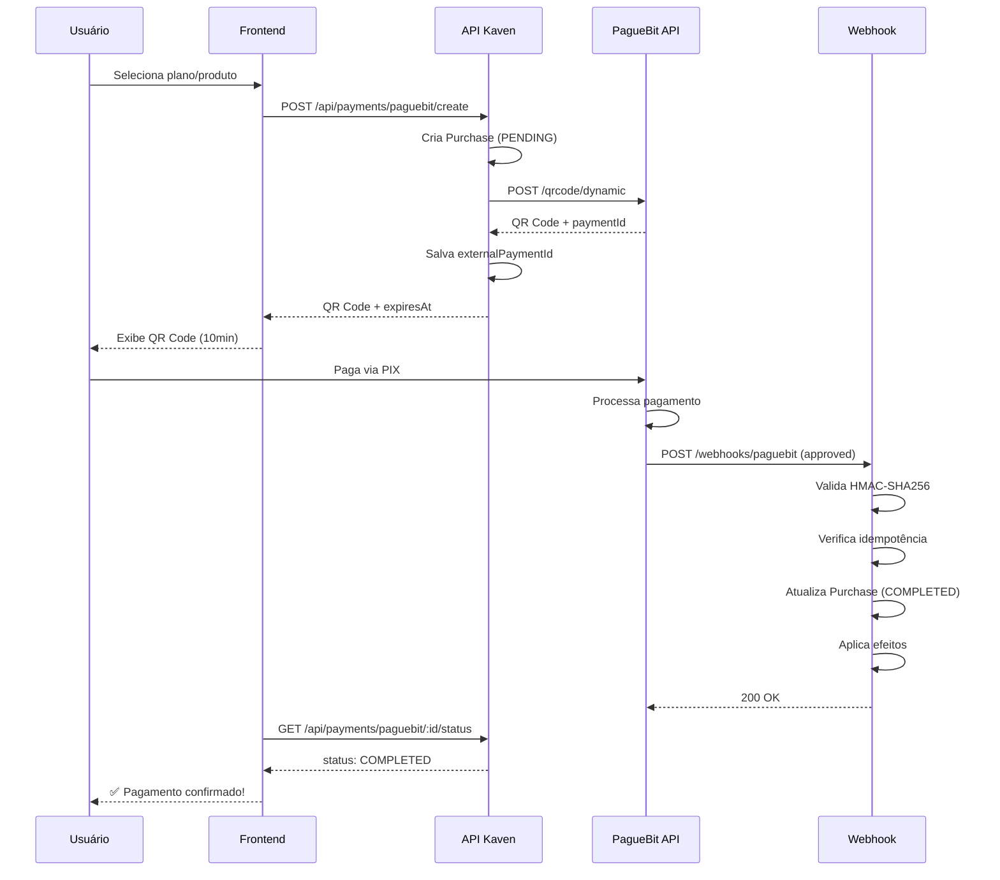

# PagueBit - Documentação Completa

**Versão:** 1.0.0  
**Data:** 05 de janeiro de 2026  
**Status:** ✅ IMPLEMENTADO E TESTADO

---

## 📑 Índice

1. [Visão Geral](#visão-geral)
2. [Arquitetura](#arquitetura)
3. [Implementação](#implementação)
4. [API Reference](#api-reference)
5. [Webhooks](#webhooks)
6. [Segurança](#segurança)
7. [Testes](#testes)
8. [Troubleshooting](#troubleshooting)
9. [Respostas Técnicas Confirmadas](#respostas-técnicas-confirmadas)

---

## 1. Visão Geral

### 1.1 O que é PagueBit?

PagueBit é um gateway de pagamentos brasileiro especializado em PIX. Nossa integração permite:

- ✅ **QR Code Dinâmico** - Pagamentos com valor fixo e expiração de 10 minutos
- ✅ **Webhooks HMAC v2** - Notificações seguras de mudança de status
- ✅ **Retry Automático** - Backoff exponencial em rate limit (300 req/min)
- ✅ **Idempotência** - Processamento seguro de webhooks duplicados
- ✅ **Multi-tenant** - Suporte completo para arquitetura multi-tenant

### 1.2 Fluxo de Pagamento



---

## 2. Arquitetura

### 2.1 Estrutura de Arquivos

```
apps/api/src/
├── lib/
│   └── validation-payments.ts              # Schemas Zod
│
├── modules/payments/
│   ├── providers/
│   │   ├── pix.interface.ts                # Interface agnóstica
│   │   │
│   │   └── paguebit/
│   │       ├── paguebit.client.ts          # HTTP client + retry
│   │       ├── paguebit.service.ts         # Service principal
│   │       ├── paguebit.types.ts           # DTOs TypeScript
│   │       └── paguebit.webhook.ts         # Webhook handler
│   │
│   ├── controllers/
│   │   └── payment.controller.ts           # Endpoints HTTP
│   │
│   └── routes/
│       └── payment.routes.ts               # Definição de rotas
│
prisma/
└── schema.prisma                           # WebhookEvent model
```

### 2.2 Componentes

#### IPixProvider (Interface Agnóstica)

Abstração que permite trocar de provider sem alterar código:

```typescript
export interface IPixProvider {
  createDynamicQRCode(params: CreateQRCodeParams): Promise<QRCodeResponse>;
  getPaymentStatus(paymentId: string): Promise<PaymentStatus>;
  validateWebhook(signature: string, body: string, timestamp: string): boolean;
  processWebhook(payload: WebhookPayload): Promise<void>;
}
```

**Benefícios:**

- Facilita migração entre providers (PagueBit → Mercado Pago)
- Permite múltiplos providers simultâneos
- Testes mais fáceis (mocks)

#### PagueBitClient (HTTP com Retry)

```typescript
export class PagueBitClient {
  private client: AxiosInstance;

  async post<T>(endpoint: string, data: any, retries = 3): Promise<T> {
    try {
      const response = await this.client.post(endpoint, data);
      return response.data;
    } catch (error) {
      // Rate limit (429) - retry com backoff exponencial
      if (error.response?.status === 429 && retries > 0) {
        const delay = Math.pow(2, 4 - retries) * 1000; // 2s, 4s, 8s
        await this.sleep(delay);
        return this.post(endpoint, data, retries - 1);
      }
      throw error;
    }
  }
}
```

**Características:**

- Base URL: `https://api.paguebit.com/v1`
- Timeout: 30 segundos
- Retry automático em 429 (rate limit)
- Backoff: 2s → 4s → 8s

#### PagueBitService

```typescript
export class PagueBitService implements IPixProvider {
  async createDynamicQRCode(
    params: CreateQRCodeParams,
  ): Promise<QRCodeResponse> {
    const response = await this.client.post('/qrcode/dynamic', {
      value: params.amount,
      description: params.description,
      external_id: params.externalId,
      metadata: params.metadata,
    });

    return {
      paymentId: response.id,
      qrCode: response.qr_code, // Base64 da imagem
      qrCodeText: response.qr_code_text, // Código copia-e-cola
      expiresAt: new Date(Date.now() + 10 * 60 * 1000), // 10 minutos
    };
  }

  validateWebhook(signature: string, body: string, timestamp: string): boolean {
    const secret = process.env.PAGUEBIT_WEBHOOK_SECRET!;

    // HMAC-SHA256 Versão 2: hash(timestamp + body, secret)
    const payload = timestamp + body;
    const expectedSignature = crypto
      .createHmac('sha256', secret)
      .update(payload)
      .digest('hex');

    return crypto.timingSafeEqual(
      Buffer.from(signature),
      Buffer.from(expectedSignature),
    );
  }
}
```

#### PagueBitWebhook (Handler)

```typescript
export async function handlePagueBitWebhook(
  request: FastifyRequest,
  reply: FastifyReply,
) {
  // 1. Validar assinatura HMAC
  const isValid = pagueBitService.validateWebhook(signature, body, timestamp);
  if (!isValid) {
    return reply.status(401).send({ error: 'Invalid signature' });
  }

  // 2. Idempotência
  const existingEvent = await prisma.webhookEvent.findUnique({
    where: { externalId: eventId },
  });
  if (existingEvent) {
    return reply.status(200).send({ received: true, duplicate: true });
  }

  // 3. Salvar evento
  await prisma.webhookEvent.create({
    data: {
      externalId: eventId,
      provider: 'PAGUEBIT',
      event: 'payment.status_changed',
      payload: request.body,
      processedAt: null,
    },
  });

  // 4. Processar
  await processPaymentWebhook(payload);

  // 5. Marcar como processado
  await prisma.webhookEvent.update({
    where: { externalId: eventId },
    data: { processedAt: new Date() },
  });

  return reply.status(200).send({ received: true });
}
```

---

## 3. Implementação

### 3.1 Configuração

#### Variáveis de Ambiente

```bash
# .env
PAGUEBIT_API_TOKEN=seu-token-aqui
PAGUEBIT_WEBHOOK_SECRET=seu-secret-aqui
```

#### Obter Credenciais

1. Acesse [PagueBit Dashboard](https://dashboard.paguebit.com)
2. **Configurações** → **API**
3. Copie **API Token** e **Webhook Secret**

### 3.2 Database Schema

```prisma
model WebhookEvent {
  id String @id @default(uuid())

  externalId String @unique @map("external_id")
  provider String
  event String
  payload Json
  processedAt DateTime? @map("processed_at")
  createdAt DateTime @default(now()) @map("created_at")

  @@index([provider])
  @@index([event])
  @@map("webhook_events")
}
```

**Migração:**

```bash
npx prisma migrate dev --name add_webhook_event
npx prisma generate
```

---

## 4. API Reference

### 4.1 POST /api/payments/paguebit/create

Criar pagamento PIX.

**Headers:**

```
Content-Type: application/json
Authorization: Bearer {token}
```

**Request Body:**

```json
{
  "userId": "uuid",
  "tenantId": "uuid",
  "productId": "uuid", // OU planId
  "planId": "uuid" // OU productId
}
```

**Response (201):**

```json
{
  "purchaseId": "550e8400-e29b-41d4-a716-446655440000",
  "paymentId": "paguebit_payment_123",
  "qrCode": "data:image/png;base64,iVBORw0KGgoAAAANS...",
  "qrCodeText": "00020126580014br.gov.bcb.pix...",
  "expiresAt": "2026-01-05T12:50:00.000Z",
  "amount": 29.99
}
```

**Erros:**

- `400` - Dados inválidos
- `404` - Produto/plano não encontrado
- `500` - Erro ao criar pagamento

### 4.2 GET /api/payments/paguebit/:id/status

Verificar status de pagamento.

**Response (200):**

```json
{
  "id": "550e8400-e29b-41d4-a716-446655440000",
  "status": "PENDING", // PENDING | COMPLETED | FAILED
  "amount": 29.99,
  "externalPaymentId": "paguebit_payment_123"
}
```

### 4.3 POST /api/webhooks/paguebit

Webhook do PagueBit (chamado automaticamente).

**Headers:**

```
X-Paguebit-Signature: a1b2c3d4e5f6...
X-Paguebit-Timestamp: 1704470400
X-Paguebit-Event-Id: evt_unique_id_123
Content-Type: application/json
```

**Payload:**

```json
{
  "id": "paguebit_payment_123",
  "external_id": "550e8400-e29b-41d4-a716-446655440000",
  "value": 29.99,
  "status": "approved",
  "paid_at": "2026-01-05T12:45:00.000Z",
  "metadata": {
    "userId": "uuid",
    "tenantId": "uuid"
  }
}
```

**Response (200):**

```json
{
  "received": true
}
```

---

## 5. Webhooks

### 5.1 Status de Pagamento

| Status         | Descrição                    | Ação                    |
| -------------- | ---------------------------- | ----------------------- |
| `pending`      | Aguardando pagamento         | Não fazer nada          |
| `review`       | Em análise (limite diário)   | **NÃO** confirmar ainda |
| `approved`     | ✅ Pagamento aprovado        | **ÚNICO** que confirma  |
| `not_approved` | Rejeitado/expirado/estornado | Cancelar purchase       |

### 5.2 Validação HMAC v2

```typescript
// Versão 2: HMAC-SHA256(timestamp + body, secret)
const payload = timestamp + body;
const expectedSignature = crypto
  .createHmac('sha256', secret)
  .update(payload)
  .digest('hex');

const isValid = crypto.timingSafeEqual(
  Buffer.from(signature),
  Buffer.from(expectedSignature),
);
```

**⚠️ IMPORTANTE:**

- **SEMPRE** validar assinatura antes de processar
- Usar `timingSafeEqual` para evitar timing attacks
- Rejeitar webhooks com assinatura inválida (401)

### 5.3 Idempotência

```typescript
// Verificar se evento já foi processado
const existingEvent = await prisma.webhookEvent.findUnique({
  where: { externalId: eventId },
});

if (existingEvent) {
  // Webhook duplicado - retornar sucesso sem reprocessar
  return reply.status(200).send({ received: true, duplicate: true });
}
```

**Por que é importante:**

- PagueBit pode enviar mesmo webhook múltiplas vezes
- Evita processar pagamento 2x
- Evita aplicar efeitos duplicados

---

## 6. Segurança

### 6.1 Checklist de Segurança

- [x] Validação HMAC em todos os webhooks
- [x] Idempotência implementada
- [x] Secrets em variáveis de ambiente
- [x] HTTPS obrigatório em produção
- [x] Rate limiting implementado
- [x] Logs de auditoria (WebhookEvent)

### 6.2 Proteção contra Ataques

#### Replay Attack

```typescript
// Verificar timestamp (max 5 minutos de diferença)
const now = Math.floor(Date.now() / 1000);
const webhookTimestamp = parseInt(timestamp);

if (Math.abs(now - webhookTimestamp) > 300) {
  return reply.status(401).send({ error: 'Timestamp too old' });
}
```

#### Timing Attack

```typescript
// SEMPRE usar timingSafeEqual
return crypto.timingSafeEqual(
  Buffer.from(signature),
  Buffer.from(expectedSignature),
);
```

---

## 7. Testes

### 7.1 Teste Manual (Desenvolvimento)

```bash
# 1. Criar pagamento
curl -X POST http://localhost:8000/api/payments/paguebit/create \
  -H "Content-Type: application/json" \
  -H "Authorization: Bearer {token}" \
  -d '{
    "userId": "user-uuid",
    "tenantId": "tenant-uuid",
    "planId": "plan-uuid"
  }'

# 2. Verificar status
curl http://localhost:8000/api/payments/paguebit/{purchaseId}/status

# 3. Simular webhook (use ngrok para expor localhost)
curl -X POST https://your-domain.com/api/webhooks/paguebit \
  -H "X-Paguebit-Signature: {hmac-signature}" \
  -H "X-Paguebit-Timestamp: 1704470400" \
  -H "X-Paguebit-Event-Id: unique-id" \
  -H "Content-Type: application/json" \
  -d '{
    "id": "payment-id",
    "external_id": "purchase-uuid",
    "value": 29.99,
    "status": "approved"
  }'
```

### 7.2 Gerar Assinatura HMAC (Teste)

```typescript
import crypto from 'crypto';

const secret = 'seu-webhook-secret';
const timestamp = '1704470400';
const body = JSON.stringify({
  id: 'payment-id',
  external_id: 'purchase-uuid',
  value: 29.99,
  status: 'approved',
});

const payload = timestamp + body;
const signature = crypto
  .createHmac('sha256', secret)
  .update(payload)
  .digest('hex');

console.log('X-Paguebit-Signature:', signature);
```

---

## 8. Troubleshooting

### 8.1 Problemas Comuns

#### QR Code não aparece

**Causa:** Erro ao criar pagamento no PagueBit

**Solução:**

```bash
# Verificar logs
tail -f logs/api.log | grep "PagueBit"

# Verificar credenciais
echo $PAGUEBIT_API_TOKEN
```

#### Webhook não chega

**Causa:** URL não configurada no PagueBit Dashboard

**Solução:**

1. Acesse PagueBit Dashboard
2. **Configurações** → **Webhooks**
3. Adicione: `https://seu-dominio.com/api/webhooks/paguebit`

#### Webhook com assinatura inválida

**Causa:** Secret incorreto ou body modificado

**Solução:**

```typescript
// Verificar se body está sendo parseado antes da validação
const body = JSON.stringify(request.body); // ✅ Correto
const body = request.body; // ❌ Errado
```

#### Rate limit (429)

**Causa:** Mais de 300 requisições/minuto

**Solução:** Retry automático já implementado (2s, 4s, 8s)

---

## 9. Respostas Técnicas Confirmadas

### 9.1 Webhook

**Pergunta:** Recebemos webhook com status `review`?

**Resposta:**

- ✅ Recebem webhook em **todas** as trocas de status
- ⏱️ Reembolso geralmente demora **no máximo 1 hora**
- ⚠️ Pode levar até **1 dia** em casos específicos

**Implementação:**

- `pending` → Aguardando
- `review` → **NÃO** confirmar ainda
- `approved` → ✅ **ÚNICO** que confirma
- `not_approved` → Cancelar

### 9.2 Expiração de QR Code

**Pergunta:** Após 10 minutos, o que acontece?

**Resposta:**

- ✅ Muda para `not_approved` (não existe status `expired`)
- ✅ Se cliente pagar QR expirado → **estornado automaticamente**

**Implementação:**

```typescript
const expiresAt = new Date(Date.now() + 10 * 60 * 1000); // 10 minutos

// Frontend: Countdown
if (Date.now() > expiresAt && payment.status === 'pending') {
  // Aguardar webhook com status 'not_approved'
}
```

### 9.3 Cancelamento

**Pergunta:** Existe endpoint para cancelar pagamento `pending`?

**Resposta:**

- ❌ Não existe endpoint de cancelamento
- ✅ Após um tempo, pagamentos `pending` são alterados para `not_approved` automaticamente
- ✅ Isso acontece quando o QR Code expira (10 minutos)

### 9.4 Rate Limiting

**Pergunta:** API retorna headers informativos?

**Resposta:**

- ❌ Não retorna headers de rate limit
- ✅ Limite conhecido: **300 req/min por IP**

**Implementação:**

```typescript
// Retry com backoff exponencial
async function callPagueBitAPI(endpoint: string, data: any, retries = 3) {
  try {
    return await axios.post(endpoint, data);
  } catch (error) {
    if (error.response?.status === 429 && retries > 0) {
      const delay = Math.pow(2, 4 - retries) * 1000; // 2s, 4s, 8s
      await sleep(delay);
      return callPagueBitAPI(endpoint, data, retries - 1);
    }
    throw error;
  }
}
```

---

## 📚 Referências

- [PagueBit API Docs](https://docs.paguebit.com)
- [PagueBit Dashboard](https://dashboard.paguebit.com)
- [Plans & Products System](../PLANS_PRODUCTS.md)

---

## 📝 Changelog

### v1.0.0 (05/01/2026)

- ✅ Implementação inicial completa
- ✅ QR Code Dinâmico
- ✅ Webhook Handler com HMAC v2
- ✅ Retry automático em rate limit
- ✅ Idempotência
- ✅ Integração com Plans & Products

---

**Última Atualização:** 05/01/2026 12:42  
**Autor:** Antigravity AI  
**Versão:** 1.0.0
